# Backend Master Guide

**A complete engineering handbook for the Real Estate Platform backend.**

This document assumes you know Python but not backend architecture. Every concept is
explained from fundamentals: what it is, why it exists, why *this* codebase uses it,
and what would break without it.

| Fact | Value |
|---|---|
| Stack | FastAPI · PostgreSQL 16 + PostGIS · Redis 7 · Celery · MinIO/S3 |
| Python | 3.13 (strict mypy, ruff) |
| Source files | ~200 under `src/app/` |
| Feature modules | 19 under `src/app/modules/` |
| Migrations | 24 (`0001` … `0024`) |
| Tests | 539, coverage gate 85% (actual 92%) |
| Blueprint | [project.md](project.md) — the §-numbers quoted throughout refer to it |
| Build history | [CLAUDE.md](CLAUDE.md) — 33 build parts with decision logs |

**How to read this guide.** If you are new, read Part 1 and Part 2, then jump to
Part 12 (*Reading the Code*) and follow its ordered path, returning here for the
deep dives. If you are debugging, go straight to Part 11. If you are adding a
feature, Part 10 is your checklist.

---

## Table of Contents

1. [High-Level Architecture](#part-1--high-level-architecture)
2. [Project Structure](#part-2--project-structure)
3. [Every Module](#part-3--every-module)
4. [Database](#part-4--database)
5. [Request Flow](#part-5--request-flow)
6. [Authentication & Security](#part-6--authentication--security)
7. [Business Logic](#part-7--business-logic)
8. [Scaling](#part-8--scaling)
9. [Deployment](#part-9--deployment)
10. [Feature Development](#part-10--feature-development)
11. [Debugging](#part-11--debugging)
12. [Reading the Code](#part-12--reading-the-code)
13. [Architecture Decisions](#part-13--architecture-decisions)
14. [Refactoring](#part-14--refactoring)
15. [Interview Mode](#part-15--interview-mode)
16. [Final Challenge](#part-16--final-challenge)

---

# Part 1 — High-Level Architecture

## 1.1 What this system actually is

Before any code: **what problem does this backend solve?**

A real estate agency needs a website (listings, search, contact forms) and a
back-office (CRM, deals, staff accounts). This platform serves **many agencies
from one deployment**. Agency A visits `alpha-realty.com`, agency B visits
`beta-homes.dz` — same servers, same database, same code, but each agency sees
only its own data.

That single sentence drives most of the architecture. Let me define the term:

> **Multi-tenancy** is one running application instance serving multiple isolated
> customers ("tenants"). The alternative is **single-tenancy**: deploy a separate
> copy of the app and database per customer.

**Why multi-tenant here?** Consider 50 agencies:

| Approach | Deployments | DB servers | Cost of a bug fix | Cost of onboarding |
|---|---|---|---|---|
| Single-tenant | 50 | 50 | Deploy 50× | Provision infra |
| Multi-tenant | 1 | 1 | Deploy 1× | Insert a DB row |

Multi-tenancy trades **operational cost** for **isolation risk**. If isolation
leaks, agency A reads agency B's leads — a business-ending breach. So this
codebase spends enormous effort on isolation, in **four independent layers**
(Part 4.7 covers all four). That is the central theme of the whole architecture.

## 1.2 The 10,000-foot view

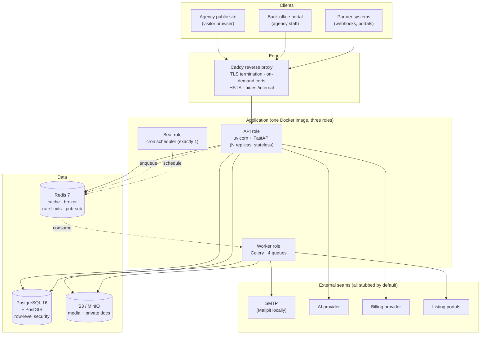

**Read that diagram as three claims:**

1. **The API is stateless.** Nothing is stored in a Python variable that outlives
   a request. All state lives in Postgres, Redis, or S3. *Why?* Because that is
   what makes horizontal scaling possible — you can run 1 replica or 20, and
   any replica can serve any request. If a replica held session state in memory,
   a user's second request hitting a different replica would fail.

2. **Slow work moves to the worker.** The rule in this codebase: anything over
   ~200ms goes to Celery (§11). Image processing, emails, portal syncs, nightly
   rollups. *Why?* A web request holds a connection, a DB connection from the
   pool, and a worker process. Spending 8 seconds resizing an image blocks all
   three, so ~30 concurrent uploads would exhaust the pool and the whole site
   stops responding — for everyone, including visitors just browsing.

3. **Every external dependency is behind a seam with an offline stub.** AI,
   billing, portals, OAuth, breach-checking. *Why?* The app must boot and the
   test suite must pass with zero third-party credentials. Part 13.8 covers this
   pattern in depth — it is one of the codebase's most distinctive decisions.

## 1.3 The layered architecture

Within the API, code is organised in strict layers. **Data flows down, never up.**

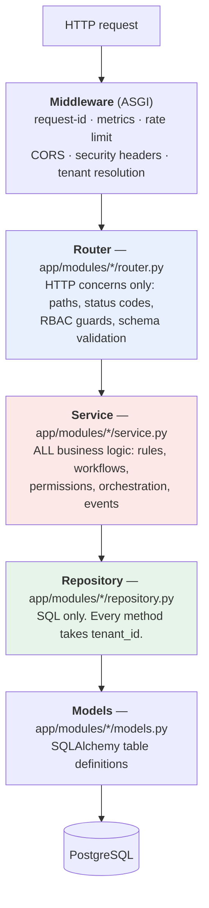

### The two hard rules

> **Rule 1: Routers never touch the database.**
> A router calls a service. It never imports a repository or a model to run a query.

> **Rule 2: Modules never import another module's `models.py` or `repository.py`.**
> To use another module's data, call its **service** (a "boundary accessor") or
> subscribe to its **events**.

These rules are enforced in code review and are the reason this codebase stays
maintainable at 200 files. Let me justify each, because a rule you do not
understand is a rule you will break.

**Why can't a router query the database?**

Imagine the "publish a listing" logic lived in the router:

```python
# ANTI-PATTERN — do not do this
@router.post("/portal/listings/{id}/publish")
async def publish(id, session, actor):
    listing = await session.get(Listing, id)          # ← DB in the router
    if listing.status != "draft": raise ...           # ← business rule
    listing.status = "published"
```

Now Celery needs to publish a listing (a scheduled publish). And the outbox
relay needs it. And a bulk import needs it. Each caller must re-implement the
status check, re-implement the ownership check, re-implement the syndication
enqueue. **The rules drift, and the drift is a security bug** — one path forgets
the ownership check and an agent publishes a colleague's listing.

With the logic in `ListingService.transition()`, there is exactly **one**
implementation. The router is a thin adapter that translates HTTP into a service
call. So is the Celery task. So is the test.

**Why can't modules import each other's models?**

Say `leads` imported `Listing` directly to show a listing title on a lead:

```python
# ANTI-PATTERN
from app.modules.listings.models import Listing
listing = await session.get(Listing, lead.listing_id)
title = listing.title["fr"]
```

Three things break:
- **Rules are bypassed.** `ListingService.get_public()` filters `status == published`
  and `deleted_at IS NULL`. This query does not. It now leaks unpublished drafts.
- **Coupling.** Rename a listings column and the leads module breaks. With 19
  modules, any schema change becomes an archaeology exercise.
- **No seam.** You cannot extract listings into its own service later, because
  half the codebase reaches into its tables.

The real code calls a narrow, purpose-built method on the listings service:

```python
# The actual pattern — a "boundary accessor"
title = await self.listings.title_for(tenant_id, lead.listing_id)
```

`ListingService` owns the rules; `leads` gets exactly the fact it needs.

## 1.4 Request lifecycle

Every HTTP request walks the same path. This sequence is the single most
important diagram in this document — internalise it.

```mermaid
sequenceDiagram
    autonumber
    participant C as Client
    participant RC as RequestContext MW
    participant M as Metrics MW
    participant RL as RateLimit MW
    participant CORS as CORS MW
    participant SH as SecurityHeaders MW
    participant T as TenantResolution MW
    participant R as Router
    participant D as Dependencies
    participant S as Service
    participant DB as Postgres

    C->>RC: GET /api/v1/listings (Host: alpha.com)
    RC->>RC: bind request_id, start timer
    RC->>M: pass
    M->>RL: pass
    RL->>RL: per-IP budget (Redis)
    Note over RL: 429 if exceeded
    RL->>CORS: pass
    CORS->>CORS: Origin allowed for this tenant?
    CORS->>SH: pass
    SH->>T: pass (headers added on the way out)
    T->>T: Host → TenantContext (Redis-cached)
    Note over T: 404 unknown host · 402 suspended
    T->>R: scope["state"]["tenant"] = ctx
    R->>D: resolve dependencies
    D->>DB: BEGIN; SET LOCAL app.tenant_id
    D->>D: decode JWT, check RBAC
    R->>S: service.list_public(tenant, filters)
    S->>DB: SELECT ... WHERE tenant_id = ...
    DB-->>S: rows (RLS-filtered)
    S-->>R: ORM objects
    R->>R: serialize to *Out schema (camelCase)
    R-->>D: response
    D->>DB: COMMIT
    D->>D: run post-commit callbacks
    SH-->>C: + security headers
    RC-->>C: + X-Request-ID, access log line
```

**Middleware ordering is deliberate and load-bearing.** In `main.py:184-195`,
middleware is added in **reverse** execution order (FastAPI wraps each new layer
*around* the previous). The comment in the code explains each choice:

| Layer | Position | Why here |
|---|---|---|
| RequestContext | Outermost | Every log line and every error needs `request_id`, including a rate-limit rejection |
| Metrics | Just inside | Its latency histogram must cover everything the access log times — including a tenant-resolution 404, which is real user-visible latency |
| GlobalRateLimit | Above CORS/tenant | A flood at an unknown host costs **one Redis lookup** instead of a tenant lookup + routing |
| CORS | Above tenant | A preflight carries no credentials and must be answerable for a host the resolver would reject |
| SecurityHeaders | Wraps tenant | So a 404/402 problem response also carries CSP/HSTS |
| TenantResolution | Innermost | Everything above it is tenant-agnostic |

> **Learning check:** why must the rate limiter sit *above* tenant resolution
> rather than below? Because tenant resolution costs a Redis lookup *and*
> potentially a DB query. If a botnet floods `random-host.com`, you want to
> reject at the cheapest possible point. Putting the limiter below would mean
> every flood packet pays for a tenant lookup first.

## 1.5 Data lifecycle — the transaction boundary

One of the most important and least obvious design decisions in this codebase:

> **The request owns the transaction. Services flush; they never commit.**

Here is the actual dependency (`core/database.py:85-103`):

```python
async def get_session(request: Request) -> AsyncIterator[AsyncSession]:
    session_factory = request.app.state.session_factory
    async with session_factory() as session:
        async with session.begin():                    # BEGIN
            tenant = getattr(request.state, "tenant", None)
            if tenant is not None:
                await set_tenant_guc(session, tenant.id)   # SET LOCAL app.tenant_id
            yield session                              # ← route runs here
        # COMMIT happened above. Only reached on success.
        for callback in session.info.get("post_commit_callbacks", []):
            await callback()
```

**Why one transaction per request?**

Consider capturing a lead. That single operation writes: a `contacts` row (or
updates an existing one), a `leads` row, a `lead_activities` row, a
`lead_drip_state` row, and an `outbox` row. If the service committed after each
write and step four failed, you would have a contact and a lead with no drip
state and no notification event — silently broken data that no error message
tells you about.

With one transaction, **either all five rows exist or none do**. This property
is called **atomicity**, and getting it for free on every endpoint is worth the
discipline it demands.

**Why `flush()` but not `commit()`?**

- `flush()` sends the pending SQL to Postgres *inside* the transaction. The row
  now has its server-generated id and is visible to subsequent queries in the
  same transaction — but is **not** durable and can still be rolled back.
- `commit()` makes it permanent.

A service calls `flush()` when it needs the id (e.g. to insert a child row
pointing at it). If a service called `commit()`, it would end the request's
transaction early, and a later failure could no longer roll back the earlier
work — atomicity destroyed. **A service that calls `commit()` is a bug.**

### Post-commit callbacks

Some side effects must happen **only after** the data is durable:

```python
on_commit(session, lambda: redis.delete(cache_key))
```

**Why not just invalidate the cache immediately?** This is a real bug that was
found and fixed in Part 2, and the reasoning is subtle enough to be worth
walking through carefully:

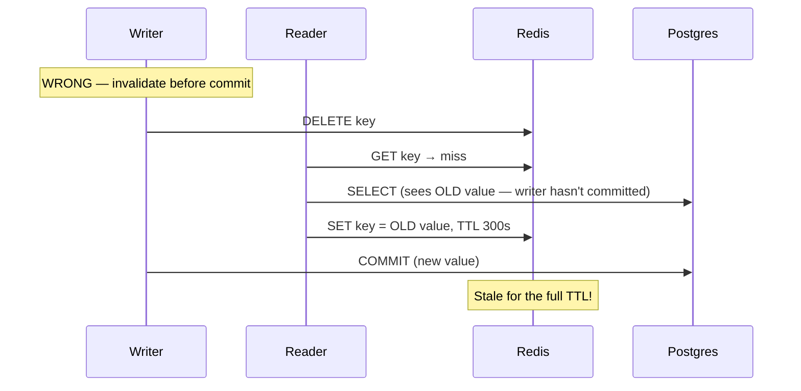

The reader re-populated the cache from the pre-commit state. Invalidating
*after* commit closes the window: any reader that misses the cache now reads
committed, current data.

**The trade-off you must know:** a post-commit callback is **not** in the
transaction. If the process crashes between COMMIT and the callback, the side
effect is lost. For a cache bust, fine — the TTL heals it. For a customer-facing
notification, **not** fine. That is precisely why the transactional outbox
exists (Part 7.9).

## 1.6 Authentication lifecycle

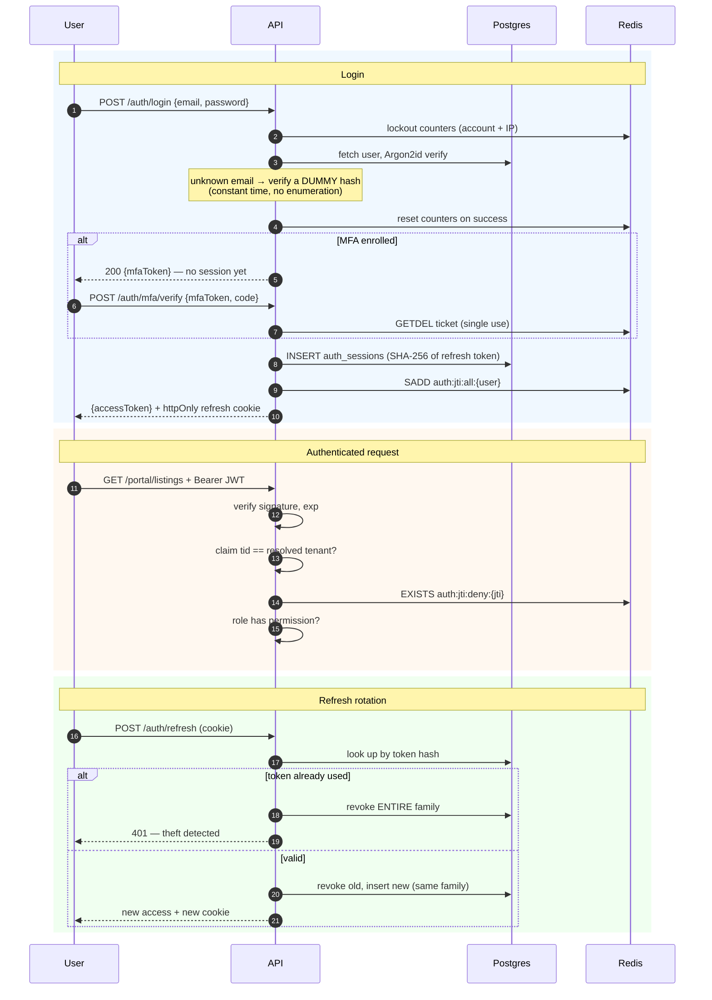

**Two token types, and the reason for each:**

| | Access token | Refresh token |
|---|---|---|
| Format | JWT (signed, self-describing) | Opaque random string |
| Lifetime | 15 minutes | 30 days |
| Storage (client) | JS memory | httpOnly cookie |
| Storage (server) | Nothing (stateless) | SHA-256 hash in `auth_sessions` |
| Verified by | Signature check — no DB hit | DB lookup |

**Why two?** This is the classic security/performance trade-off:

- A **stateless JWT** needs no DB query, so it is fast enough to check on every
  request. But it cannot be revoked — it is valid until it expires. So it must
  be **short-lived**.
- A **stateful refresh token** can be revoked instantly (delete the row), but
  needs a DB query. So it is used **rarely** (once per 15 min).

**Why is the refresh token in an httpOnly cookie and the access token not?**
`httpOnly` means JavaScript cannot read the cookie, so an XSS payload cannot
steal it. The access token *must* be readable by JS (to set the
`Authorization` header), so XSS *can* steal it — but only for 15 minutes.
The long-lived credential gets the strong protection; the short-lived one
accepts the risk. This is defence in depth: two credentials with different
threat models.

**Refresh reuse detection**, in plain terms: refresh tokens are single-use. Each
refresh revokes the old token and issues a new one, tagged with a shared
`family_id`. If an *already-used* token arrives, there are only two
explanations: a network retry, or **an attacker replaying a stolen token**. The
system cannot tell which, so it assumes theft and revokes the entire family —
logging out both the attacker and the legitimate user, who must log in again.
An annoying but safe failure.

## 1.7 Background jobs

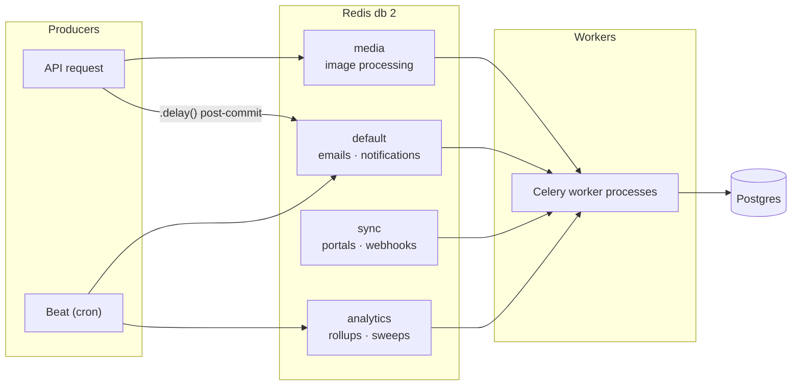

**Why four queues instead of one?** Head-of-line blocking. Picture one queue
with 500 pending image resizes (8s each) and one lead-notification email. The
email waits over an hour behind the images. The agency loses the lead — a
"speed to lead" business metric measured in minutes.

Separating by **workload profile** means a slow queue can never starve a fast
one. The routing table in `celery_app.py:31-77` is annotated with the reasoning
for every task, and note that the criterion is *not* "which module" but "which
profile":

```python
# Not `analytics`: the sweep sends latency-sensitive lead-notification
# emails — the same class email.* already occupies. `analytics` is for
# pure-batch work with no human-facing side effect.
"app.workers.tasks.leads.*": {"queue": "default"},
```

**Every task must be idempotent** — safe to run twice. Celery guarantees
*at-least-once* delivery, not exactly-once (`task_acks_late=True` means a worker
that dies mid-task has its message redelivered). The codebase's standard
technique is a **status filter or a timestamp stamp** that makes a re-run a
no-op:

```python
# flag_stale_listings: already-flagged rows are excluded by the query itself,
# so an overlapping or retried run cannot double-count.
.where(Listing.stale_flagged_at.is_(None))
```

## 1.8 External services

Every third-party integration lives in `src/app/integrations/` — **not** in
`modules/` — and follows the same four-file shape:

```
integrations/<name>/
  base.py      Protocol + neutral DTOs + <Name>Error(permanent=bool)
  stub.py      Offline implementation (the default)
  <real>.py    Live adapter (anthropic.py, google.py, ...)
  registry.py  build_x(settings) → picks by config, falls back to stub
```

**Why `integrations/` and not `modules/`?** A module owns database tables, a
router, and RBAC. An integration owns none of those — it is pure I/O. Mixing
them would imply an adapter can define tables, which is exactly the coupling
this separation prevents.

The **permanent vs transient error split** appears in every adapter and drives
retry behaviour:

| Error class | Meaning | Retry? |
|---|---|---|
| `permanent=True` | Bad payload, auth failure, 4xx | **No** — retrying cannot help |
| `permanent=False` | Timeout, 5xx, connection reset | **Yes** — with exponential backoff |

Without this split you get one of two failure modes: retrying a malformed
payload forever (a poison message burning worker capacity), or dropping a
delivery because the receiver happened to be restarting.

---

## Part 1 Summary

| Concept | One-line takeaway |
|---|---|
| Multi-tenancy | One deployment, many agencies; isolation enforced in 4 layers |
| Stateless API | All state in PG/Redis/S3, so replicas scale horizontally |
| Layers | Router (HTTP) → Service (rules) → Repository (SQL) → Model (tables) |
| Rule 1 | Routers never touch the DB |
| Rule 2 | Modules call each other's **services**, never models/repositories |
| Transaction | One per request; services `flush()`, the boundary `commit()`s |
| `on_commit` | Side effects after durability; lossy by design → use the outbox when loss is unacceptable |
| Auth | Short stateless JWT (15 min) + long stateful refresh (30 d) with family revocation |
| Queues | Four, split by workload profile, so slow work never starves fast work |
| Idempotency | Every task safe to re-run, via status filters / timestamp stamps |
| Integrations | Protocol + stub + real + registry; offline by default |

### Exercise 1

Without opening the code, answer these, then verify:

1. A visitor loads `alpha-realty.com/listings`. Which middleware turns the
   hostname into a tenant, and what happens if that hostname is not in the
   database? *(Verify: `core/tenancy.py:62-106`)*
2. Why does the metrics middleware sit *inside* the request-context middleware
   rather than outside it? *(Verify: `main.py:170-183`)*
3. A service method calls `await session.commit()`. Name two things that break.
4. Why does an image resize go to the `media` queue rather than `default`?

---

# Part 2 — Project Structure

## 2.1 The top level

```
real estate backend/
├── src/app/                 ← ALL application code
├── tests/                   ← 539 tests, real services (no mocking of PG/Redis)
├── alembic/                 ← database migrations
├── docker/                  ← Dockerfile, compose, Caddy, initdb
├── scripts/                 ← operational one-offs
├── .github/workflows/       ← CI pipeline
├── pyproject.toml           ← deps + ruff/mypy/pytest/coverage/bandit config
├── uv.lock                  ← exact resolved versions (committed)
├── alembic.ini              ← migration tool config
├── .env / .env.example      ← configuration (never committed / template)
├── project.md               ← the original blueprint (§-numbers)
├── CLAUDE.md                ← build log: 33 parts, every decision + gotcha
├── NEXT_PARTS.md            ← remaining credential-gated work
├── PRODUCTION_READINESS.md  ← §18 checklist: 25 done, 11 waived w/ rationale
└── graphify-out/            ← generated code knowledge graph (queryable)
```

**Why `src/app/` and not just `app/`?** This is the "src layout". Without it, the
project root is on `sys.path`, so `import app` picks up the local directory even
if the package is not properly installed. That means tests can pass locally
against files that would be missing from the built wheel. With `src/`, you must
install the package (`uv sync` does an editable install), so **tests run against
the same import path production uses**. It catches packaging bugs before they
ship.

## 2.2 `src/app/` — application root

```
src/app/
├── main.py            App factory: middleware, routers, lifespan
├── health.py          /healthz, /readyz
├── internal.py        /internal/* — private endpoints (TLS check, metrics)
├── core/              Infrastructure. Knows nothing about real estate.
├── common/            Pure shared helpers (geo, money)
├── modules/           Feature modules — the business domain
├── integrations/      Third-party adapters
└── workers/           Celery app + task bodies
```

### The dependency direction (the most important structural rule)

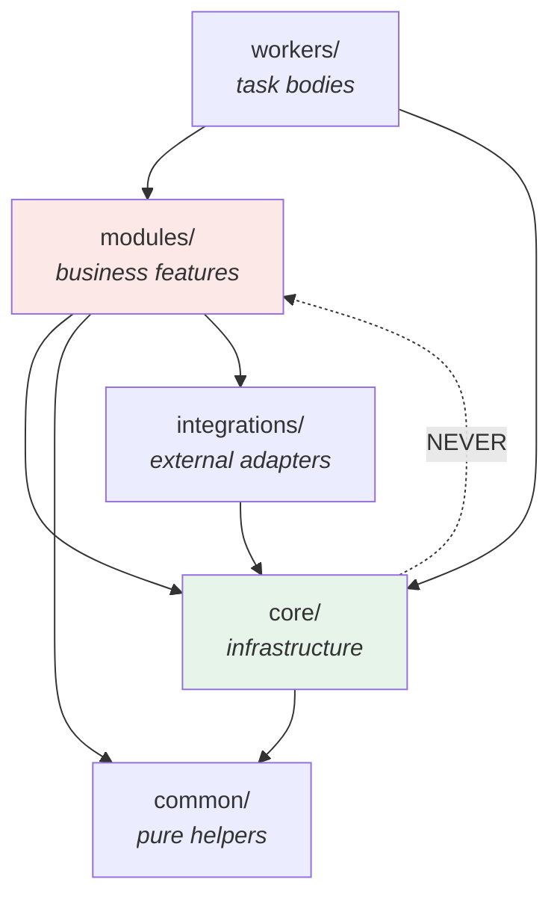

> **`core/` must never import from `modules/`.**

This is not stylistic — it is what keeps `core/` reusable and testable. If
`core/tenancy.py` imported the tenants module to resolve a hostname, then
`core` would depend on a feature, the feature would depend on `core`, and you
would have a circular import that Python resolves by accident of import order.

**How does `core` resolve tenants without importing the tenants module?**
Dependency inversion via a `Protocol`. `core/tenancy.py:52-53` declares the
*shape* it needs:

```python
class TenantResolver(Protocol):
    async def resolve(self, domain: str) -> TenantContext | None: ...
```

The app factory injects a concrete implementation at startup
(`main.py:87-91`), and the middleware reads it off `app.state`:

```python
resolver: TenantResolver = scope["app"].state.tenant_resolver
```

`core` depends on an **interface it defines**; the module supplies the
implementation. The arrow points from module to core, never the reverse.

## 2.3 `core/` — infrastructure, file by file

Everything here is domain-agnostic: it would work for a hospital or a bank.

| File | Purpose | What breaks without it |
|---|---|---|
| `config.py` | `Settings` from env via pydantic-settings; `get_settings()` is `lru_cache`d | Secrets hardcoded; no startup validation of missing config |
| `database.py` | Engine, session factory, `Base`, mixins, request-scoped session, `on_commit` | No transaction boundary; no tenant GUC |
| `tenancy.py` | `TenantContext`, resolution middleware, `TenantDep` | No multi-tenancy |
| `rls.py` | DDL helpers migrations use to attach RLS policies | Isolation depends only on app code |
| `permissions.py` | `Role`, `Permission`, role-to-permission matrix, `require()` | No RBAC |
| `security.py` | Argon2id, JWT encode/decode, HMAC `sign_value`, token hashing | No auth crypto |
| `exceptions.py` | `AppError` hierarchy + RFC 9457 handlers | Stack traces leak to clients |
| `schema.py` | `InputSchema` / `OutSchema` / camelCase alias generator | Inconsistent JSON casing |
| `pagination.py` | Cursor encode/decode, `Page[T]` envelope | Offset pagination (slow, unstable) |
| `i18n.py` | Locale negotiation + `pick_localized` fallback chain | Missing translations render as holes |
| `middleware.py` | Request-id/access-log + security-headers ASGI middleware | No correlation ids, no CSP/HSTS |
| `cors.py` | Tenant-aware dynamic CORS | Static allowlist cannot work multi-tenant |
| `rate_limit.py` | Sliding-window limiter (global + per-endpoint) | No abuse protection |
| `lockout.py` | Per-account + per-IP failed-login counters with backoff | Credential stuffing succeeds |
| `crypto.py` | AES-256-GCM `FieldCipher`, `EncryptedString` column type | MFA secrets stored in plaintext |
| `mfa.py` | TOTP wrapper (pyotp) | No second factor |
| `idempotency.py` | `IdempotentRoute` — `Idempotency-Key` replay cache | Double-charges on client retry |
| `events.py` | Transactional outbox: table, `emit_event`, handler registry, relay | Lost notifications on broker hiccup |
| `net.py` | SSRF guard: `validate_public_url`, pinned transport | Webhooks can hit internal services |
| `cache.py` | `cache_aside` + versioned-key invalidation | Every read hits Postgres |
| `http_cache.py` | ETag / `Last-Modified` / `Cache-Control` for public GETs | No CDN or browser caching |
| `metrics.py` | Prometheus registry, middleware, business counters | No observability |
| `telemetry.py` | Sentry + OpenTelemetry init (no-ops when unconfigured) | No error tracking or tracing |
| `storage.py` | boto3 S3 wrapper: presigned PUT/GET, HEAD, batch delete | No object storage |
| `logging.py` | structlog config with PII redaction | Unstructured logs; PII in logs |

### What belongs in `core/` — and what must not

| Belongs | Does not belong |
|---|---|
| Cross-cutting mechanisms every module needs | Anything naming a business concept (`Listing`, `Lead`) |
| Domain-agnostic infrastructure | Any import from `app.modules.*` |
| Protocols other layers implement | Business rules or workflow graphs |

**The test:** could you copy this file into a hospital-management backend and
have it still make sense? If yes, it belongs in `core/`.

## 2.4 `common/` — pure helpers

Two files, both **pure functions**: no session, no tenant, no I/O.

- **`geo.py`** — WKB/WKT point and multipolygon helpers built on top of
  GeoAlchemy2. Promoted here in Part 9 when a second module (agents' service
  areas) needed what listings already had.
- **`money.py`** — `to_money`, `percentage_of`, `commission_amount`,
  `monthly_payment`. Every monetary value is a `Decimal` quantized to two places
  with `ROUND_HALF_UP`.

**Why does `money.py` exist as a separate file?** Read the module docstring — it
is a case study in why duplication is a bug:

> That rule was previously restated inline in `transactions` (commission) and
> `valuations` (mortgage), each with its own `_CENT` constant and its own
> `.quantize` call; **one drifting rounding mode between them would be invisible
> until an agency queried a total that did not add up.**

There is a second reason, and it is about testability. Because these are pure
functions, property-based tests (`tests/test_money_properties.py`, hypothesis)
can run thousands of examples with **no database round trip per example**. When
the logic was buried in a service method, testing it meant creating a tenant, a
user, a deal, per example. Extracting it made exhaustive testing feasible.

**Why never `float` for money?** Floats are binary; `0.10` has no exact binary
representation:

```python
>>> 0.1 + 0.2
0.30000000000000004
>>> Decimal("0.1") + Decimal("0.2")
Decimal('0.3')
```

Over thousands of commission calculations that error compounds into figures that
do not reconcile — and reconciliation failures with an agency's accountant are
expensive to explain.

## 2.5 `modules/` — the business domain

Every module follows the same five-file shape (§5):

```
modules/<name>/
├── models.py       SQLAlchemy tables (the only place columns are defined)
├── schemas.py      Pydantic in/out DTOs (the API contract)
├── repository.py   SQL. Every method takes tenant_id.
├── service.py      Business logic. The only place rules live.
└── router.py       HTTP endpoints. Thin.
```

**Why the same shape every time?** Predictability is a feature. With 19 modules,
"where is the workflow rule for listings?" must have exactly one answer
(`modules/listings/service.py`) without searching. A new engineer learns the
shape once and can navigate all of them. Consistency here is worth more than
per-module cleverness.

### The layer contract

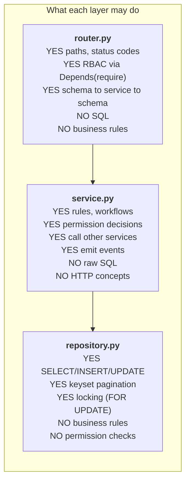

**Where do permission checks live?** This trips people up, so be precise:

| Check | Layer | Example |
|---|---|---|
| *Does this role hold the permission?* | Router (declarative) | `Depends(require(Permission.LISTING_MANAGE))` |
| *May this actor do it to this row?* | Service | "only managers may set `featured`" |
| *Which rows may this actor see?* | Repository (via a scope argument) | `scope_user_ids=[...]` |

The router answers a question about the **role**; only the service knows enough
about the **resource** to answer the rest.

### The 19 modules at a glance

| Module | Tables | Owns |
|---|---|---|
| `tenants` | 8 | Agencies, domains, plans, quotas, billing, audit, impersonation |
| `users` | 1 | Accounts, roles, profile, soft delete |
| `auth` | 2 | Sessions, refresh rotation, MFA, OAuth links |
| `listings` | 3 | Property inventory, workflow, search, reference codes |
| `media` | 1 | Photos/docs, presigned upload, variant pipeline |
| `leads` | 5 | CRM: contacts, leads, activities, assignment, drips |
| `agents` | 3 | Agent profiles, teams, service areas |
| `favorites` | 2 | Saved listings, saved searches, alerts |
| `appointments` | 2 | Availability templates, tour bookings, iCal |
| `valuations` | 1 | Seller valuation funnel + mortgage calculator |
| `content` | 4 | Pages, legal versions, guides, market reports |
| `blog` | 2 | Posts, categories, scheduled publish, RSS |
| `reviews` | 1 | Testimonials, moderation queue, aggregates |
| `notifications` | 4 | Unified `notify()` fan-out, prefs, WS, digests |
| `transactions` | 3 | Deals, milestones, documents, commissions |
| `syndication` | 1 | Portal push state, circuit breaker, feeds |
| `analytics` | 4 | Event firehose (partitioned), rollups, dashboards |
| `compliance` | 3 | Consent records, cookie config, DSR export/erasure |
| `webhooks` | 2 | Outbound endpoints, HMAC delivery log |

### Deliberate deviations from the blueprint

Two places where the code intentionally differs from `project.md` §5, both
documented in the module docstring. **Read these — they teach you when to break
a rule:**

1. **Search lives inside `listings`, not its own module.** A `search` module
   would have to import listings' models and repository to build a query. The
   no-cross-module-models rule is stronger than the aspirational folder layout.
   *When to revisit:* when Meilisearch arrives and search stops being a SQL
   query against one table.

2. **`leads` is one module, not `leads` + `clients`.** Every lead has a
   mandatory `contact_id` and there is no standalone contact portal, so two
   services would need row-level access to the same intertwined tables for
   every operation — "ceremony without an isolation benefit".  *When to revisit:*
   if a contact/account portal materialises.

The lesson: **the layout serves the rules, not the reverse.** When they
conflict, keep the rule and document the deviation where the next reader will
find it.

## 2.6 `integrations/` — external adapters

```
integrations/
├── ai/          base · stub · anthropic · registry · scoring
├── billing/     base · stub (real HMAC) · registry
├── portals/     base · mock · registry
├── auth_oauth/  base · google · registry
├── breach/      hibp.py (HIBP k-anonymity)
└── email/       service.py (SMTP via aiosmtplib)
```

**What belongs here:** anything that talks to a system outside this deployment
and has no tables, router, or RBAC of its own.

**What must not:** database models, HTTP endpoints, business rules. If your
"integration" needs a table to track state, that state belongs in a module —
which is exactly what `modules/syndication` (state, router, RLS) does alongside
`integrations/portals` (pure I/O). That split is the reference example.

## 2.7 `workers/` — background execution

```
workers/
├── celery_app.py   Celery config: 4 queues, task routes, beat schedule
├── db.py           run_scoped / run_scoped_many / run_ddl / run_sync
└── tasks/          19 task modules, one per feature area
```

**Why does `workers/db.py` exist rather than reusing `core/database.py`?**
Three genuine incompatibilities between the web and worker runtimes:

| | API process | Worker process |
|---|---|---|
| Event loop | One long-lived loop (uvicorn) | None — Celery task bodies are sync |
| Engine | One pooled engine for the process lifetime | Must not share a pool across forks |
| Tenant | Resolved from `Host` | Must be passed explicitly |

So `run_scoped(tenant_id, fn)` opens a short-lived engine, begins a
transaction, sets the tenant GUC, runs `fn`, commits, and **drains post-commit
callbacks** — mirroring `get_session` so a service behaves identically in both
runtimes. `run_scoped_many` shares one engine across a batch of per-tenant
transactions (a nightly sweep over 200 tenants should not open 200 engines).

There is a subtle gotcha in `run_sync` worth understanding, because it explains
a whole class of test-only bugs (`workers/db.py:37-51`):

```python
try:
    asyncio.get_running_loop()
except RuntimeError:
    return asyncio.run(coro)        # real worker: no loop, plain path
with ThreadPoolExecutor(max_workers=1) as pool:
    return pool.submit(_run_with_current_app, coro).result()
```

In production there is no running loop, so `asyncio.run` works. But in tests,
Celery's eager mode executes task bodies **inline inside pytest-asyncio's
already-running loop**, where `asyncio.run` raises. Hence the thread fallback.
And that fallback needed a second fix: Celery's "current app" lookup is
*thread-local*, so a fresh thread fell back to an unconfigured default app and
nested `.delay()` calls silently did nothing (Part 8's bug). Hence
`celery_app.set_current()` inside the thread.

## 2.8 `alembic/` — migrations

```
alembic/
├── env.py              Imports every models module so autogenerate sees all tables
├── script.py.mako      Template for new migrations
└── versions/           0001 … 0024, a linear chain
```

Each migration declares its position:

```python
revision: str = "0003"
down_revision: str | None = "0002"
```

**Why is `env.py`'s import list load-bearing?** Autogenerate diffs
`Base.metadata` (what Python knows) against the live database. A models module
that is never imported is not in `Base.metadata`, so autogenerate concludes its
tables should be **dropped**. Part 15 found this list stale since Part 8 —
content, favorites, appointments, and valuations were missing. Adding a module
means adding its import here.

## 2.9 `docker/`

| File | Role |
|---|---|
| `Dockerfile` | Multi-stage build; one image, three roles; non-root; libvips |
| `entrypoint.sh` | Dispatches on `$1`: `api` (migrates, then uvicorn) / `worker` / `beat` |
| `docker-compose.yml` | Dev **backing services**: Postgres+PostGIS, Redis, MinIO, Mailpit |
| `docker-compose.prod.yml` | **Layers over** the base: app, worker, beat, Caddy |
| `Caddyfile` | TLS termination, on-demand certs, HSTS, hides `/internal` |
| `initdb/01-app-role.sql` | Creates `app_user` + test DB + PostGIS (idempotent) |

**One image, three roles** — why does this matter? If you built three images,
they could drift: worker running last week's code against this week's schema.
Building once and promoting **the same digest** to all three roles makes that
impossible.

Note `docker-compose.prod.yml` is *additive*, not standalone:

```bash
docker compose -f docker/docker-compose.yml -f docker/docker-compose.prod.yml up -d
```

The backing services are defined once. Duplicating them would let dev and prod
Postgres versions diverge — a class of bug that appears only in production.

## 2.10 `tests/`

| File | Role |
|---|---|
| `conftest.py` | Env pins (before any app import), fixtures, per-test state reset |
| `containers.py` | Optional testcontainers bootstrap (`TESTCONTAINERS=1`) |
| `factories.py` | factory_boy attribute factories + RLS-aware async insert helpers |
| `helpers.py` | Shared API-driven builders (`make_tenant`, `make_listing`, …) |
| `test_*.py` | 40 suites, one per feature area |

**These are integration tests against real services** — real Postgres, real
Redis, real MinIO, real SMTP (Mailpit). Postgres and Redis are **not mocked**.

*Why not mock them?* Because the most important behaviours in this codebase are
behaviours of Postgres, not of Python: RLS policies, `FOR UPDATE` locking,
advisory locks, `ON CONFLICT` upserts, generated `tsvector` columns, partition
routing. A mock would assert your *belief* about Postgres. Every RLS test here
would pass against a mock while the real policy was broken.

## 2.11 CI (`.github/workflows/ci.yml`)

Three jobs:

1. **`quality`** — spins up service containers mirroring the dev compose, then:
   `ruff check` → `ruff format --check` → `mypy` → `pytest --cov` →
   `pip-audit` → `bandit`.
2. **`migrations`** — on a **clean** database: `upgrade head` → `downgrade base`
   → `upgrade head`. This catches a migration that only works against an
   already-populated schema — which you would otherwise discover during a
   production rollback.
3. **`docker`** — builds the image and smoke-checks it (binaries resolve, runs
   as `app`, entrypoint parses).

Run the full gate locally before pushing:

```bash
uv run ruff check && uv run ruff format --check && uv run mypy \
  && uv run pytest --cov \
  && uv run bandit -c pyproject.toml -r src/app -q \
  && uv run pip-audit --skip-editable
```

---

## Part 2 Summary

| Folder | Owns | Never contains |
|---|---|---|
| `core/` | Domain-agnostic infrastructure | Any `app.modules.*` import; business concepts |
| `common/` | Pure helpers (geo, money) | I/O, sessions, tenants |
| `modules/<n>/` | One feature: models, schemas, repository, service, router | Another module's models/repository |
| `integrations/` | External adapters (protocol + stub + real + registry) | Tables, routers, RBAC |
| `workers/` | Celery app, queue routing, task bodies | Business rules (call services) |
| `alembic/` | Linear migration chain | Untested DDL |
| `docker/` | Build + runtime topology | Secrets |
| `tests/` | Integration tests on real services | Mocked Postgres/Redis |

**The three structural rules:**
1. `core/` never imports `modules/` (use a `Protocol` + injection).
2. Modules never import another module's `models.py`/`repository.py` (use a service boundary).
3. Routers never touch the database.

### Exercise 2

1. You need a helper that formats a phone number to E.164. Which folder, and why
   not the other candidates?
2. You are adding Stripe. Which files do you create, and where does the
   `stripe_customer_id` column live?
3. `core/cache.py` needs to know a tenant's plan to pick a TTL. Why is importing
   `app.modules.tenants.service` the wrong fix, and what are two correct fixes?
4. Run `uv run alembic check`. Some output is pre-existing noise
   (PostGIS/expression indexes). Which output would indicate a *real* problem?

---

# Part 3 — Every Module

19 modules, 51 tables. This part covers each one: purpose, business logic,
dependencies, flows, pitfalls, and how to modify it safely.

**How modules relate.** Before the details, the dependency map. Arrows are
*service-level* calls (boundary accessors) — never model or repository imports:

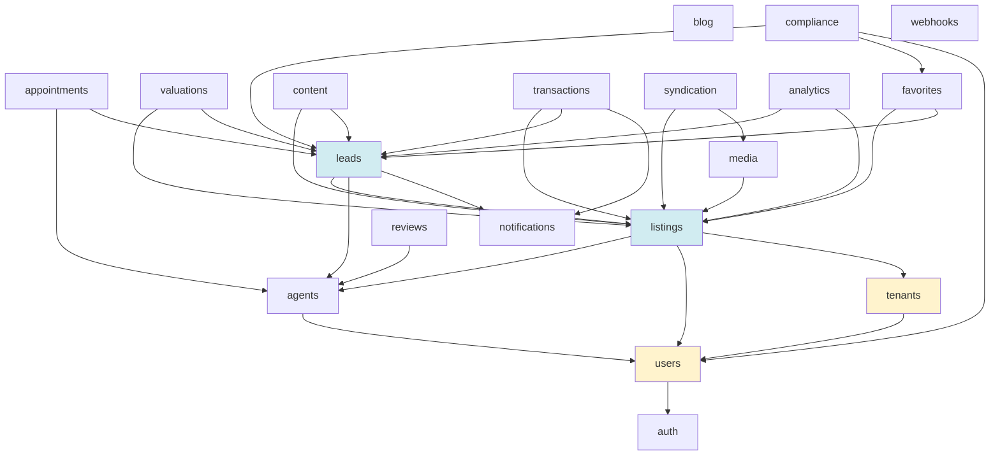

Note the shape: **`tenants` and `users` are the foundation** (everything depends
on them); **`listings` and `leads` are the hubs** (most features attach to one or
both); and there are **no cycles**. That acyclicity is not luck — it is enforced
by the boundary rule, and it is why a lazy import is occasionally needed (see
3.6's pitfall).

---

## 3.1 `tenants` — agencies, plans, billing, platform admin

**Purpose.** Owns the concept of an agency: its identity, its domains, its plan
and quotas, its subscription, its lifecycle (trial → active → suspended →
offboarded → purged), and the platform back-office that manages all of it.

**Tables (8, all global — no RLS).**

| Table | Holds |
|---|---|
| `tenants` | Agency row: slug, name, status, plan, settings JSONB, trial/offboard dates |
| `tenant_domains` | Hostnames → tenant; primary-domain flag; DNS verification token |
| `tenant_usage` | O(1) running counters (listings, agents, storage bytes, emails) |
| `tenant_subscriptions` | Billing mirror: provider, status, period, plan |
| `billing_events` | Webhook idempotency log, unique `(provider, event_id)` |
| `audit_log` | Append-only trail (impersonation, plan changes) |

**Why no RLS on these tables?** This is the one deliberate exception, and the
reason is a chicken-and-egg problem. RLS policies read
`current_setting('app.tenant_id')` — but the middleware queries `tenant_domains`
**to discover** which tenant this is. There is no tenant id to set yet. So these
tables are protected by application logic (platform-only routers) rather than
RLS.

**Key business logic.**

- **Domain resolution + caching.** `DomainTenantResolver` looks up `Host` →
  `TenantContext`, cached in Redis for `tenant_cache_ttl_seconds` (300s). On a
  Redis failure it degrades to a direct DB query rather than failing the request.
- **Plans & quotas.** `plans.py` holds a code-owned table (plan → max listings /
  agents / storage / emails). The plan rides on the cached `TenantContext`, so a
  write-time quota check is a plan lookup plus one `FOR UPDATE` on the usage row
  — never a recount.
- **Trial and offboard lifecycle.** Create stamps `trial_ends_at`; a Beat sweep
  suspends lapsed trials. Offboard = suspend now, export the tenant's data to a
  JSON archive, schedule a hard delete 30 days later (reversible until then).
- **Billing webhooks.** Verified by HMAC signature (not auth — the signature *is*
  the authentication), then idempotency-guarded by `(provider, event_id)`.
- **Impersonation.** Platform staff mint a 15-minute access token carrying an
  `imp` claim, audit-logged, with **no refresh token** so it cannot be renewed.

**Flow — onboarding a new agency:**

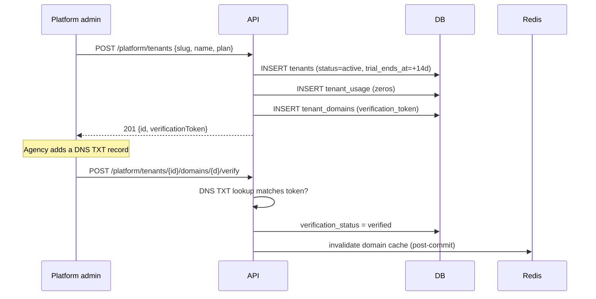

**Pitfalls.**
- Cache invalidation **must** be post-commit. Invalidating before commit lets a
  concurrent reader re-cache the old value for the full TTL (the Part 2 bug).
- `TenantContext.plan` has a default (`"trial"`) so an older cached payload
  deserializes without `KeyError` after a deploy that adds a field. **Any new
  `TenantContext` field needs a default** for the same reason.
- The settings blob is free-form JSONB. Every read must be defensive — a tenant
  can put anything in there. See the `_tenant_appointment_settings` pattern.

**Safe modification.** Adding a plan tier = edit `plans.py` only. Adding a
setting = read it defensively at the point of use; no migration (it is JSONB).

---

## 3.2 `users` — accounts and identity

**Purpose.** One table, one job: who exists, what role they hold, are they
active.

**The critical schema detail:** `users.tenant_id` is **nullable**, and
`NULL` means *platform staff*. This is why `users` uses **identity RLS** rather
than tenant RLS (`core/rls.py:28-45`):

```sql
CREATE POLICY tenant_isolation ON users USING (
  tenant_id IS NOT DISTINCT FROM NULLIF(current_setting('app.tenant_id', true), '')::uuid
)
```

Read that carefully — it is doing two things at once:

| Session | `app.tenant_id` | Sees |
|---|---|---|
| Tenant request | `'abc-123'` | Exactly that tenant's users |
| Platform request | unset | Exactly the `NULL`-tenant (staff) rows |

`IS NOT DISTINCT FROM` is null-safe equality (`NULL = NULL` is `NULL` in SQL, but
`NULL IS NOT DISTINCT FROM NULL` is `TRUE`). And note `missing_ok=true` here,
unlike the strict tenant policy — platform requests legitimately have no GUC set.

**Key logic.**
- Argon2id hashing via pwdlib. A login against an unknown email still verifies
  against `DUMMY_PASSWORD_HASH` so the response takes the same time — no
  enumeration by timing.
- Soft delete (`deleted_at`); the normal `get` filters it out. `get_including_deleted`
  exists for the compliance purge, which must act on already-soft-deleted rows.
- **Boundary accessors** other modules use: `get_identity_if_active`,
  `identities_for` (batch), `email_taken`, `export_identity`, `anonymize_account`.

**Pitfall.** The users router orchestrates users + auth for token revocation:
disabling an account must denylist its live JWTs **immediately**, not wait out
the 15-minute TTL. `auth` already depends on `users`, so putting the
orchestration in the users *router* avoids a circular service import.

---

## 3.3 `auth` — sessions, MFA, OAuth

**Purpose.** Everything about proving identity. Owns `sessions` and
`oauth_identities`; the password hash and TOTP secret stay behind the users
boundary and never cross it.

**Redis keyspace** (worth memorising — it is your debugging map):

| Key | Holds | TTL |
|---|---|---|
| `auth:reset:{sha256}` | password-reset token → user id | 30 min |
| `auth:verify:{sha256}` | email-verification token → user id | 24 h |
| `auth:jti:deny:{jti}` | revoked access token | = token lifetime |
| `auth:jti:all:{user}` | set of a user's live jtis | — |
| `auth:mfa:{sha256}` | pending second-factor ticket | 5 min |
| `auth:oauth:{sha256}` | OAuth CSRF state | 10 min |
| `auth:lockout:*` | failed-login counters | window |

**Why is `auth:jti:all:{user}` needed?** Because a JWT cannot be un-issued. When
an admin disables an account, you must revoke every outstanding token *now*.
Tracking the set of live jtis per user lets logout-all / disable / demote /
password-reset denylist them all in one operation. Without it, a disabled
employee keeps working for up to 15 minutes.

**Refresh rotation with reuse detection** — the flow that matters most:

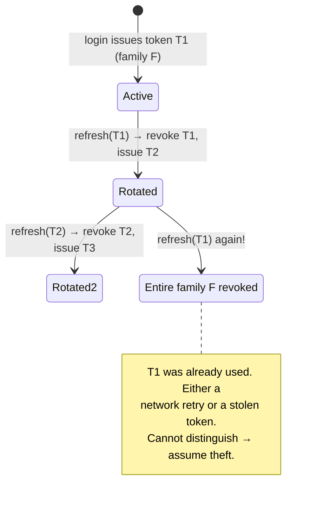

**A subtlety you must know before touching this code:** the family revocation
commits on a **dedicated session**. Why? Because the request is about to raise a
401, and raising rolls back the request transaction — which would roll back the
revocation too. The security action must survive the error response.

**MFA.** Two columns split "a secret exists" from "the factor is live"
(`mfa_secret` + `mfa_enabled`), plus `mfa_pending_secret` for re-enrolment. That
third column fixed a real self-lockout bug: writing a new seed directly to
`mfa_secret` while `mfa_enabled` stayed true meant an *abandoned* re-enrolment
left login verifying against a secret the user's old authenticator no longer
matched. Now enrolment writes *pending*, and a confirmed code promotes it.

The TOTP ticket is consumed with `GETDEL` **before** the code is checked, so one
ticket buys exactly one guess. Otherwise a 5-minute window is unlimited attempts
at a 6-digit code.

**Pitfall.** Every login failure path — locked out, unknown email, wrong
password, disabled — raises the **same generic 401**. A distinct "account locked"
message would confirm the address exists. If you add a failure path, match it.

---

## 3.4 `listings` — the core inventory

**Purpose.** Property inventory: CRUD, the publishing workflow, full-text and
geo search, reference codes, and the public site's read model. The
pattern-setting module — read it first.

**Tables.** `listings`, `listing_status_history`, `listing_reference_counters`.

**The workflow graph** (`service.py:76-92`) is data, not `if` statements:

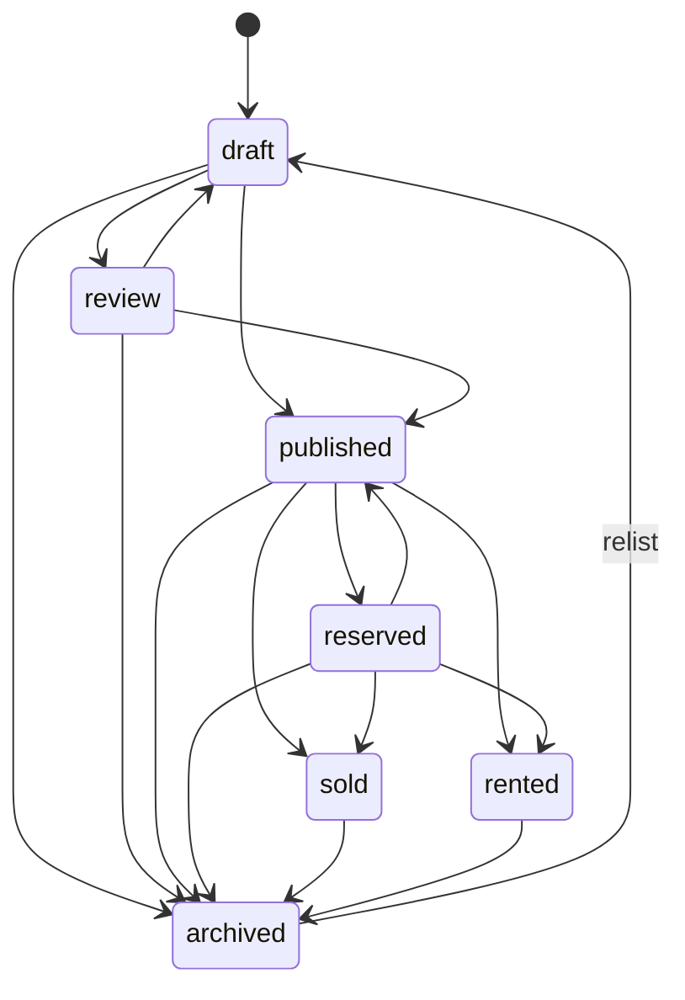

**Why a dict instead of `if`/`elif`?** Because the graph is then testable as
data, printable, and impossible to make inconsistent between two call sites. An
`if` chain spread across create/update/transition drifts.

**Reference codes** (`AGE-2026-00001`). Per tenant, per year, gap-free. Minted
by an atomic upsert:

```sql
INSERT INTO listing_reference_counters (tenant_id, year, last_value)
VALUES (:t, :y, 1)
ON CONFLICT (tenant_id, year)
DO UPDATE SET last_value = listing_reference_counters.last_value + 1
RETURNING last_value
```

*Why not `MAX(reference_code) + 1`?* Two concurrent creates would both read the
same max and mint the same code. The upsert is a single atomic statement — the
database serialises it.

**Ownership scoping** is the security core. Three roles, three visibilities:

| Role | Sees |
|---|---|
| `agent` | Listings assigned to or created by them |
| `team_lead` | Their own + their team members' |
| `admin` / `marketing` | Tenant-wide |

Implemented as a `scope_user_ids` argument the repository turns into a
`WHERE agent_id IN (...) OR created_by IN (...)`. Crucially, **a scoped miss is a
404, not a 403**:

```python
if listing is None:
    # 404 for both "doesn't exist" and "not yours" — no existence oracle.
    raise NotFoundError("Listing not found.")
```

*Why?* A 403 confirms the row exists. An attacker enumerating UUIDs learns which
ids are real. 404 for both leaks nothing.

**Search** (Part 7 lives in this module, deliberately). A STORED generated
`tsvector` column covers all three locales, each through its own text-search
config, weighted title > description > city:

```sql
setweight(to_tsvector('french',  coalesce(title ->> 'fr','')), 'A') ||
setweight(to_tsvector('english', coalesce(title ->> 'en','')), 'A') || ...
```

*Why generated rather than a trigger?* `to_tsvector(regconfig, text)` and
`jsonb ->>` are both immutable, so Postgres can compute the column itself. No
trigger to forget, no way for the index to drift from the data.

**Pitfalls.**
- `/map` is declared **before** `/{ref_or_id}` — route matching is
  declaration-order, so the reverse would make `/map` match as a reference code.
- `eager_defaults=True` on `Base` is required: async sessions cannot lazy-refresh
  `updated_at` after an UPDATE, and serializing a flushed object would raise
  `MissingGreenlet`.
- SQLAlchemy refuses `bool_column < python_bool`, so the keyset's featured branch
  uses `is_(False)` / `false()`.
- FastAPI 0.139 silently degrades a Pydantic query-param model to a required
  scalar if any plain `Query()` sits beside it — so all query params fold into
  one model.

**Safe modification.** New status = add to the enum *and* to `ALLOWED_TRANSITIONS`
(both, or it becomes unreachable/inescapable). New filter = add to
`PublicListingFilters` and to `_published_filtered` (one place, shared by list /
map / count, so they cannot disagree).

---

## 3.5 `media` — photos and documents

**Purpose.** Upload, process, and serve listing media. The reference example of
"the file never touches FastAPI".

**Upload flow:**

```mermaid
sequenceDiagram
    participant C as Client
    participant API
    participant S3 as MinIO/S3
    participant W as Worker

    C->>API: POST /portal/listings/{id}/media/uploads
    API->>API: quota check (FOR UPDATE on listing)
    API->>S3: presign PUT (15 min)
    API-->>C: {uploadUrl, mediaId}
    C->>S3: PUT the bytes directly
    C->>API: POST /portal/media/{id}/confirm
    API->>API: status = processing
    API-->>C: 202
    Note over API,W: post-commit: enqueue process_media
    W->>S3: HEAD (real size — before buffering!)
    W->>S3: GET object
    W->>W: verify magic bytes vs declared type
    W->>W: libvips variants (thumb/card/gallery/full × webp/jpeg)
    W->>W: blurhash from a 32px render
    W->>S3: PUT variants (content-hashed keys)
    W->>API: status = ready
```

**Why presign instead of proxying the upload?** A 10 MB upload through FastAPI
occupies a worker process and a connection for the whole transfer. Presigning
means the client talks to S3 directly; the API handles two tiny JSON calls.

**Three security lessons in this module:**

1. **HEAD before GET.** A presigned PUT cannot cap `Content-Length`, so the
   client's declared `sizeBytes` is a *claim*, not proof. The worker HEAD-checks
   the real size before `get_object` buffers the body — otherwise a client PUTs a
   5 GB file and the worker OOMs reading it.
2. **Magic-byte verification.** The declared content type is also a claim.
3. **`keep="none"` on every variant** strips all metadata including EXIF GPS. A
   seller's photo would otherwise publish their home's exact coordinates.

**Validation failure vs infrastructure failure** — the split that appears
everywhere in this codebase:

| Failure | Action | Retry? |
|---|---|---|
| Wrong magic bytes, oversized | mark `failed`, delete original | Never |
| S3 timeout, transient error | leave `processing` | Yes, with backoff |

**Pitfall.** Deleting media enqueues object cleanup **post-commit** — a
rolled-back delete must not orphan-delete live files. And `_mark_ready` deletes
its own just-uploaded variants if it finds the row gone (deleted mid-processing).

---

## 3.6 `leads` — the CRM

**Purpose.** The revenue engine: capture a visitor, dedupe them into a contact,
score them, assign an agent, notify that agent fast, and nurture with a drip.

**Tables (5).** `contacts`, `leads`, `lead_activities`, `assignment_rules`,
`lead_drip_state`.

**Capture flow:**

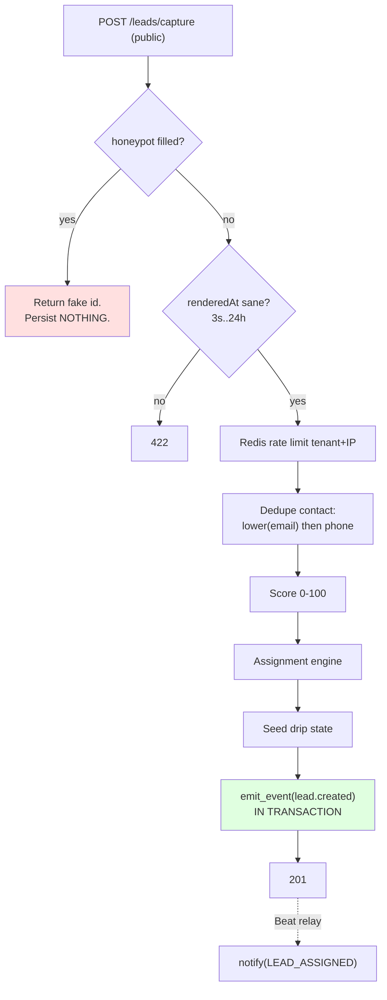

**Spam defence without CAPTCHA.** Two techniques:
- A **honeypot** field hidden by CSS. Humans never fill it; bots fill everything.
  Critically, a honeypot hit returns a **realistic response with a fake id** — a
  bot must not be able to tell it was caught, or it adapts.
- **`renderedAt`** timestamp: minimum 3s (humans do not fill forms instantly),
  maximum 24h (a stale form is a replayed one).

**Scoring** = source weight + listing-attached bonus + capped engagement −
recency decay − no-show penalty, clamped 0–100. Extracted behind a `LeadScorer`
protocol in Part 24, so a model-based scorer can replace the rules at one call
site with no leads change.

**Assignment strategies:**

| Strategy | Logic |
|---|---|
| `listing_agent` | The listing's assigned agent (default) |
| `round_robin` | Least-loaded agent in the pool, optional per-agent cap |
| `territory` | PostGIS `ST_Contains` on agents' service areas |

**The speed-to-lead retrofit (Part 31) — the best worked example of the outbox.**
Originally the notification was a post-commit `notify()`. If the broker hiccuped
in the gap between COMMIT and enqueue, **the lead was in the database and nobody
was told** — the agency paid for a lead they never saw. Now `emit_event()` writes
an `outbox` row *in the same transaction*, and the Beat relay delivers it with
at-least-once + backoff. Compare:

| | Post-commit hook | Outbox |
|---|---|---|
| Atomic with the lead? | No | **Yes** |
| Survives a broker outage? | No | **Yes** |
| Duplicates possible? | No | Yes (at-least-once) |

**Pitfall (and the reason a lazy import exists).** `leads.service` imports
`listings.service`; `favorites`' alert matcher imports both. Some of these
imports must be **lazy** (inside the function) to break a module-scope cycle. If
you hit `ImportError: cannot import name ... (most likely due to a circular
import)`, that is the fix — and Part 11 covers diagnosing it.

---

## 3.7 `agents` — profiles, teams, territories

**Purpose.** The public agent directory and the team structure that drives
*visibility scoping* across listings, leads, appointments, and deals.

**Tables.** `agent_profiles` (i18n bio, specialties, `service_areas`
MultiPolygon + GiST, photo, slug), `teams`, `team_members`.

**Why this module matters far beyond agent pages:** it owns
`scope_user_ids_for(tenant_id, actor)` — the single function that answers "which
users' rows may this actor see?"

```python
# ADMIN / MARKETING → None (tenant-wide)
# TEAM_LEAD        → self ∪ members of teams they lead
# AGENT            → {self}
```

`listings`, `leads`, `appointments`, and `transactions` all call it. Putting it
in one place means the definition of "my team" cannot drift between modules — and
if it did drift, the drift would be a data leak.

**A distinction worth internalising:** *visibility* and *action permission* are
separate.

- `TENANT_WIDE_ROLES` (visibility) — admin, marketing
- `MANAGES_ALL_ROLES` (action gates) — admin, marketing, **team_lead**

A team lead may *act* tenant-wide (reassign a listing) but only *see* their
team's rows. Conflating the two would either over-expose data or block
legitimate manager actions.

**Pitfall.** `build_agents_boundary(session)` is a factory that lets other
services inject just the boundary accessors without needing `request.app.state`
— that is what keeps `get_listing_service(session)` signatures stable when
agents grows a new dependency.

---

## 3.8 `favorites` — saved listings, saved searches, alerts

**Purpose.** Buyer-side persistence, and the first `/me` surface — where
**ownership is the authorization** (no RBAC permission; you operate on your own
rows by definition).

**The interesting design detail.** `saved_searches` stores the *validated
camelCase dump* of `PublicListingFilters` plus the creation-time locale:

```python
filters = {"purpose": "sale", "priceMax": 5000000, "q": "vue mer"}
locale  = "fr"
```

Two reasons: the stored blob replays through the **same** validation the search
endpoint uses (so a filter that no longer parses deactivates the row rather than
crashing the sweep), and the locale pins the FTS text-search config so `q` means
the same thing on replay as it did at creation.

**Anonymous signup is double-opt-in:**

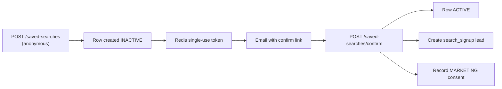

*Why double opt-in?* Anyone can type your email. Without confirmation you are a
spam vector, and under GDPR you have no proof of consent. The confirmation *is*
the consent record.

**Unsubscribe uses a stateless HMAC token**, not Redis. An unsubscribe link in
an email must work in six months — longer than any Redis TTL. `sign_value` with a
purpose domain means the token cannot be replayed as a different link type.

**Alerts.** Publishing a listing enqueues `match_published_listing`, which asks
`ListingService.published_matches` (an `EXISTS` on the *same* query builder the
search endpoint uses). So **matching can never disagree with search** — a saved
search cannot alert on something the search page would not return.

---

## 3.9 `appointments` — tours and availability

**Purpose.** Agent availability templates, slot computation, bookings with a
CRM link, reminders, and an iCal feed.

**The time model** is where the bugs hide, so be precise:

| Data | Stored as | Interpreted in |
|---|---|---|
| Availability windows | local time-of-day | tenant `settings.appointments.timezone` |
| Appointments | UTC instant | UTC |

Slot computation = availability − blocks − (busy ± buffer), stepping a fixed
grid from each window start, dropping past slots, bounded 90 days out.

**The booking race, and why an advisory lock.** Two visitors book the same slot
simultaneously. There is no row to `FOR UPDATE` — the appointment does not exist
yet. So:

```python
pg_advisory_xact_lock(hashtextextended(f"appointments:{tenant}:{agent}"))
```

Inside the lock, free slots are **re-derived** and the requested start must equal
a computed slot start exactly. That single mechanism kills both double-booking
and booking an arbitrary off-grid time.

> **Learn this pattern.** When you need to serialise "check then insert" and
> there is no existing row to lock, an advisory lock keyed on the logical
> resource is the tool. `FOR UPDATE` only works when the row already exists.

**The `forced_agent_id` detail.** A booking mints a lead, but the assignment
engine must **not** route it away from the agent the visitor is actually meeting.
So the lead is created with a forced agent (still re-validated as active).

**Pitfalls.**
- `date: date | None = None` in a Pydantic class body is a self-shadow — the
  assignment binds `date = None` before the annotation is evaluated, giving
  `TypeError: NoneType | NoneType`. Alias the module (`import datetime as dt`).
- `to_camel("reminder_1h_sent_at")` is `reminder1HSentAt` (capital H).
- There is deliberately **no** `APPOINTMENT_VIEW_ALL` permission — reach flows
  entirely through scoping, so the constant would be dead code.

---

## 3.10 `valuations` — seller funnel + mortgage calculator

**Purpose.** A multi-step "what is my property worth?" form that produces a
seller lead, plus a stateless mortgage calculator.

**No portal surface at all.** Agency-side visibility is the existing lead inbox
filtered by source, and the property payload lands on the lead timeline as a
`SYSTEM` activity. *Why?* Because a second CRUD surface for the same information
is maintenance cost with no user benefit.

**Multi-step state without server sessions.** The step token is a **stateless
HMAC capability token** pinned to `tenant:row_id`:

```
POST  /valuations              → {token}     (step 1: address)
PATCH /valuations/{token}      → 200         (step 2: details, repeatable)
POST  /valuations/{token}/complete → {band}  (step 3: contact → lead)
```

Forged, foreign-tenant, and unknown-id tokens all 404 with no oracle. Nothing has
to outlive a Redis TTL.

**The estimator.** A radius ladder [2, 5, 10] km, stopping at the first rung with
≥ 3 comparable sold listings; the band is the 25th/75th percentile of comp
price/m² × the subject's built area. **Too few comps → a null band, but the lead
is still created** — "an agent will contact you" is the product answer, not an
error.

**Pitfall.** The mortgage-email path recomputes the estimate server-side and
never trusts a client-echoed number. And a client-supplied `listing_id` is
validated through `ListingService.get_public` *before* the insert — otherwise a
bogus id is an uncaught FK `IntegrityError` → 500.

---

## 3.11 `content` — pages, legal, guides, reports

**Purpose.** The agency-site CMS: structured pages, versioned legal documents,
neighborhood guides with PostGIS boundaries, and gated market reports.

**Tables.** `content_pages`, `legal_pages`, `neighborhood_guides`, `market_reports`.

**Versioned legal pages** — the compliance-critical design. Every edit is a **new
row**, never an update:

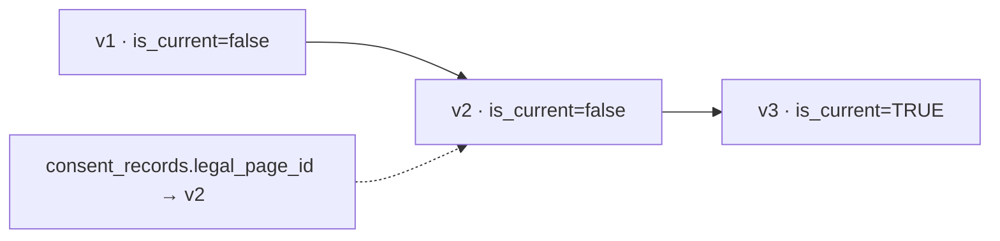

*Why append-only?* Because an agency must be able to prove **what a user
consented to and when**. If publishing v3 overwrote v2, every consent record
would point at text the user never saw. A partial-unique index
`(tenant_id, kind) WHERE is_current` keeps exactly one current version per kind.

**Auto-linking guides to listings is live, never a stored FK.** A listing
"belongs" to a guide if `ST_Contains(boundary, listing.location)`. *Why not a
column?* A listing can be edited to a new location, and a boundary can be
redrawn. A stored FK would silently go stale; a live query cannot.

**Gated report download** (§8.10's "email required → lead"):

```
GET  /reports/{slug}          → metadata + stats, pdfReady bool, NO url
POST /reports/{slug}/download → honeypot + email → lead → 15-min presigned GET
```

**Pitfall.** `Base.type_annotation_map` maps `dict[str, Any]` → JSONB but **not**
`list[dict[str, Any]]`, so `blocks` needs an explicit `JSONB` column type. Same
for blog's `tags`. This bites once per module.

Also: a shared `Field(...)` instance reused as a default across two schemas makes
the field **required in both** (a `FieldInfo` carries no default). Use an
`Annotated[...]` type alias applied independently per field.

---

## 3.12 `blog` — posts, categories, scheduled publish

**Purpose.** Content marketing: i18n posts, a small taxonomy, tag filtering,
scheduled publishing, and RSS.

**The first real XSS surface in the codebase.** Content pages store opaque
frontend-owned block JSON, but blog bodies are **rich text that renders as HTML**.
Sanitization uses `nh3` (Mozilla's ammonia) in the **service** at write time, per
locale:

- An **allowlist** of formatting tags (`p/br/strong/em/ul/ol/li/h2-h4/blockquote/a/img`)
- `url_schemes={http, https, mailto}` — blocks `javascript:`
- `link_rel="noopener noreferrer nofollow"` forced on every link

**Why allowlist, not denylist?** A denylist of dangerous tags is a losing game:
`<svg onload=>`, `<iframe srcdoc=>`, obscure event handlers, encoding tricks. An
allowlist rejects everything unknown by construction. **Sanitize on write, not
on read** — one write versus millions of reads, and a missed sanitization on one
read path is a live vulnerability.

**Three-state status** (`draft | scheduled | published`) with a Beat sweep every
5 minutes. The idempotency guard is the `status == SCHEDULED` filter — a re-run
no longer matches a published row.

**Pitfall (a real post-review fix).** A partial PATCH touching only
`scheduledAt` — status omitted, so still `SCHEDULED` — bypassed the
future-time validator entirely, because that validator only fires when the
*request* sets status. A past `scheduledAt` would persist and publish on the next
tick. The fix validates the **resulting state** in the service, not the request
shape.

> **Generalise that lesson:** schema validators see the *request*. Business
> invariants are about the *resulting row*. Validate invariants in the service.

---

## 3.13 `reviews` — testimonials and moderation

**Purpose.** Collect, moderate, aggregate, and embed reviews of agents (or the
agency as a whole).

**Schema notes.** `agent_user_id` nullable — **NULL means an agency-wide
testimonial**. Author name/email live **on the row**: a testimonial is not a lead,
so there is no `contacts` record and the module stays self-contained.

**One-way moderation.** `pending → approved | rejected`. Re-applying the same
terminal decision is idempotent (200); flipping approved↔rejected once decided
is a **409**. *Why?* Silently re-exposing or hiding a public testimonial is worse
than failing loudly.

**Reverse-boundary composition — an important pattern.** Agents must not import
reviews' models, but the agent profile page needs a rating rollup. Solution:
compose at the **router** layer.

```python
# agents/router.py injects ReviewsServiceDep
aggregates = await reviews.aggregates_by_agent(tenant, [...])  # ONE GROUP BY
```

Note `aggregates_by_agent` (plural) for the directory page — a single `GROUP BY`
rather than N queries. **This is the general escape hatch** when module A's
response needs module B's data and B depends on A: compose in the router, where
both services are already injected.

---

## 3.14 `notifications` — the unified fan-out

**Purpose.** One function every module routes user-facing notifications through:

```python
await notify(session, tenant, user_id, NotificationType.LEAD_ASSIGNED, payload, locale)
```

**Tables (4).** `notifications` (durable in-app row), `notification_preferences`,
`notification_sends` (append-only per-channel delivery log),
`notification_digest_items`.

**The preferences design is worth copying.** A *missing* row means "the type's
default". So a brand-new user gets sensible delivery with **no backfill**, and
adding a notification type does not require inserting rows for every existing
user.

**What `notify()` does:**

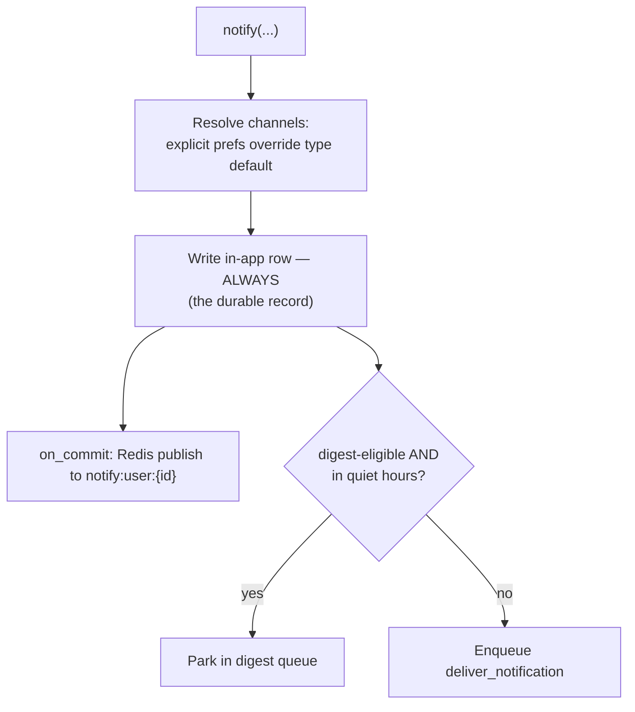

Note **one Redis channel per user**, not per tenant — fan-out stays O(1). And the
WS push is best-effort: a client reconciles against the DB on connect.

**WebSocket auth without a long-lived token in a URL.** A JWT in a query string
lands in proxy logs and browser history. Instead: an authenticated POST mints a
60-second single-use ticket in Redis; the WS handler redeems it with `GETDEL`
pinned to the tenant resolved from the `Host` header (the ASGI tenant middleware
only runs for HTTP scopes, so the WS handler resolves it itself).

**SMS/WhatsApp are logged `SKIPPED`, not silently dropped.** No adapter exists,
and pretending to deliver would make a real gap invisible in the delivery log.

**Pitfall.** `workers/db.py` drains post-commit callbacks so a worker-context
`notify()` behaves exactly like a request-context one. Without that, notifications
sent from a Beat sweep would never push to WS or enqueue their email.

---

## 3.15 `transactions` — deals, milestones, documents

**Purpose.** Back-office deal tracking after a lead converts: pipeline,
checklist, contracts, commissions.

**Portal-only** — deals are not a public concept.

**The commission gate is a field-level permission one level tighter than the
resource permission.** `DEAL_MANAGE` gets you the deal; only an **admin** may
read or set commission figures. For a non-admin, the response carries **no
commission keys on the wire at all** (not nulls — absent).

Note also that `marketing` has **no** `DEAL_MANAGE` at all: commissions are
sensitive and a marketer has no reason to see a back-office deal.

**The FastAPI gotcha this module discovered** — memorise it:

```python
class DealWithCommissionOut(DealOut): ...   # adds commission fields

@router.get("/{id}")
async def get_deal(...) -> DealOut:         # ← BUG
    return DealWithCommissionOut(...)       # commission keys STRIPPED
```

FastAPI's `response_model` coercion serializes by the **annotated** type, so
subclass fields are silently removed. The fix is a union, most-specific first:

```python
DealResponse = DealWithCommissionOut | DealOut
async def get_deal(...) -> DealResponse:
```

**Documents.** Presigned PUT to the private bucket; confirm HEAD-checks the
object and computes **sha256 server-side** (never trust the client's claim).
Done inline, not in a worker — back-office contracts are small, and a worker
round trip would only add latency. The e-signature columns exist as a **seam**;
the provider integration is deferred.

**Pitfall (post-review fix).** `_validate_links` covered `listing_id` /
`lead_id` / `contact_id` but not `owner_user_id`, so a bogus owner faulted as an
`IntegrityError` → 500 instead of a clean 404 — exactly the bug class the
validation existed to prevent. **When you add an FK, add it to the validator.**

---

## 3.16 `syndication` — pushing listings to portals

**Purpose.** Distribute listings to external portals, and serve pull-based feeds.

**The infrastructure/feature split** (the reference example):

| `integrations/portals/` | `modules/syndication/` |
|---|---|
| Adapter protocol, DTO, error split | `portal_sync_state` table (RLS) |
| Pure I/O, no DB | Admin router, RBAC |
| No RBAC, no router | Orchestration, circuit breaker |

**Circuit breaker.** 5 consecutive failures → `circuit_open`, and
`sync_to_portal` short-circuits **before calling the adapter**. *Why?* A portal
that is down does not need 200 retrying listings hammering it — that is a
retry storm that delays recovery and may get you rate-limited or blocked. A
success resets the counter; an admin re-push clears a tripped breaker.

**Where the retry decision lives.** The service returns
`SyncOutcome(retry=bool)` and the *task* calls `self.retry()`. Keeping the
decision in the service makes it testable without Celery.

**Pitfall (post-review fix).** `PUT /settings` did a full-namespace replace, but
`api_key` is write-only (GET returns only `hasApiKey`). So the natural
fetch-edit-PUT flow silently wiped a configured key. An omitted `api_key` now
carries the stored value forward. **Any write-only field needs this treatment.**

---

## 3.17 `analytics` — events, rollups, dashboards

**Purpose.** An anonymous batched event firehose, nightly rollups, and manager
dashboards.

**Tables.** `analytics_events` (**monthly range partitions**) + three daily
rollup tables.

**Why partition the raw table?** Retention. Pruning 90-day-old rows with
`DELETE` on a huge table is slow, bloats the table, and needs a `VACUUM`.
Dropping a whole month partition is a near-instant metadata operation.

Two consequences you must know:
- The partition key must be part of every PK, so the PK is composite
  `(created_at, id)`.
- RLS is enabled on the **parent** and Postgres propagates it to partitions.
  (Verified empirically: children show `relrowsecurity=f`, but a query routed
  through the parent still enforces the parent's policy.)
- Partition DDL needs the **DDL role** — `app_user` has no `CREATE` on schema
  `public`. Hence `run_ddl()` in `workers/db.py`.

**Ingestion is a tight allowlist.** The event type enum is fixed, and each type
validates against a small typed payload via a **discriminated union** on
`eventType`. Anonymous clients cannot invent types or smuggle arbitrary JSONB —
which would be both an abuse vector and unbounded storage growth.

**Dashboards read only from rollup tables, never raw events.** Rollups upsert
absolute recomputed values (`ON CONFLICT DO UPDATE`, not `+=`), so re-aggregating
a day is idempotent.

**The authorization split is instructive.** Four tenant-wide dashboards require
`ANALYTICS_VIEW`. But the per-listing report sits on its **own router gated by
authentication alone** — it is visibility-scoped to the actor's own listings, so
**ownership is the authorization**. An agent sees their numbers; a buyer with no
listings gets an allowed-but-empty 200.

---

## 3.18 `compliance` — consent, cookies, DSR

**Purpose.** GDPR-shaped machinery: consent proof, cookie config, data-subject
export/erasure, retention sweeps, and a tenant-scoped audit report.

**Mostly a thin orchestrator.** The export/erasure fan-out reads and writes
through `LeadsService` / `FavoritesService` / `NotificationsService` /
`UserService` — never their tables. Compliance owns only its own three tables.
It is the best demonstration that the boundary rule scales.

**`consent_records` is append-only proof.** A withdrawal is a **new row** with
`granted=false`. Subject identity is `user_id` **or** `email` **or** `session_id`
(at least one — a signed-in user in a browser carries both).
`user_id`/`legal_page_id` are `ON DELETE SET NULL` so the **proof outlives** the
account or policy version it names.

**The erasure purge makes per-data-type judgements** — this is the part people
get wrong, so study the table:

| Data | Action | Why |
|---|---|---|
| CRM contacts | **Anonymize** | The agency's pipeline history is a legitimate business record; strip PII, keep the shape |
| Account row | **Tombstone** | FKs across the app point at it; a hard delete would cascade business records |
| Favorites, saved searches | **Hard delete** | Pure preference rows, no business value |
| Notifications | **Delete** | Transient messages (the `notification_sends` log survives — no PII, it is the audit record) |

"Delete everything" would destroy an agency's legitimate records; "keep
everything" fails the regulation. The judgement is per data type.

**`DELETE /me` force-revokes live tokens immediately** — a soft-deleted account
must not keep working off a still-valid 15-minute JWT. The test suite caught that
gap.

**Pitfall.** `dsr_requests` is tenant-RLS, so the purge sweep must run inside a
**tenant-scoped** transaction. An unscoped `run_scoped(None, ...)` sees nothing
(fail-closed) — the sweep would silently do nothing forever.

---

## 3.19 `webhooks` — outbound delivery

**Purpose.** Tenant-registered HTTP endpoints that receive signed domain events.

**Signing** uses the **same** Stripe-style `t=<unix>,v1=<hmac-sha256>` scheme as
the inbound billing webhook. One signing convention in the codebase, not two.

**The SSRF guard (`core/net.py`) — read this even if you never touch webhooks.**
A tenant admin supplies an arbitrary URL that the *server* then fetches. Without
a guard they can point it at:

| Target | What they get |
|---|---|
| `http://169.254.169.254/` | Cloud instance metadata → credentials |
| `http://localhost:5432` | Your database |
| `http://10.0.0.5/admin` | Internal admin panels |

The guard rejects non-http(s) and any host resolving to a non-public address,
delegating the determination to `ipaddress.is_global` (no hand-maintained CIDR
list to drift), with IPv4-mapped-IPv6 unwrapping so `::ffff:127.0.0.1` cannot
sneak past.

**And validating once is not enough.** Two bypasses:

1. **DNS rebinding.** Validate `evil.com` → resolves public. httpx then does its
   *own* resolution to connect → now returns `127.0.0.1`. Fixed by resolving
   **once**, validating that address, and **pinning the connection to it** — the
   URL host is rewritten to the IP literal while the hostname rides in the `Host`
   header and TLS SNI.
2. **Redirect to private.** A public URL 302s to `http://localhost`. Fixed by
   re-checking **every redirect hop**.

---

## Part 3 Summary

**Patterns that recur across modules** — learn these once and you can read any
of the 19:

| Pattern | Where it appears |
|---|---|
| Scoped miss → **404, never 403** | listings, leads, deals, appointments, reviews |
| Honeypot returns a **realistic fake** response | leads, valuations, reviews, reports, saved searches |
| Permanent vs transient error split | media, portals, webhooks, AI, billing |
| Idempotency via status filter / timestamp stamp | every Beat sweep |
| `FOR UPDATE` for read-validate-write | listings transitions, media quota, deals |
| Advisory lock when there is no row yet | appointments booking |
| Append-only for proof | legal pages, consent records, status history, audit log |
| Write-only secret (`hasApiKey`) | syndication, webhooks |
| Boundary accessor instead of a model import | everywhere |
| Router-level composition for reverse dependencies | agents ← reviews |
| Stateless HMAC token for long-lived links | valuations, iCal, unsubscribe, preview |
| Sanitize on write, not on read | blog |

### Exercise 3

1. `favorites` needs a listing's title for an alert email. Write the boundary
   method signature you would add to `ListingService`, and say why the alert task
   must not query `listings` directly.
2. Why does a scoped miss return 404 rather than 403? Give the concrete attack a
   403 enables.
3. `appointments` uses an advisory lock; `listings` uses `FOR UPDATE`. Explain the
   difference in one sentence.
4. Trace a `lead.created` event from `emit_event` to a delivered webhook POST,
   naming each file it passes through.
5. Where is the *only* correct place to add a new listing status, and what second
   file must change in the same commit?

---

# Part 4 — Database

This part teaches the database layer from zero: how the ORM works, how the schema
is organised, how isolation is enforced, and how migrations are managed.

## 4.1 How SQLAlchemy actually works

You will be far more effective at debugging if you understand what the ORM is
doing rather than treating it as magic. Four concepts.

### Concept 1: The declarative mapping

`Base` (`core/database.py:40-48`) is the registry that connects Python classes to
database tables:

```python
class Base(DeclarativeBase):
    metadata = MetaData(naming_convention=NAMING_CONVENTION)
    type_annotation_map = {
        datetime: TIMESTAMP(timezone=True),
        dict[str, Any]: JSONB,
    }
    __mapper_args__ = {"eager_defaults": True}
```

When you write `class Listing(Base)` with `price: Mapped[Decimal]`, SQLAlchemy
inspects the type annotation and consults `type_annotation_map` to pick a column
type. This is why `dict[str, Any]` becomes JSONB automatically — **and why
`list[dict[str, Any]]` does not** (it is not in the map, which is the gotcha
Parts 14 and 15 both hit).

`Base.metadata` is the in-Python picture of the whole schema. Alembic's
autogenerate diffs it against the live database — which is why an un-imported
models module looks like tables that should be dropped.

### Concept 2: The Session as a unit of work

> A **Session** is an in-memory workspace holding objects you have loaded or
> created, tracking what changed, and translating those changes to SQL at flush
> time.

```python
listing = Listing(title={"fr": "Villa"}, price=Decimal("5000000"))
repo.add(listing)          # session.add — in memory only, NO SQL yet
await repo.flush()         # NOW: INSERT ... RETURNING id
print(listing.id)          # populated by RETURNING
# ... more work in the same transaction ...
# COMMIT happens at the request boundary
```

Three distinct operations people conflate:

| Operation | What happens | Reversible? |
|---|---|---|
| `add()` | Object joins the session's pending set. No SQL. | Trivially |
| `flush()` | Pending SQL is sent. Ids assigned. Visible in-transaction. | Yes — rollback |
| `commit()` | Transaction ends. Durable. | **No** |

**The identity map.** A session keeps one Python object per primary key. Load the
same listing twice in one session and you get **the same object**:

```python
a = await repo.get(tenant_id, listing_id)
b = await repo.get(tenant_id, listing_id)
assert a is b   # True — same object
```

Consequence: mutating `a.status` also changes `b.status`, because they are one
object. This is usually what you want, but it explains "I changed it over here and
it changed over there".

### Concept 3: Async SQLAlchemy and the greenlet

This is the single most confusing part of the stack, and understanding it
prevents a whole class of errors.

The database driver (`asyncpg`) is async. But SQLAlchemy's core is decades of
synchronous code. The bridge is a **greenlet** — a lightweight coroutine that
lets synchronous code "await" by switching out.

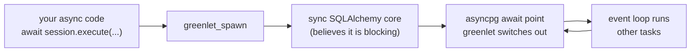

Two consequences you will meet:

**1. `MissingGreenlet` errors.** Touching an attribute that needs a database
round trip *outside* a greenlet context raises `MissingGreenlet: greenlet_spawn
has not been called`. The two triggers are lazy relationship loads and expired
attributes. The codebase avoids both:

```python
expire_on_commit=False               # objects stay usable after commit
__mapper_args__ = {"eager_defaults": True}   # fetch server defaults via RETURNING
```

Without `eager_defaults`, serializing a flushed object to read `updated_at` (set
by `onupdate=func.now()`) would try to refresh from the DB and raise.

**2. Coverage cannot see through it.** Service code running inside the greenlet is
invisible to coverage's tracer — `transactions/service.py` measured 42% while its
tests demonstrably exercised it. Hence `pyproject.toml`:

```toml
[tool.coverage.run]
concurrency = ["greenlet", "thread"]
```

That single line took the modules+core total from 80% to 92%. The code was never
under-tested; it was under-**measured**.

### Concept 4: ORM to SQL — a worked example

```python
stmt = (
    select(Listing)
    .where(Listing.tenant_id == tenant_id, Listing.deleted_at.is_(None))
    .where(Listing.status == ListingStatus.PUBLISHED)
    .order_by(Listing.published_at.desc(), Listing.id.desc())
    .limit(25)
)
rows = list((await session.execute(stmt)).scalars())
```

becomes:

```sql
SELECT listings.id, listings.tenant_id, listings.reference_code, ...
FROM listings
WHERE listings.tenant_id = $1 AND listings.deleted_at IS NULL
  AND listings.status = $2
ORDER BY listings.published_at DESC, listings.id DESC
LIMIT 25
```

`.scalars()` unwraps single-column rows to the entity. **To see the real SQL when
debugging**, set `echo=True` on the engine or use `print(stmt)`.

## 4.2 The schema: 51 tables

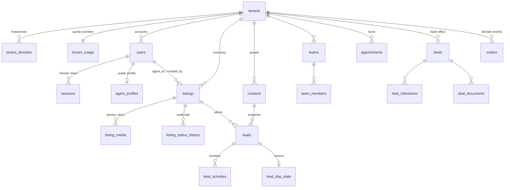

**Tenant ownership is the organising principle.** Almost every table carries
`tenant_id` with `ON DELETE CASCADE`, so deleting a tenant removes all its data in
one statement (which is exactly how the offboard purge works).

**Three tenancy categories:**

| Category | Tables | RLS |
|---|---|---|
| Global (no tenant) | `tenants`, `tenant_domains`, `tenant_usage`, `tenant_subscriptions`, `billing_events`, `audit_log` | None — queried before a tenant is known |
| Identity (nullable tenant) | `users`, `sessions`, `oauth_identities` | Identity RLS (`IS NOT DISTINCT FROM`) |
| Tenant-owned (NOT NULL) | The other ~42 | Strict tenant RLS |

## 4.3 Primary keys: why UUIDv7

```python
class UUIDPrimaryKeyMixin:
    id: Mapped[uuid.UUID] = mapped_column(primary_key=True, default=uuid7)
```

Compare the three options:

| PK type | Guessable? | Time-ordered? | Multi-tenant safe? |
|---|---|---|---|
| `SERIAL` (auto-increment) | **Yes** — `/listings/42` invites `/listings/43` | Yes | Leaks volume: id 5000 tells a competitor your listing count |
| UUIDv4 (random) | No | **No** — random insert order fragments the B-tree index | Yes |
| **UUIDv7** | No | **Yes** — first 48 bits are a timestamp | Yes |

UUIDv7 gets you unguessability *and* time-ordering. The second property matters
twice: index locality (new rows append to the right edge of the B-tree rather
than scattering), and **`id` doubles as a stable tiebreaker in keyset
pagination** — which is why cursors here are `(sort_key, id)`.

## 4.4 Constraints — pushing invariants into the database

An invariant enforced only in Python holds until someone writes a script,
a migration, or a second code path. In the database it always holds.

**Unique constraints.**

```python
__table_args__ = (UniqueConstraint("tenant_id", "reference_code"),)
```

Note it is `(tenant_id, reference_code)`, not `reference_code` alone — two
agencies may both use `VIL-2026-00001`. **Every uniqueness rule in a multi-tenant
schema must be scoped by tenant.** Getting this wrong means agency B cannot use a
slug agency A already took, which is a bizarre bug from the customer's side.

**Partial unique indexes** enforce "at most one X where Y":

```sql
CREATE UNIQUE INDEX ... ON listing_media (listing_id) WHERE is_cover;
CREATE UNIQUE INDEX ... ON legal_pages (tenant_id, kind) WHERE is_current;
```

One cover photo per listing; one current version per legal-page kind. A plain
unique index cannot express this.

**Check constraints** encode either/or rules:

```python
CheckConstraint("(day_of_week IS NULL) <> (date IS NULL)", name="weekly_xor_exception")
CheckConstraint("rating BETWEEN 1 AND 5", name="rating_range")
```

**FK delete behaviour is a business decision, not a default.** Choose
deliberately:

| Behaviour | Meaning | Used for |
|---|---|---|
| `CASCADE` | Delete children with the parent | `tenant_id` everywhere; a deleted tenant leaves nothing |
| `SET NULL` | Keep the child, forget the link | `listing_id` on a review — a removed listing must not delete the testimonial |
| `RESTRICT` | Refuse to delete the parent | `owner_user_id` on a deal |

Ask: *if the parent disappears, is the child meaningless (CASCADE), still
meaningful (SET NULL), or is the delete itself wrong (RESTRICT)?*

**Enums are `native_enum=False`.** They become `VARCHAR + CHECK` rather than a
Postgres `ENUM` type:

```python
Enum(ListingStatus, name="listing_status", native_enum=False, length=20,
     values_callable=lambda e: [m.value for m in e])
```

*Why?* Adding a value to a Postgres native enum requires `ALTER TYPE ... ADD
VALUE`, which historically could not run inside a transaction and complicates
rollback. With a check constraint, adding an enum value is often a **code-only
change**. (Verified against the live DB: several parts added enum values with no
migration at all.)

## 4.5 Indexes — and how to reason about them

An index is a sorted lookup structure. Without one, Postgres reads every row
(a sequential scan). Every index costs write time and disk, so they are added
deliberately, for a query that exists.

| Type | Used for | Example here |
|---|---|---|
| B-tree (default) | Equality, ranges, sorting | `tenant_id`, all FKs |
| Composite | Multi-column filters/sorts | `(tenant_id, status, featured DESC, published_at DESC)` |
| GIN | Containment in JSONB / arrays / tsvector | `features @> '["pool"]'`, `search_vector @@ query` |
| GiST | Geometry | `location` (PostGIS) |
| Partial | A subset of rows | `WHERE is_cover` |
| Expression | A computed value | `lower(email)` |

**Composite column order is not arbitrary.** For
`(tenant_id, status, featured DESC, published_at DESC)`, Postgres can use it for:

- `WHERE tenant_id = ?` ✓
- `WHERE tenant_id = ? AND status = ?` ✓
- `WHERE tenant_id = ? AND status = ? ORDER BY featured DESC, published_at DESC` ✓ (the exact default query)
- `WHERE status = ?` alone ✗ — cannot skip the leading column

**Rule: order columns most-selective-and-always-present first.** Here that is
always `tenant_id`, because every query filters it.

**Expression indexes must match the query exactly.** `ix_contacts_tenant_email`
is on `lower(email)`, so the query must also say `lower(email) = lower(:email)`.
A query on bare `email` will not use it — and the write path must normalise to
match, which is why `ContactUpdate` lowercases email.

**Diagnosing.** `EXPLAIN ANALYZE` is the tool:

```sql
EXPLAIN ANALYZE SELECT * FROM listings WHERE tenant_id = '...' AND status = 'published';
```

Look for `Seq Scan` on a large table (bad) versus `Index Scan` (good), and compare
`rows=` estimated against actual — a large mismatch means stale statistics
(`ANALYZE`).

## 4.6 Transactions and isolation

> A **transaction** is a group of statements that either all take effect or none
> do.

The four ACID properties, concretely:

| Property | Meaning here |
|---|---|
| **A**tomicity | A failed lead capture leaves no partial contact/lead/activity rows |
| **C**onsistency | Constraints hold at every commit |
| **I**solation | Concurrent transactions do not see each other's uncommitted work |
| **D**urability | A committed lead survives a crash |

**Postgres defaults to READ COMMITTED**, which this codebase uses. Each statement
sees a snapshot taken at *statement* start. That allows a **lost update**:

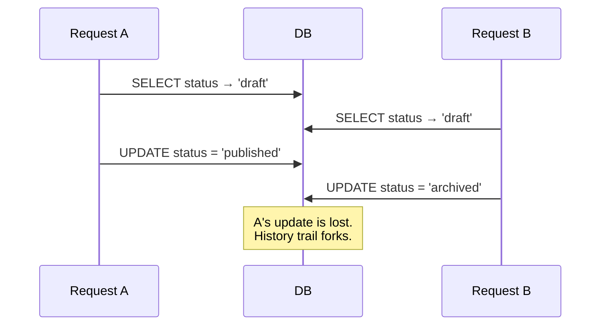

**The fix used throughout: `SELECT ... FOR UPDATE`.**

```python
listing = await self.repo.get(tenant_id, listing_id, for_update=True)
```

`FOR UPDATE` takes a row lock, so B blocks until A commits, then **re-reads the
committed state** and re-validates the transition. Every read-validate-write flow
here uses it: workflow transitions, deletes, media quota checks, deal updates,
moderation.

**When there is no row to lock**, use an advisory lock (appointments booking):

```python
pg_advisory_xact_lock(hashtextextended(f"appointments:{tenant}:{agent}"))
```

An arbitrary named lock, released automatically at transaction end.

**And when you can express it as one statement, prefer that** — no lock needed,
because a single statement is atomic:

```sql
INSERT INTO listing_reference_counters (tenant_id, year, last_value)
VALUES (:t, :y, 1)
ON CONFLICT (tenant_id, year) DO UPDATE SET last_value = ... + 1
RETURNING last_value
```

| Concurrency need | Tool |
|---|---|
| Read, validate, then write the same row | `FOR UPDATE` |
| Check-then-insert with no existing row | Advisory lock |
| Counter increment / upsert | `ON CONFLICT DO UPDATE` |
| Batch claim across workers | `FOR UPDATE SKIP LOCKED` |

`SKIP LOCKED` deserves a note: the outbox relay uses it so two concurrent ticks
**skip** rows the other has claimed rather than blocking. Blocking would serialise
the relay; skipping lets both make progress.

## 4.7 Tenant isolation — the four layers

This is the heart of the system. Isolation is enforced **four independent times**,
so that any single failure is not a breach.

```mermaid
graph TD
    L1["<b>Layer 1 — Middleware</b><br/>Host → TenantContext, before any route runs"]
    L2["<b>Layer 2 — Session GUC</b><br/>SET LOCAL app.tenant_id per transaction"]
    L3["<b>Layer 3 — Explicit filters</b><br/>every repository method takes tenant_id"]
    L4["<b>Layer 4 — Postgres RLS</b><br/>policy the app role cannot bypass"]
    L1 --> L2 --> L3 --> L4
    style L4 fill:#e6f4ea
```

### Layer 1 — Middleware

`TenantResolutionMiddleware` resolves `Host` → `TenantContext` and attaches it to
the scope. Unknown host → 404; suspended tenant → 402. Nothing downstream can run
without a tenant (except explicitly exempt prefixes).

### Layer 2 — The session GUC

```python
await session.execute(
    text("SELECT set_config('app.tenant_id', :tenant_id, true)"),
    {"tenant_id": str(tenant_id)},
)
```

`set_config(..., is_local => true)` is the key: **`true` scopes it to the
transaction**, so it is discarded on commit or rollback. If it were session-scoped
and the connection returned to the pool, the *next* request on that connection
would inherit the previous tenant's id — a catastrophic cross-tenant leak.

### Layer 3 — Explicit filters

> **Every repository method takes `tenant_id`. No exceptions.**

```python
def _base(self, tenant_id, *, scope_user_ids=None):
    stmt = select(Listing).where(Listing.tenant_id == tenant_id, ...)
```

*Why bother if RLS exists?* Three reasons: it keeps the index working (RLS adds a
predicate but the explicit filter is what the planner sees first), it fails
loudly in code review when missing, and the global tables have no RLS at all.

### Layer 4 — Row-level security

This is the layer that saves you when the other three have a bug.

```sql
ALTER TABLE listings ENABLE ROW LEVEL SECURITY;
CREATE POLICY tenant_isolation ON listings
  USING (tenant_id = current_setting('app.tenant_id')::uuid);
```

**Note the deliberate absence of `missing_ok`.** `current_setting('app.tenant_id')`
without the second argument **raises** if the GUC is unset. That is fail-closed by
design: a query that forgot to set the tenant **errors loudly** instead of quietly
returning zero rows. A silent empty result is the worse failure — it looks like
"no data" and can ship to production unnoticed.

**RLS only applies to non-superusers**, which is why the app connects as
`app_user` and Alembic uses a separate `DATABASE_DDL_URL` as `postgres`:

| Role | Used by | RLS applies? | Can CREATE? |
|---|---|---|---|
| `app_user` | The application | **Yes** | No |
| `postgres` | Alembic, partition DDL | No (bypasses) | Yes |

If the app connected as `postgres`, RLS would be decoration — Layer 4 would not
exist. **This is why the two URLs must never be pointed at the same role.**

### The identity-RLS variant

`users` and `sessions` need a different policy because `tenant_id` is nullable:

```sql
USING (tenant_id IS NOT DISTINCT FROM NULLIF(current_setting('app.tenant_id', true), '')::uuid)
```

Here `missing_ok=true` is correct — platform requests legitimately set no GUC and
must reach the NULL-tenant staff rows. `IS NOT DISTINCT FROM` is null-safe
equality, keeping it strict in both directions.

### Proving it works

`tests/test_rls.py` and `tests/test_tenant_isolation.py` are the guard. The
isolation harness is parametrized over 10 portal resources × three assertions:

1. Tenant B's **admin** gets 404 on tenant A's row id.
2. That row does not appear in B's list.
3. An **unknown** id gives the *same* 404 — which is what makes the isolation 404
   non-informative.

Plus a **drift guard**: a new module fails the suite until it is registered. That
turns "remember to test isolation" into "the suite tells you".

## 4.8 PostGIS — geography

PostGIS adds geometry types and spatial indexes.

```python
location: Mapped[WKBElement | WKTElement | None] = mapped_column(
    Geometry(geometry_type="POINT", srid=4326, spatial_index=False)
)
```

`srid=4326` is WGS84 — plain latitude/longitude, what GPS and browsers use.

**Geometry vs geography** — this distinction causes real bugs:

| Type | Units | Correct for |
|---|---|---|
| `geometry` | Degrees | Fast bounding-box prefilters |
| `geography` | **Metres** | True distance on a sphere |

A degree of longitude is ~111 km at the equator and ~0 km at the poles, so
"within 0.05 degrees" is not a distance. The codebase uses **both, in sequence**:

```python
# 1. Cheap, GiST-indexable degree prefilter
Listing.location.op("&&")(func.ST_Expand(point, degrees))
# 2. Exact spherical distance on the survivors
func.ST_DWithin(cast(Listing.location, Geography), cast(point, Geography), radius_m)
```

The prefilter uses the index to cut millions of rows to hundreds; the exact check
runs only on those. Doing only step 2 would be correct but slow (no index); only
step 1 would be fast but wrong.

**Untrusted polygons are hardened.** A user-drawn shape may self-intersect, which
makes PostGIS raise:

```python
func.ST_CollectionExtract(func.ST_MakeValid(polygon), 3)
```

`ST_MakeValid` repairs it; `ST_CollectionExtract(..., 3)` keeps only polygons.
Result: a bad shape **degrades** instead of 500-ing. And WKT is only ever built
from **schema-validated floats** — never string-concatenated from user input,
which would be injection into the WKT parser.

## 4.9 Connection pooling

Opening a Postgres connection costs ~5–50ms (TCP, TLS, auth, backend fork). Doing
that per request would dominate your latency budget. A **pool** keeps connections
open and hands them out.

```python
create_async_engine(settings.database_url, pool_pre_ping=True)
```

Defaults: `pool_size=5`, `max_overflow=10` → up to 15 connections per process.

**`pool_pre_ping=True`** issues a cheap `SELECT 1` before handing over a
connection. Without it, a connection killed by a restart or an idle timeout is
handed to your request and fails — the classic "first request after a quiet
period always errors".

**The capacity arithmetic you must do before scaling:**

```
API replicas × (pool_size + max_overflow) + workers × concurrency ≤ max_connections
```

Postgres defaults to `max_connections = 100`. So:

| Setup | Connections |
|---|---|
| 4 API replicas × 15 | 60 |
| 2 workers × 4 concurrency | 8 |
| Beat | 1 |
| **Total** | **69** — fits, with headroom |
| 10 API replicas × 15 | 150 — **exceeds 100, outage** |

Past ~6 replicas you need **PgBouncer** (Part 8.5), not a bigger
`max_connections` — each Postgres connection is a process with its own memory, so
raising the limit trades a hard failure for memory exhaustion.

**Workers deliberately do not share the pool.** `run_scoped` creates a
short-lived engine per call. Sharing a pool across `fork()` gives two processes
the same socket — corruption. `run_scoped_many` shares one engine across a batch,
which is the middle ground for per-tenant sweeps.

## 4.10 Alembic migrations

> A **migration** is a versioned, reviewable script that moves the schema from one
> state to the next, with an `upgrade()` and a `downgrade()`.

*Why not just `create_all()` from the models?* Because it cannot alter an existing
table without losing data, gives no ordering across deploys, and offers no
rollback. Migrations are the schema's version control.

**The chain** is linear: `0001 → 0002 → … → 0024`, each declaring
`down_revision`. Alembic stores the current revision in `alembic_version`.

**Workflow:**

```bash
# 1. Edit models.py
# 2. Autogenerate a draft
uv run alembic revision --autogenerate -m "add listing energy rating"
# 3. HAND-REVIEW the generated file — always
# 4. Apply
uv run alembic upgrade head
# 5. Verify the downgrade works
uv run alembic downgrade -1 && uv run alembic upgrade head
```

**Step 3 is not optional.** Autogenerate cannot detect:

| Not detected | Consequence |
|---|---|
| RLS policies | New table has **no isolation** |
| `PARTITION BY` / `PARTITION OF` | Partitioning silently absent |
| Server-side computed columns | Generated column missing |
| Table/column **renames** | Emitted as drop + create — **data loss** |
| Data backfills | New NOT NULL column fails on existing rows |

The rename case is the dangerous one: a rename looks exactly like "drop this
column, add that one" in a schema diff.

**Every tenant table needs its RLS statements added by hand:**

```python
from app.core.rls import enable_tenant_rls_sql, disable_tenant_rls_sql

def upgrade():
    op.create_table("my_table", ...)
    for stmt in enable_tenant_rls_sql("my_table"):
        op.execute(stmt)

def downgrade():
    for stmt in disable_tenant_rls_sql("my_table"):
        op.execute(stmt)
    op.drop_table("my_table")
```

**Deterministic constraint naming** (`core/database.py:31-37`) makes autogenerated
migrations reviewable — without it, constraint names differ between environments
and diffs are full of noise:

```python
NAMING_CONVENTION = {
    "ix": "ix_%(column_0_label)s",
    "uq": "uq_%(table_name)s_%(column_0_name)s",
    "ck": "ck_%(table_name)s_%(constraint_name)s",
    "fk": "fk_%(table_name)s_%(column_0_name)s_%(referred_table_name)s",
    "pk": "pk_%(table_name)s",
}
```

**Zero-downtime migrations: expand/contract.** During a rolling deploy, old and
new code run **simultaneously**. So a migration must be compatible with both.

Renaming `phone` → `phone_number` safely takes three deploys:

```mermaid
graph LR
    A["Deploy 1 — EXPAND<br/>Add phone_number, backfill,<br/>write BOTH, read old"] --> B["Deploy 2 — MIGRATE<br/>Read new, still write both"]
    B --> C["Deploy 3 — CONTRACT<br/>Stop writing old,<br/>drop the column"]
```

**Rules for a rolling deploy:**

| Safe | Unsafe |
|---|---|
| Add a nullable column | Add NOT NULL without a default |
| Add a table | Drop a column old code still reads |
| Add an index (`CONCURRENTLY`) | Rename anything in one step |
| Widen a type (`VARCHAR(64)` → `(255)`) | Narrow a type |

`alembic check` reports drift between models and the database. Note that in this
repo some output is **known pre-existing noise** (PostGIS internals,
expression-index and composite-unique representations). Real drift is a
column/table/FK your migration forgot — the `add_fk fk_reviews_moderated_by_users`
that `alembic check` caught in Part 16 is the canonical example.

---

## Part 4 Summary

| Concept | Takeaway |
|---|---|
| Session | Unit of work: `add` (memory) → `flush` (SQL, reversible) → `commit` (durable) |
| Greenlet | The async/sync bridge; explains `MissingGreenlet` and the coverage config |
| UUIDv7 PKs | Unguessable *and* time-ordered → index locality + keyset tiebreaker |
| Uniqueness | Always scope by `tenant_id` |
| `native_enum=False` | Enums as VARCHAR+CHECK; adding a value is often code-only |
| Index order | Most-selective-and-always-present first (`tenant_id`) |
| `FOR UPDATE` | For read-validate-write; advisory lock when no row exists |
| `SKIP LOCKED` | For batch claiming across concurrent workers |
| 4 isolation layers | Middleware → GUC → explicit filter → RLS |
| `is_local => true` | GUC scoped to the transaction, or pooling leaks tenants |
| No `missing_ok` | RLS fails **closed and loud**, not silently empty |
| Two DB roles | `app_user` (RLS applies) vs `postgres` (DDL only) |
| Geometry + geography | Degree prefilter for the index, metre check for correctness |
| Pool math | replicas × 15 + workers ≤ `max_connections`; PgBouncer past ~6 replicas |
| Migrations | Always hand-review; autogenerate misses RLS, partitions, renames |
| Expand/contract | Old and new code run together during a rolling deploy |

### Exercise 4

1. Write the migration for a new tenant-owned table `listing_notes`
   (`tenant_id`, `listing_id`, `body`, `created_by`). Include RLS in both
   directions. Then verify: `alembic upgrade head`, `downgrade -1`, `upgrade head`.
2. Connect as `app_user` with **no** `app.tenant_id` set and
   `SELECT * FROM listings`. What happens, and why is that better than returning
   zero rows?
3. You add `energy_rating VARCHAR(2) NOT NULL` to `listings` with 10,000 existing
   rows. Why does the migration fail, and what are the three steps to do it with
   zero downtime?
4. Compute the maximum API replicas for `max_connections = 200` with 3 workers at
   concurrency 4.
5. Find one `FOR UPDATE` in the codebase and describe the exact interleaving it
   prevents.

---

# Part 5 — Request Flow

Four real endpoints traced end to end. Read these with the files open — this is
where the abstractions from Parts 1–4 become concrete.

## 5.0 First: how FastAPI dependency injection works

You cannot follow a trace without this, so let us be precise.

```python
async def list_published_listings(
    tenant: TenantDep,                  # = Annotated[TenantContext, Depends(get_current_tenant)]
    service: ListingServiceDep,         # = Annotated[ListingService, Depends(get_listing_service)]
    query: Annotated[PublicListingQuery, Query()],
) -> Page[PublicListingOut]:
```

FastAPI inspects the signature at **startup** and builds a dependency graph. Per
request it resolves that graph depth-first, caching each dependency for the
duration of the request.

```mermaid
graph TD
    EP["list_published_listings"] --> T["get_current_tenant(request)"]
    EP --> LS["get_listing_service"]
    EP --> Q["PublicListingQuery (from query string)"]
    LS --> SESS["get_session(request)"]
    LS --> US["get_user_service"]
    LS --> AG["build_agents_boundary"]
    LS --> UG["build_usage_boundary"]
    US --> SESS
    AG --> SESS
    UG --> SESS

    style SESS fill:#e6f4ea
```

**The caching is load-bearing.** `get_session` appears four times in that graph
but runs **once** — so the whole request shares one session and therefore one
transaction. Without caching you would get four sessions, four transactions, and
atomicity would be gone.

Here is the actual factory (`listings/service.py:810-819`):

```python
def get_listing_service(session: SessionDep) -> ListingService:
    return ListingService(
        ListingRepository(session),
        get_user_service(session),
        build_agents_boundary(session),
        build_usage_boundary(session),
    )

ListingServiceDep = Annotated[ListingService, Depends(get_listing_service)]
```

**Why factories instead of instantiating in the router?** Because the router
would then have to know how to build every collaborator. When `ListingService`
gained a `usage` dependency in Part 22, only this factory changed — no router
touched. That is the whole point of `build_*_boundary` factories: keeping
`get_x_service(session)` signatures stable as dependencies grow.

**Two ways to declare a dependency, and the difference matters:**

```python
# Value form — you need the result
actor: AuthenticatedUser = Depends(require(Permission.LISTING_MANAGE))

# Side-effect form — you only need it to run (or raise)
dependencies=[Depends(_capture_limit)]
```

---

## 5.1 Trace A — public listing detail (read path)

`GET /api/v1/listings/VIL-2026-00042` on `Host: alpha-realty.com`

### Step 1 · RequestContextMiddleware (`core/middleware.py:56-86`)

```python
request_id = headers.get(b"x-request-id", b"").decode() or uuid.uuid4().hex
structlog.contextvars.clear_contextvars()
structlog.contextvars.bind_contextvars(request_id=..., method=..., path=...)
start = time.perf_counter()
```

Every subsequent log line in this request automatically carries `request_id`. The
client's own `X-Request-ID` is honoured if present, so a trace spans the frontend
and backend. `clear_contextvars()` first is essential — contextvars are
per-task, and a reused task must not inherit the previous request's binding.

### Step 2 · MetricsMiddleware (`core/metrics.py`)

Records `http_requests_total{method,route,status}` and a latency histogram. The
`route` label is the **template**, recovered by substituting `path_params` back
into the concrete path right-to-left:

```
/api/v1/listings/VIL-2026-00042  →  /api/v1/listings/{ref_or_id}
```

**Why not label with the raw path?** One time series per listing id would kill a
Prometheus server. Cardinality discipline is not optional in metrics.

### Step 3 · GlobalRateLimitMiddleware (`core/rate_limit.py`)

A sliding-window log in Redis, keyed on the client IP, 300/min. `/healthz`,
`/readyz` and `/internal` are exempt — a load balancer polling on a fixed interval
would otherwise rate-limit its own health check.

**Degrades open**: any Redis error lets the request through. The limiter blunts
abuse; it is not the last line in front of an account (that is the lockout).

### Step 4 · TenantCORSMiddleware (`core/cors.py`)

No `Origin` header on a same-origin GET, so this is a pass-through. (5.5 covers
the interesting case.)

### Step 5 · SecurityHeadersMiddleware

Registers a send-wrapper that will append CSP, `X-Frame-Options`,
`X-Content-Type-Options`, `Referrer-Policy`, and (in staging/production) HSTS on
the way out.

### Step 6 · TenantResolutionMiddleware (`core/tenancy.py:72-106`)

```python
host = _host_from_scope(scope)                      # "alpha-realty.com"
tenant = await resolver.resolve(host)
if tenant is None:      → 404 problem+json "unknown-tenant"
if tenant.status == "suspended": → 402 problem+json
scope.setdefault("state", {})["tenant"] = tenant
structlog.contextvars.bind_contextvars(tenant_id=str(tenant.id))
```

Resolution is Redis-cached (300s), degrading to a DB query. Note the tenant id now
joins the log context, so **every log line for the rest of the request is
attributable to an agency** — invaluable in an incident.

### Step 7 · Routing

FastAPI matches in **declaration order**. `/listings/map` is declared *before*
`/listings/{ref_or_id}` (`router.py:94` vs `:153`) — reversed, `/map` would match
as a reference code.

### Step 8 · Dependency resolution

`get_session` opens the transaction:

```sql
BEGIN;
SELECT set_config('app.tenant_id', 'a1b2...', true);
```

From here, **every** query in this request is RLS-scoped to alpha-realty.

### Step 9 · The endpoint (`listings/router.py:153-183`)

```python
resolved = negotiate_locale(locale, accept_language)   # "fr"
listing = await service.get_public(tenant, ref_or_id)
rows = await media_service.public_for_listing(tenant, listing.id)
media = [PublicMediaOut.from_media(m, resolved, media_service.public_url) for m in rows]
out = PublicListingOut.from_listing(listing, resolved, cover=..., media=media,
                                    json_ld=build_json_ld(...))
return cached_json_response(request, out, s_maxage=..., last_modified=listing.updated_at)
```

### Step 10 · Service → Repository

```python
# service.get_public
listing = await self.repo.get_published_by_ref_or_id(tenant.id, ref_or_id)
if listing is None:
    raise NotFoundError("Listing not found.")
```

```python
# repository (line 96-106)
matchers = [Listing.reference_code == ref_or_id]
with contextlib.suppress(ValueError):
    matchers.append(Listing.id == uuid.UUID(ref_or_id))   # only if parseable
stmt = self._base(tenant_id).where(Listing.status == PUBLISHED, or_(*matchers))
```

Note `contextlib.suppress(ValueError)`: the path segment might be a reference code
*or* a UUID. Attempting the parse and ignoring failure is cleaner than a regex,
and one query handles both.

The emitted SQL:

```sql
SELECT listings.* FROM listings
WHERE listings.tenant_id = $1 AND listings.deleted_at IS NULL
  AND listings.status = 'published'
  AND (listings.reference_code = $2)
```

Plus, invisibly, the RLS policy `AND tenant_id = current_setting('app.tenant_id')::uuid`.
**Both layers are applied** — that is defence in depth, not redundancy.

### Step 11 · HTTP caching (`core/http_cache.py`)

```python
body = model.model_dump(by_alias=True)     # camelCase, byte-identical to FastAPI's
etag = f'"{sha256(body).hexdigest()}"'
if if_none_match matches: return 304 (validators only, no body)
headers: ETag, Cache-Control: public, s-maxage=60, Vary: Accept-Language, Origin
```

`Vary: Accept-Language` is mandatory here — without it a CDN would serve the
French response to an English request. And `Vary: Origin` stops a shared cache
handing one tenant's response to another's origin.

### Step 12 · Unwinding

```
COMMIT  →  post-commit callbacks (none)  →  + security headers
        →  + X-Request-ID  →  access log line
```

```mermaid
sequenceDiagram
    participant C as Client
    participant MW as Middleware stack
    participant R as router.py:153
    participant S as service.get_public
    participant Repo as repository:96
    participant DB
    participant Cache as http_cache

    C->>MW: GET /listings/VIL-2026-00042
    MW->>MW: request-id, metrics, rate limit, CORS
    MW->>MW: Host → TenantContext (Redis)
    MW->>R: route matched
    R->>DB: BEGIN; SET LOCAL app.tenant_id
    R->>S: get_public(tenant, ref)
    S->>Repo: get_published_by_ref_or_id
    Repo->>DB: SELECT ... status='published'
    DB-->>Repo: row (RLS applied)
    Repo-->>S: Listing
    S-->>R: Listing
    R->>R: media, i18n, JSON-LD
    R->>Cache: cached_json_response
    Cache-->>C: 200 + ETag + Cache-Control
    R->>DB: COMMIT
```

---

## 5.2 Trace B — public lead capture (write path, the richest one)

`POST /api/v1/leads/capture`

```json
{"contact": {"email": "buyer@example.com", "phone": "+213555000111"},
 "listingId": "…", "message": "Is this still available?",
 "hp": "", "renderedAt": "2026-07-26T10:00:00Z"}
```

### The route is special: two routers, one path

```python
capture_router = APIRouter(prefix="/leads", tags=["leads:public"])
capture_idempotent_router = APIRouter(prefix="/leads", tags=["leads:public"],
                                      route_class=IdempotentRoute)
```

**Why two?** `include_router()` cannot override a single route's class, and the
`@router.post()` decorator does not expose `route_class_override`. So the one route
needing `Idempotency-Key` handling sits on its own tiny router with identical
prefix and tags. You will see this pattern three times (leads capture,
appointment booking, billing checkout).

### Step 1 · `IdempotentRoute` wraps the whole cycle (`core/idempotency.py`)

Implemented by overriding `get_route_handler()`, not as a dependency —
**a dependency runs before the handler and never sees what it returned**, so it
could not cache a response.

```mermaid
graph TD
    A["Idempotency-Key present?"] -->|no| Z[Execute normally]
    A -->|yes| B["SET NX lock (30s)"]
    B -->|acquired| C[Execute handler]
    B -->|not acquired| D["GET cached response"]
    D -->|hit| E["Replay: status + body + headers"]
    D -->|miss| F["409 idempotency-key-in-flight"]
    C --> G{5xx?}
    G -->|no| H["Cache 24h"]
    G -->|yes| I["Free the key — a server error<br/>is not a result worth replaying"]
```

Two refinements worth knowing: a background task **renews the lock** every 15s so
a slow handler cannot have its lock expire and let a retry execute concurrently;
and the actor component of the cache key is a **SHA-256 of the bearer header**, not
the raw token (Redis keys appear in `MONITOR`, `SLOWLOG`, and RDB dumps).

### Step 2 · Rate limit (side-effect dependency)

```python
_capture_limit = rate_limit(key_prefix="lead_capture", limit=5, window_seconds=60)
```

Keyed on tenant + IP. Its own bucket, so exhausting lead capture does not affect
other endpoints.

### Step 3 · Pydantic validation

`LeadCaptureCreate` extends `_CaptureBase` (honeypot + `renderedAt`) and, because
`InputSchema` sets `extra="forbid"`, an unknown field is a **422** rather than
silently ignored. That is deliberate: silently dropping a field the client thinks
it sent produces bugs that are invisible from both sides.

### Step 4 · The service (`leads/service.py`)

```python
async def capture_lead(self, tenant, data) -> Lead | None:
    if data.hp:                      # honeypot filled
        return None                  # ← nothing persisted, no DB touched
    self._validate_form_timing(data)
    return await self._create_captured_lead(...)
```

And the router turns `None` into a **realistic** response:

```python
return LeadCaptureOut(id=lead.id if lead is not None else uuid.uuid4())
```

**The camouflage is the point.** If a honeypot hit returned 400, a bot would
detect the trap and adapt. A random UUID with a 201 is indistinguishable from
success.

### Step 5 · `_create_captured_lead` — one transaction, six writes

```mermaid
graph TD
    A["Dedupe contact:<br/>lower(email) then phone"] --> B["Score 0-100"]
    B --> C["Assignment engine"]
    C --> D["INSERT leads"]
    D --> E["INSERT lead_activities"]
    E --> F["INSERT lead_drip_state"]
    F --> G["emit_event(lead.created)<br/>← plain session.add, IN TRANSACTION"]
    G --> H["on_commit: bump leads_created_total"]
```

Look closely at the last two steps — they are **different mechanisms for
different reliability needs**:

| Step | Mechanism | Why |
|---|---|---|
| Outbox event | `session.add` in-transaction | Must never be lost — the agency paid for this lead |
| Metrics counter | `on_commit` | A rolled-back capture must not inflate "leads/hour"; losing a count is harmless |

That is also exactly why a honeypot hit correctly counts **zero** leads: nothing
was added, so no callback was registered.

### Step 6 · Commit, then the relay

```
COMMIT   ← contact + lead + activity + drip + outbox all durable together
on_commit → leads_created_total{source="listing_form"} += 1
```

Within a minute, the Beat relay picks up the outbox row:

```mermaid
sequenceDiagram
    participant B as Beat (every minute)
    participant W as Worker
    participant DB
    participant N as notify()
    participant M as Mailpit/SMTP

    B->>W: relay_outbox
    W->>DB: BEGIN; SET LOCAL app.tenant_id
    W->>DB: SELECT ... status='pending' AND next_attempt_at <= now()<br/>FOR UPDATE SKIP LOCKED
    W->>W: SAVEPOINT (begin_nested)
    W->>N: _handle_lead_created → notify(LEAD_ASSIGNED)
    N->>DB: INSERT notifications (in-app row)
    W->>DB: status = 'delivered'
    W->>DB: COMMIT
    W->>M: on_commit: send email
```

The **savepoint** is the subtle part. The relay catches a handler failure and
continues the batch — but a raised exception can leave asyncpg's transaction in an
aborted state where every later statement fails. `begin_nested()` means a failure
rolls back **only that event**, leaving the outer transaction usable for the retry
bookkeeping and the rest of the batch. One poison event cannot wedge the tick.

---

## 5.3 Trace C — portal workflow transition (the RBAC + locking path)

`POST /api/v1/portal/listings/{id}/transition` `{"toStatus": "published"}`
with `Authorization: Bearer <jwt>`

### Step 1 · The RBAC dependency chain

```mermaid
graph TD
    A["Depends(require(LISTING_MANAGE))"] --> B["get_current_user(request)"]
    B --> C["_bearer_token: parse header"]
    C --> D["decode_access_token: verify HS256 + exp"]
    D --> E["role in Role enum?"]
    E --> F["tenant_id-is-None == role-is-platform?"]
    F --> G["claims.tid == resolved tenant.id?"]
    G --> H["Redis: EXISTS auth:jti:deny:{jti}"]
    H --> I["AuthenticatedUser"]
    I --> J["permission in ROLE_PERMISSIONS[role]?"]
    J -->|no| K["403 permission-denied"]
```

Step G is the one people miss (`core/permissions.py:202-205`):

```python
tenant = getattr(request.state, "tenant", None)
resolved_tenant_id = tenant.id if tenant is not None else None
if claims.tenant_id != resolved_tenant_id:
    raise UnauthorizedError("The access token is not valid for this site.")
```

**Without this, a token minted on `alpha-realty.com` would work on
`beta-homes.dz`.** The JWT signature is valid — same secret, same server — so
signature verification alone proves nothing about *which* tenant. Pinning the
`tid` claim to the resolved tenant is what makes a token useless cross-tenant. The
same check enforces the tenant/platform plane split.

Step H degrades **open** on a Redis error: a still-signed, ≤15-minute token is
accepted. That is a deliberate availability trade, documented in the code.

### Step 2 · The service (`listings/service.py`)

```python
listing = await self._get_scoped_or_404(tenant.id, actor, listing_id, for_update=True)
```

Two things at once:

```python
scope = await self.agents.scope_user_ids_for(tenant.id, actor)
# ADMIN/MARKETING → None (tenant-wide)
# TEAM_LEAD       → self ∪ team members
# AGENT           → {self}
```

and `for_update=True` → `SELECT ... FOR UPDATE`.

**The interleaving the lock prevents:**

```mermaid
sequenceDiagram
    participant A as Request A (publish)
    participant DB
    participant B as Request B (archive)

    A->>DB: SELECT FOR UPDATE → 'draft' 🔒
    B->>DB: SELECT FOR UPDATE → BLOCKS
    A->>DB: UPDATE status='published'
    A->>DB: INSERT history (draft→published)
    A->>DB: COMMIT 🔓
    B->>DB: (unblocks) re-reads 'published'
    B->>B: re-validate: published→archived allowed ✓
    B->>DB: INSERT history (published→archived)
```

Without the lock both would read `draft`, both would validate against `draft`, one
UPDATE would be lost, and the history trail would **fork** — showing two
transitions out of `draft`, which is an unfixable audit trail.

### Step 3 · Validate, then fan out

```python
if to_status not in ALLOWED_TRANSITIONS[listing.status]:
    raise ConflictError(...)                       # 409
if to_status is PUBLISHED and not self._can_publish(actor, tenant):
    raise PermissionDeniedError(...)               # 403
```

Note `_can_publish` reads the **tenant's own setting**:

```python
if actor.has_permission(Permission.LISTING_PUBLISH): return True
return actor.role is Role.AGENT and bool(tenant.settings["listings"]["agent_self_publish"])
```

A permission the *agency* grants, not the platform. This is the pattern for
per-tenant feature toggles: RBAC gives the baseline, tenant settings extend it.

Then, on entering `published`:

| Side effect | Mechanism |
|---|---|
| `listing_status_history` row | Same transaction |
| `published_at` stamp | Same transaction |
| `emit_event(listing.published)` | Same transaction (outbox) |
| Saved-search alert matching | `on_commit` enqueue |
| Portal syndication per enabled portal | `on_commit` enqueue |

**Why is the alert enqueue only `on_commit` while the event is transactional?**
A missed alert email is a degraded experience; a missed lead notification is lost
revenue. The reliability mechanism is chosen per side effect, not globally.

---

## 5.4 Trace D — presigned media upload (three round trips)

```mermaid
sequenceDiagram
    participant C as Client
    participant API
    participant DB
    participant S3
    participant W as Worker

    C->>API: POST /portal/listings/{id}/media/uploads
    API->>DB: get_portal(for_update=True) 🔒
    API->>DB: count photos vs quota
    Note over API: FOR UPDATE serialises count-then-insert,<br/>so concurrent uploads cannot exceed quota
    API->>DB: INSERT listing_media (status=pending)
    API->>S3: presign PUT (15 min, private bucket)
    API-->>C: {mediaId, uploadUrl}

    C->>S3: PUT bytes (never touches FastAPI)

    C->>API: POST /portal/media/{id}/confirm
    API->>DB: status = processing
    API-->>C: 202
    Note over API,W: on_commit → process_media.delay()

    W->>S3: HEAD (real size, BEFORE buffering)
    W->>S3: GET
    W->>W: magic bytes vs declared type
    W->>W: libvips variants, keep="none" (strips EXIF GPS)
    W->>W: blurhash from 32px render
    W->>S3: PUT variants (content-hashed keys)
    W->>DB: status = ready, variants JSON
```

**Three security decisions in one flow:**

1. **HEAD before GET.** A presigned PUT cannot cap `Content-Length`, so the
   declared `sizeBytes` is a claim. Without the HEAD, a client PUTs 5 GB and the
   worker OOMs *while reading it to find out it is too big*.
2. **Magic bytes.** The declared content type is also a claim.
3. **`keep="none"`.** Strips EXIF, including GPS. Otherwise a seller's photo
   publishes their home's exact coordinates.

**Why enqueue post-commit?** If the task were enqueued before commit and the
transaction rolled back, the worker would look for a row that does not exist.

---

## 5.5 The CORS trace — why static allowlists cannot work here

`OPTIONS /api/v1/listings` with `Origin: https://alpha-realty.com`,
`Host: alpha-realty.com`

A static `CORS_ORIGINS` env var is impossible in this system for two reasons:
agency domains are **database rows** that change on every onboarding with no
restart, and listing them all in one variable would let agency A's site make
**credentialed** cross-origin calls to agency B's API host — precisely what CORS
exists to prevent.

So the allowlist is resolved per request:

```mermaid
graph TD
    A["Origin header"] --> B["origin_host() — bracket-aware,<br/>keeps IPv6 [::1]"]
    B --> C{"origin host == Host?"}
    C -->|yes| ALLOW["Reflect the origin"]
    C -->|no| D["Resolve BOTH through DomainTenantResolver"]
    D --> E{"same tenant id?"}
    E -->|yes| ALLOW
    E -->|no| F{"in static cors_origins?"}
    F -->|yes| ALLOW
    F -->|no| DENY["403 (preflight) — never a silent 200"]
    ALLOW --> V["+ Vary: Origin, + baseline security headers"]

    style DENY fill:#ffe0e0
```

Three details that were bug fixes:

- **`Vary: Origin` always**, so a shared cache cannot serve one tenant's response
  to another's origin.
- **Never `*`.** `Access-Control-Allow-Origin: *` with
  `Allow-Credentials: true` is spec-forbidden *and* would make every agency site
  readable by any page on the internet.
- **Rejected preflights are 403, not a silent 200 without headers.** The browser
  blocks either way, but the network log tells the truth.
- Preflights are answered **in the middleware** and never forwarded — and they
  still carry the baseline security headers, via a helper reusing the same
  `SECURITY_HEADERS`/`API_CSP` constants (fixed in a Part 28 review: the CORS
  middleware sits *outside* `SecurityHeadersMiddleware`, so a short-circuited
  preflight was the one response in the app with no CSP).

A deliberate scope call: **CORS does not require `verification_status ==
verified`.** Domains are created `PENDING` and the tenant middleware already
serves traffic on them, so a verified-only rule would break the browser for every
newly-onboarded agency while its API kept working. **Tenant ownership, not DNS
proof, is the property that matters** for "may this origin read this tenant's
API". DNS verification gates *certificate issuance*, a different question.

---

## 5.6 Error paths

Any `AppError` raised anywhere unwinds to RFC 9457 problem+json:

```mermaid
graph TD
    A["raise NotFoundError('Listing not found.')"] --> B["Transaction ROLLS BACK"]
    B --> C["post-commit callbacks SKIPPED"]
    C --> D["_app_error_handler"]
    D --> E["problem_response(...)"]
    E --> F["404 application/problem+json"]
```

```json
{
  "type": "https://api.realestate.example/errors/not-found",
  "title": "Resource Not Found",
  "status": 404,
  "instance": "/api/v1/portal/listings/abc-123",
  "detail": "Listing not found.",
  "request_id": "7f3a9c2e1b8d4a5f"
}
```

**Why RFC 9457 rather than ad-hoc JSON?** A machine-readable `type` a client can
branch on, a stable shape across every endpoint, and `request_id` so a user's
screenshot maps to a log line. `detail` is always safe for end users — internals
never leak.

**Two handler details worth knowing:**

Validation errors are stripped to `type`/`loc`/`msg` only:

```python
errors = [{k: err.get(k) for k in ("type", "loc", "msg")} for err in exc.errors()]
```

Pydantic's `input` and `ctx` may echo **PII** (the submitted password) or hold
non-serializable exception objects.

And `retry_after` is promoted to a real header:

```python
if isinstance(retry_after, int):
    headers = {"Retry-After": str(retry_after)}
```

A client that understands only the standard header still backs off.

---

## Part 5 Summary

| Stage | Owns | Key file |
|---|---|---|
| Middleware | Request-id, metrics, rate limit, CORS, headers, tenant | `core/middleware.py`, `core/tenancy.py` |
| Routing | Declaration-order match (specific before parameterised) | `modules/*/router.py` |
| Dependencies | Session (one per request), tenant, auth, RBAC, services | `core/database.py`, `core/permissions.py` |
| Validation | `extra="forbid"` inputs; 422 on unknown fields | `core/schema.py` |
| Service | All business rules, locking, events, orchestration | `modules/*/service.py` |
| Repository | SQL, always `tenant_id`-filtered | `modules/*/repository.py` |
| Serialization | `*Out` schemas, camelCase by alias | `core/schema.py` |
| Unwind | COMMIT → post-commit → headers → access log | `core/database.py` |

**The five patterns these traces share:**
1. Dependency caching gives **one session per request** → atomicity.
2. The `tid` claim is pinned to the resolved tenant → tokens are useless cross-tenant.
3. `FOR UPDATE` on every read-validate-write → no lost updates, no forked history.
4. Reliability is chosen **per side effect**: transactional outbox vs `on_commit`.
5. Errors roll the transaction back and skip post-commit callbacks.

### Exercise 5

1. Trace `DELETE /api/v1/portal/listings/{id}`. Which layer refuses a `published`
   listing, and which layer would refuse another agent's?
2. A client sends the same `Idempotency-Key` twice, 100 ms apart, while the first
   is still running. What does the second receive, and why is that better than
   waiting?
3. Why can a token minted on agency A not be used on agency B, given both are
   signed with the same secret?
4. Add a public `GET /api/v1/listings/featured`. Where must you declare it
   relative to `/{ref_or_id}`, and what happens if you get it wrong?
5. In Trace B, a honeypot hit increments `leads_created_total` by zero. Explain
   the mechanism that guarantees this.

---

# Part 6 — Authentication & Security

This part is organised as an **attack/defence analysis**: for each way an attacker
could come at this backend, what stops them, and where the trade-offs sit.

## 6.1 The threat model

Four attacker types, in rough order of likelihood:

| Attacker | Goal | Primary defence |
|---|---|---|
| **Opportunist** | Scan for known holes, weak passwords | Rate limits, lockout, HIBP, Argon2id |
| **Malicious tenant** | Read another agency's data | 4 isolation layers, `tid` pinning, SSRF guard |
| **Compromised account** | Escalate within an agency | RBAC, ownership scoping, admin-only field gates |
| **Insider / stolen laptop** | Read secrets from a DB dump | Argon2id, token hashing, field encryption |

The second is the distinctive one. In a single-tenant app your customers are not
adversaries. Here **every tenant is a potential attacker against every other**,
and one of them is an admin with a legitimate login.

## 6.2 Passwords

**Argon2id** via pwdlib (`core/security.py:24`).

```python
_password_hasher = PasswordHash.recommended()
```

> A **password hash** must be slow and salted. Slow, so brute-forcing a stolen
> database is expensive. Salted, so identical passwords produce different hashes
> and one cracked hash does not crack all of them.

Why Argon2id specifically:

| Algorithm | Problem |
|---|---|
| MD5 / SHA-256 | Designed to be **fast** — billions of guesses/sec on a GPU |
| bcrypt | Good, but only memory-light; GPU-parallelisable |
| **Argon2id** | **Memory-hard** — needs a lot of RAM per guess, which defeats GPU/ASIC parallelism |

Argon2**id** is the hybrid variant: side-channel resistance from Argon2i plus
GPU resistance from Argon2d. It won the Password Hashing Competition and is the
current OWASP recommendation.

### Timing-attack resistance

```python
DUMMY_PASSWORD_HASH = _password_hasher.hash("dummy-password-for-timing")
```

**The attack:** submit `victim@example.com` with any password. If the response
comes back in 2 ms, no hash was computed → the account does not exist. If it takes
200 ms, Argon2 ran → **the account exists**. Now the attacker has a verified list
of real accounts for a targeted campaign.

**The defence:** when the email is unknown, verify against the dummy hash anyway.
Both paths pay the same cost. This is why the codebase never short-circuits an
unknown email.

### Breached-password checking (`integrations/breach/hibp.py`)

Checked on registration **and** password reset, via HIBP's k-anonymity range API:

```mermaid
graph LR
    A["password"] --> B["SHA-1 locally"]
    B --> C["Send first 5 hex chars only"]
    C --> D["HIBP returns ~800 suffixes"]
    D --> E["Match locally"]
```

**The password never leaves the process — not even its full hash.** HIBP learns a
prefix shared by hundreds of thousands of passwords, which tells them nothing.
(SHA-1 here is the corpus's *index format*, not a security choice; storage is
still Argon2id.)

**Deliberately fail-open.** Disabled, timeout, transport error, non-200,
unparseable body → "not breached". Blocking every signup because a free
third-party API is down would be a self-inflicted outage traded against a
probabilistic improvement in password quality. This is a *filter on bad choices*,
not an authentication control.

**One ordering detail that matters:** on password reset, the breach check runs
**before the single-use reset code is consumed**. Otherwise a typo in the
replacement password burns the code and locks the person out of their own recovery
flow.

## 6.3 JWT — how it actually works, and its limits

A JWT is three base64url segments: `header.payload.signature`.

```json
{"sub": "user-uuid", "role": "agent", "jti": "token-uuid",
 "tid": "tenant-uuid", "iat": 1750000000, "exp": 1750000900}
```

> **Critical misconception to kill now:** the payload is **encoded, not
> encrypted**. Anyone can read it — paste it into jwt.io. The signature proves it
> was not *modified*; it does not hide anything. **Never put a secret in a JWT.**

```python
jwt.decode(token, settings.app_secret_key, algorithms=[JWT_ALGORITHM],
           options={"require": ["sub", "role", "jti", "exp", "iat"]})
```

Two hardening details:

- **`algorithms=["HS256"]` is an explicit allowlist.** The classic JWT
  vulnerability is `alg: none` — an attacker strips the signature and sets the
  algorithm to none. Pinning the accepted algorithm makes that impossible. (The
  related `RS256`→`HS256` confusion attack is also blocked.)
- **`require=[...]`** rejects a token missing `exp`, so a token without an
  expiry cannot be crafted into an eternal one.

### The three checks beyond the signature

A valid signature is necessary but nowhere near sufficient
(`core/permissions.py:186-224`):

```python
# 1. Role must be a real role
role = Role(claims.role)

# 2. Plane consistency: platform tokens have no tenant, tenant tokens must have one
if (claims.tenant_id is None) != (role in PLATFORM_ROLES):
    raise UnauthorizedError(...)

# 3. Tenant pinning — the one that stops cross-tenant use
if claims.tenant_id != resolved_tenant_id:
    raise UnauthorizedError("The access token is not valid for this site.")
```

**Why check 3 is essential.** All tenants share one signing secret, so a token
minted for agency A verifies perfectly on agency B's domain. Signature validity
proves *we issued this*, not *for which tenant*. Without pinning, any agency user
could read any other agency's data by pointing their client at a different Host —
the entire isolation model collapses at the auth layer.

### Revoking the unrevokable

A JWT is valid until `exp`. But an admin disabling an employee expects it to take
effect **now**. Solution — two Redis structures:

```
auth:jti:all:{user_id}   → SET of that user's live jtis
auth:jti:deny:{jti}      → presence means revoked (TTL = remaining lifetime)
```

Disable / demote / delete / logout-all / password-reset all denylist every
tracked jti at once. Cost: one `EXISTS` per request.

**Degrades open** (`permissions.py:210-214`): a Redis error accepts the
still-signed, ≤15-minute token. A trade documented in the code — Redis being down
must not lock every user out.

## 6.4 Refresh tokens and theft detection

| Property | Choice | Why |
|---|---|---|
| Format | Opaque random (`token_urlsafe(48)`) | Nothing to parse or forge; meaningless without the DB row |
| Storage at rest | **SHA-256 only** | A stolen DB dump contains no usable tokens |
| Transport | httpOnly, path-scoped cookie | JS cannot read it → XSS cannot steal it |
| Lifetime | 30 days, single-use | Rotation gives theft detection |

**Why is hashing at rest enough here, when passwords need Argon2id?** Because a
refresh token is 48 bytes of cryptographic randomness — there is no dictionary to
attack. Passwords are human-chosen and need the slow hash. Matching the tool to
the threat matters more than "always use the strongest thing".

### Family revocation

```mermaid
graph TD
    A["Refresh token presented"] --> B{"Found by hash?"}
    B -->|no| C["401"]
    B -->|yes| D{"Already revoked?"}
    D -->|yes| E["REVOKE ENTIRE FAMILY<br/>on a DEDICATED session"]
    E --> F["401 — theft assumed"]
    D -->|no| G["Revoke this one, issue next in family"]
    style E fill:#ffe0e0
```

**The dedicated-session detail is the thing to remember.** The request is about to
raise a 401, and raising rolls back the request transaction — which would roll back
the revocation too, leaving the stolen family alive. The security action must
commit **outside** the failing transaction.

> **Generalise:** any security side effect that accompanies an error response
> needs its own transaction.

## 6.5 MFA / TOTP

TOTP = HMAC of (shared secret, current 30-second counter), truncated to 6 digits.
Both sides compute it independently; nothing is transmitted but the code.

**Three design decisions:**

**1. The secret is encrypted at rest** with AES-256-GCM
(`core/crypto.py`, `EncryptedString`). Unlike a password hash this must be
**reversible** — verification needs the seed back. A DB dump must not hand over
working second factors.

The cipher is rotation-ready:

```
{key_id}:{base64(nonce || ciphertext)}
```

`field_encryption_key_id` names the current key for new writes;
`field_encryption_keys` keeps retired keys so already-encrypted rows still
decrypt after a rotation. Also note the **key is separate from
`app_secret_key`**, so rotating one never touches the other.

*Why AES-GCM rather than AES-CBC?* GCM is **AEAD** — authenticated. A tampered
ciphertext raises rather than decrypting to garbage. With CBC, a flipped bit
silently produces different plaintext.

**2. Three columns, not one.**

| Column | Meaning |
|---|---|
| `mfa_secret` | The **live** secret login verifies against |
| `mfa_pending_secret` | An in-progress enrolment, not yet proven |
| `mfa_enabled` | Whether a factor is actually demanded |

This fixed a real self-lockout: writing a new seed straight to `mfa_secret` during
re-enrolment (a lost phone) while `mfa_enabled` stayed true meant an **abandoned**
re-enrolment left login verifying against a secret no authenticator held. Now
enrolment writes *pending*, and only a confirmed code promotes it.

**3. The challenge ticket is single-use, consumed before verification.**

```python
raw = await self.redis.getdel(_MFA_KEY.format(hash_token(mfa_token)))
if raw is None: raise UnauthorizedError(...)
# tenant pinning, then:
if not await self.users.verify_mfa_code(...): raise UnauthorizedError(...)
```

`GETDEL` **before** checking the code means one ticket buys exactly one guess.
Otherwise a 5-minute window is unlimited attempts at a 6-digit code — about a
million guesses of headroom.

**The enforcement decision worth understanding.** For privileged roles, MFA is a
**prompt to enrol**, not a hard login block:

> flipping the setting on would otherwise instantly lock out every existing admin,
> including the one who would have to fix it.

This is honestly recorded as a **waiver** in `PRODUCTION_READINESS.md` rather than
checked off as done. Note the general lesson: a security control that locks out
the person who administers it is not a security control, it is an outage.

## 6.6 RBAC — and the four layers of authorization

The role→permission matrix lives **in code** (`core/permissions.py:88-154`), not
the database.

*Why?* It is auditable in git (every change has an author, a diff, a review), it
is testable, and it cannot be altered by a SQL injection or a compromised admin
account. The cost is that changing it needs a deploy — an acceptable trade for
something this security-critical.

**Authorization is answered at four levels**, and knowing which level answers
which question is the key skill:

```mermaid
graph TD
    A["<b>1. Authentication</b><br/>Is the token valid + tenant-pinned?"] --> B
    B["<b>2. Permission</b> (router)<br/>Does the ROLE hold it?<br/>Depends(require(...))"] --> C
    C["<b>3. Visibility</b> (repository)<br/>WHICH ROWS may they see?<br/>scope_user_ids"] --> D
    D["<b>4. Field</b> (service)<br/>WHICH FIELDS may they read/write?<br/>commission gate, featured flag"]
```

| Level | Failure | Example |
|---|---|---|
| Authentication | 401 | No/expired/wrong-tenant token |
| Permission | 403 | Agent tries a `CONTENT_MANAGE` route |
| Visibility | **404** | Agent requests a colleague's listing |
| Field | 403 or **absent key** | Agent cannot see commission figures |

**Why is level 3 a 404 rather than a 403?** A 403 confirms the row exists.
Enumerating UUIDs against a 403/404 difference maps out which ids are real. 404
for both "not found" and "not yours" leaks nothing.

**Why is level 4 sometimes an absent key rather than a 403?** For a non-admin,
the deal response uses `DealOut` — the commission fields are **not on the wire at
all**, not nulled. A null tells you the field exists and you are not allowed it;
absence tells you nothing. (And recall the FastAPI union trick from 3.15 that
makes this work.)

**Visibility vs action permission are separate concepts:**

- `TENANT_WIDE_ROLES` (visibility) — admin, marketing
- `MANAGES_ALL_ROLES` (action gates) — admin, marketing, **team_lead**

A team lead may *act* tenant-wide but only *see* their team's rows. Conflating
them either over-exposes data or blocks legitimate manager actions.

## 6.7 Rate limiting and lockout — why both

These look similar and are solving genuinely different problems. Getting this
distinction is worth real effort.

| | Rate limit (`core/rate_limit.py`) | Lockout (`core/lockout.py`) |
|---|---|---|
| Protects | The **system** (capacity) | One **account** (credentials) |
| Keyed on | IP, or tenant+IP | Account (hashed email) **and** IP |
| Window | Fixed budget per minute | Doubling backoff |
| On Redis failure | Degrades open | Degrades open |

**Why is a rate limit insufficient on its own?** Read the lockout docstring:

> five tries a minute from a rotating IP pool will never trip a rate limit, but it
> will walk a password list.

A per-minute budget bounds *volume*. It does nothing about a slow, distributed,
patient attack. The lockout counts failures **per account**, so a distributed run
against one account is stopped no matter how many IPs it comes from.

**Two counters with different thresholds** — and the reason for the asymmetry is
an availability lesson:

| Key | Threshold | Purpose |
|---|---|---|
| `auth:lockout:user:{tenant}:{sha256(email)}` | 5 | Focused attack on one account |
| `auth:lockout:ip:{ip}` | **50** | One host spraying many accounts |

The IP threshold is deliberately 10× higher because **many legitimate users share
one public IP** (corporate NAT, mobile CGNAT). At the per-account threshold, one
misbehaving client would lock out every real user behind that egress. This was a
post-review fix, and it is the kind of mistake that only shows up in production.

**Two more details:**

- The email is **hashed into the key**. Redis keys surface in `MONITOR`,
  `SLOWLOG`, and RDB dumps, and *the set of accounts under attack* is itself worth
  not leaking.
- A successful login **resets both counters first**, or someone who mistypes four
  times stays permanently one slip from a lockout.

**A sliding-window log, not a fixed-window counter:**

```mermaid
graph TB
    subgraph "Fixed window — BROKEN"
        A["10:00:59 — spend all 5"] --> B["10:01:00 — window resets, spend 5 more"]
        B --> C["10 requests in 2 seconds"]
    end
    subgraph "Sliding log — correct"
        D["Sorted set of hit timestamps"] --> E["Trim older than the window"]
        E --> F["Count what remains"]
    end
    style C fill:#ffe0e0
```

And a subtlety verified during review: `consume()` records the hit *before* the
count check, so a rejected caller still spends budget. That is inherent to a
sliding log and is what stops a flooder from recovering budget by hammering.

## 6.8 Web attack surface

### XSS

> **Cross-site scripting**: attacker-supplied content executes as script in
> another user's browser, letting it read the DOM and any JS-readable token.

Defences here, in layers:

| Layer | Mechanism |
|---|---|
| **Sanitization** | `nh3` allowlist on blog rich text, at **write** time, in the service |
| **CSP** | `default-src 'none'` on all API responses |
| **Cookie flag** | Refresh token is `httpOnly` → unreadable by JS |
| **Content type** | `application/json` + `X-Content-Type-Options: nosniff` |

The allowlist matters more than it sounds: a denylist loses to `<svg onload=>`,
`<iframe srcdoc=>`, and encoding tricks. And `url_schemes={http,https,mailto}`
specifically blocks `javascript:` hrefs.

**Sanitize on write.** One write versus millions of reads, and a single missed
sanitization on one read path is a live vulnerability.

### SQL injection

Fully prevented by parameterisation — the ORM never interpolates values:

```python
.where(Listing.reference_code == user_input)   # → $1 bind parameter
```

**The one place to stay alert** is geometry. WKT is a string format, so it is
built **only from schema-validated floats**, never concatenated from raw input:

```python
# Correct: parsed and range-checked to floats by the schema first
polygon_wkt = build_polygon_wkt(validated_rings)
```

If you ever find yourself f-stringing user text into SQL or WKT, stop.

### CSRF

> **Cross-site request forgery**: a malicious page makes the victim's browser
> issue an authenticated request, relying on cookies being sent automatically.

Why this API is largely immune, and what carries the residual risk:

| Factor | Effect |
|---|---|
| Auth is a **`Authorization` header**, not a cookie | Another origin cannot set it |
| The refresh cookie is **path-scoped** to the refresh endpoint | Not attached to normal API calls |
| CORS never reflects an untrusted origin with credentials | Cross-origin reads blocked |
| `SameSite` on the cookie | Not sent on cross-site navigation |

The header-based scheme is what does most of the work. This is a real advantage of
`Authorization: Bearer` over session cookies.

### SSRF

> **Server-side request forgery**: the attacker supplies a URL and *your server*
> fetches it — from inside your network.

This is live surface here: tenant admins register webhook endpoints.

| Target | Prize |
|---|---|
| `http://169.254.169.254/` | Cloud metadata → IAM credentials |
| `http://localhost:5432` | Your database |
| `http://10.0.0.5/admin` | Internal admin panels |

`core/net.py` blocks non-http(s) and any host resolving to a non-public address,
delegating to `ipaddress.is_global` — the exact inverse of a blocklist, with **no
hand-maintained CIDR list to drift**. IPv4-mapped IPv6 is unwrapped so
`::ffff:127.0.0.1` cannot slip past.

**Validating once is not enough** — two bypasses, both closed:

```mermaid
graph TD
    subgraph "Bypass 1 — DNS rebinding"
        A["Guard resolves evil.com → 1.2.3.4 ✓"] --> B["httpx resolves AGAIN → 127.0.0.1"]
        B --> C["Connects to loopback"]
    end
    subgraph "Fix"
        D["Resolve ONCE, validate that address"] --> E["Pin the connection to the IP"]
        E --> F["Hostname rides in Host header + TLS SNI"]
    end
    style C fill:#ffe0e0
```

Bypass 2 is a public URL that 302s to `http://localhost` — closed by re-checking
**every redirect hop**.

`webhook_allow_private_hosts` (default **off**) is the single escape hatch for
tests delivering to a local mock.

### Security headers

| Header | Attack it blunts |
|---|---|
| `Content-Security-Policy: default-src 'none'` | XSS if JSON is rendered as HTML |
| `X-Frame-Options: DENY` | Clickjacking |
| `X-Content-Type-Options: nosniff` | MIME-sniffing a JSON body as HTML |
| `Referrer-Policy: strict-origin-when-cross-origin` | URL leakage to third parties |
| `Strict-Transport-Security` | SSL-stripping downgrade |
| `Permissions-Policy` | Silent camera/mic/geolocation access |

**HSTS is conditional, and this is a real trap avoided:**

```python
if self._tls_deployment or scope.get("scheme") == "https":
```

Emitted in staging/production or over https, **never on plain-http local dev** —
a `max-age=31536000` cached from `http://localhost` would pin the developer's
browser to https for a year, breaking every local project on that host.

Two CSPs: `API_CSP` (`default-src 'none'`) for JSON, `DOCS_CSP` for Swagger UI —
scoped to `/docs` specifically because Swagger needs `'unsafe-inline'`, which must
never apply globally. The allowances were read out of the installed FastAPI, not
guessed.

## 6.9 Secrets management

**Required with no default** → the app **cannot start** without them:

```python
app_secret_key: str = Field(min_length=32)
database_url: str
storage_access_key: str
storage_secret_key: str
field_encryption_key: str = Field(min_length=32)
```

**Why no defaults?** A default is a credential shipped in your source repository.
The Part 6 review caught exactly this: a hardcoded MinIO dev credential silently
backstopping a missing production value. Removing the default converts a silent
security hole into a loud startup failure.

**And one default that must be rejected in deployment:**

```python
@model_validator(mode="after")
def _reject_dev_secrets(self) -> Self:
    if self.app_env != "local" and self.billing_webhook_secret == DEV_BILLING_WEBHOOK_SECRET:
        raise ValueError("BILLING_WEBHOOK_SECRET is still the built-in development default...")
```

`billing_webhook_secret` needs a working default (the stub is self-contained) but
the endpoint it protects is deliberately unauthenticated — **the signature is the
authentication**. Leaving the default in place lets anyone who has read this repo
forge `subscription.activated` (free plan upgrade) or `subscription.canceled`
(suspend a competitor). Hence: startup failure, not a runtime surprise.

**Distinct keys for distinct purposes:**

| Key | Signs / encrypts |
|---|---|
| `app_secret_key` | JWTs, HMAC link tokens |
| `field_encryption_key` | Field-level AES-GCM (MFA secrets) |
| `billing_webhook_secret` | Inbound billing webhooks |
| Per-endpoint webhook secrets | Outbound webhook signatures |

Separate keys mean rotating one does not invalidate everything else, and a
compromise of one is contained.

**PII redaction in logs** (`core/logging.py`) and separately in Sentry
(`core/telemetry.py`). The Sentry scrubber needs its **own** header denylist —
`REDACTED_KEYS` is a *log-field* list with no `cookie` entry, so a raw
`Cookie: refresh_token=…` header (present on every authenticated request) rode
out with any authenticated 500 until a review caught it. Sentry captures headers,
cookies, bodies, and locals that the logger never sees.

## 6.10 The "degrade open" philosophy — stated plainly

Nearly every Redis-dependent control here **degrades open**:

| Control | Redis down → | Residual protection |
|---|---|---|
| Rate limit | No limiting | Global limiter, upstream infra |
| Lockout | No lockout | Argon2id, password strength |
| JWT denylist | Revoked tokens work ≤15 min | Short TTL |
| Idempotency | Duplicates possible | Nothing (convenience only) |
| Tenant cache | Falls back to Postgres | Full correctness |

**This is a deliberate, documented availability-over-enforcement trade.** The
reasoning: these controls blunt abuse but are not the last line. Failing *closed*
would mean a Redis blip takes the entire platform down for every tenant — a
guaranteed outage traded against a probabilistic attack.

**But note what does NOT degrade open**, which is the important half:

- **RLS** — fails closed and loud (no `missing_ok`)
- **JWT signature verification** — no fallback
- **Tenant pinning** — no fallback
- **RBAC** — in-process, nothing to fail
- **SSRF guard** — an unresolvable host is refused

The rule: **anything that enforces isolation or identity fails closed. Anything
that shapes traffic fails open.** If you add a control, decide which category it
is in and document the choice.

---

## Part 6 Summary

| Attack | Defence |
|---|---|
| Password cracking | Argon2id (memory-hard) |
| User enumeration (timing) | Dummy-hash verify on unknown email |
| User enumeration (responses) | Identical generic 401 on every login failure |
| Weak passwords | HIBP k-anonymity, fail-open |
| Credential stuffing | Dual-key lockout with doubling backoff |
| Stolen access token | 15-min TTL + jti denylist |
| Stolen refresh token | Single-use rotation + family revocation |
| Cross-tenant token use | `tid` claim pinned to resolved tenant |
| Stolen DB dump | Argon2id, SHA-256 tokens, AES-GCM fields |
| XSS | nh3 allowlist on write, CSP, httpOnly, nosniff |
| SQL injection | Parameterised ORM; WKT only from validated floats |
| CSRF | Header auth, path-scoped cookie, strict CORS |
| SSRF | Public-address guard, pinned connection, per-hop redirect check |
| Clickjacking | `X-Frame-Options: DENY`, `frame-ancestors 'none'` |
| Row enumeration | Scoped miss → 404, never 403 |
| Privilege escalation | 4-level authorization; field-level admin gates |
| Shipped dev secrets | No defaults + startup rejection of dev values |

### Exercise 6

1. An attacker has a valid agency-A agent token and changes the `Host` header to
   agency B. Name every check that fires, in order.
2. Why does the refresh-token family revocation commit on a **separate** session?
   What would go wrong otherwise?
3. `POST /leads/capture` needs an auth token — true or false? Then explain what
   protects it.
4. Why is the per-IP lockout threshold 50 while per-account is 5? What breaks if
   you set both to 5?
5. Write a webhook URL that would reach the cloud metadata service, then name the
   two independent mechanisms in `core/net.py` that stop it.
6. You add a Redis-backed control. Should it fail open or closed? Give the rule
   and apply it to (a) a per-tenant API quota, (b) a check that a user accepted
   the current terms of service.

---

# Part 7 — Business Logic

Part 3 covered modules as *code*. This part covers the features as *product*: what
business problem each solves, why the workflow is shaped that way, and where to
extend it.

## 7.1 The business model

```mermaid
graph LR
    subgraph "Platform (you)"
        P["Sells SaaS subscriptions<br/>to agencies"]
    end
    subgraph "Agency (the tenant)"
        A["Sells/rents property<br/>to the public"]
    end
    subgraph "Public"
        B["Buyers, renters, sellers"]
    end
    P -->|"plans, quotas, billing"| A
    A -->|"listings, agents, content"| B
    B -->|"leads, tours, valuations"| A
```

**Two customers, two products.** The platform's customer is the agency (revenue:
subscriptions). The agency's customer is the public (revenue: commissions). Every
feature serves one of them, and knowing which tells you who to optimise for:

| Serves the agency | Serves the public |
|---|---|
| CRM, deals, analytics, portal | Search, listing pages, saved searches |
| Syndication, staff management | Lead forms, tour booking, valuations |

The commercial logic that drives most product decisions: **a lead is worth money
to an agency**. Losing one is a direct revenue loss, which is why lead capture has
the most reliability machinery in the codebase.

## 7.2 Tenant lifecycle

```mermaid
stateDiagram-v2
    [*] --> trial: platform creates (14 days)
    trial --> active: subscription activates
    trial --> suspended: trial expires (Beat)
    active --> suspended: payment fails + grace elapses
    suspended --> active: payment succeeds
    active --> offboarding: agency cancels
    suspended --> offboarding: agency cancels
    offboarding --> active: cancel_offboard (within 30 days)
    offboarding --> purged: 30 days elapse (Beat)
    purged --> [*]
```

**Every transition is defensible as a business decision:**

| Transition | Business reason |
|---|---|
| 14-day trial | Long enough to load listings and see value |
| Suspend, not delete, on non-payment | Recoverable — the data is the retention hook |
| **402** on a suspended site (not 404) | 402 Payment Required is honest; the site exists, it is unpaid |
| Export **before** purge | The agency owns its data; leaving with it is a right |
| 30-day purge delay | An accidental cancellation is recoverable |
| Dunning grace window | A failed card is usually an expiry, not a churn signal |

**Quota enforcement** is a write-time check, not a nightly audit:

```python
await self.usage.reserve_listing(tenant.id, tenant.plan)   # before creating
```

The plan rides on the cached `TenantContext`, so the check is a dict lookup plus
one `FOR UPDATE` on the usage counter row — never a `COUNT(*)`. Over quota is a
**403 `quota-exceeded`** problem+json, which a frontend can turn into an upgrade
prompt.

**Why an O(1) counter rather than counting rows?** At 50k listings, `COUNT(*)` per
create would dominate the request. And the counter is released on delete, so it
tracks *current* usage rather than lifetime creates.

**Extension points.** New plan tier → `plans.py` only. Usage-based billing →
`tenant_usage` already has the counters. Annual plans → `tenant_subscriptions`
already models periods.

## 7.3 Listings — inventory and the publishing workflow

**Business purpose.** Inventory is the product. Everything else (search, leads,
syndication) exists to move it.

**Why a workflow rather than a boolean `is_published`?**

| Status | Business meaning |
|---|---|
| `draft` | Agent is still writing; incomplete data is fine |
| `review` | Awaiting manager approval (agencies with quality control) |
| `published` | Live on the site and syndicated |
| `reserved` | Offer accepted, not closed — still show, mark unavailable |
| `sold` / `rented` | Closed. Keeps it as a **comparable** for valuations |
| `archived` | Off-site, retained for records; relistable |

A boolean cannot express `reserved` (visible but unavailable) or preserve sold
history for the valuation comparables — and that history is what makes the
valuation feature possible at all.

**Why `sold` must not be deleted.** The valuation estimator reads sold listings as
comparables. Deleting closed inventory would destroy the agency's own pricing
intelligence.

**Reference codes** (`AGE-2026-00042`). Agencies quote these on the phone. They are
per-tenant, per-year, and gap-free — a gap looks like a lost listing to an agency
owner, which generates a support ticket. Hence the atomic counter rather than
`MAX()+1`.

**Publishing permission is a three-way decision:**

```python
if actor.has_permission(Permission.LISTING_PUBLISH): return True
return actor.role is Role.AGENT and tenant.settings["listings"]["agent_self_publish"]
```

Some agencies trust agents to self-publish; others require review. **The platform
does not decide the agency's internal process** — the tenant setting does. This is
the general pattern for per-tenant policy: RBAC sets the baseline, tenant settings
extend it.

**Extension points.** New status → enum + `ALLOWED_TRANSITIONS`. Approval
notification → subscribe a handler to `listing.published`. Per-tenant custom
statuses → would need the graph moved to tenant settings (a real design change,
not a config tweak).

## 7.4 Search & discovery

**Business purpose.** A visitor who cannot find a property does not become a lead.

**Capabilities:**

| Feature | Implementation |
|---|---|
| Keyword | `websearch_to_tsquery` against the generated `tsvector`, in the negotiated locale |
| Attributes | Purpose, type, price, beds, baths, area, city |
| Features | JSONB `@>` on a GIN index (AND semantics) |
| Geo | `inBbox` / `near+radiusKm` / `inPolygon` (mutually exclusive) |
| Sort | newest, price, area — **`featured DESC` leads every sort** |
| Map | ≤500 pins, then server-side geohash clusters |

**`featured` leads every sort — a commercial decision.** Paid placement is agency
revenue. And it is **manager-only** (an agent cannot self-feature), because paid
placement is an agency-level decision, not an individual's.

**Why keyset (cursor) pagination and not `OFFSET`?** Two independent reasons:

```mermaid
graph TB
    subgraph "OFFSET 10000 — slow"
        A["Postgres reads 10,024 rows,<br/>discards 10,000"]
    end
    subgraph "Keyset — fast"
        B["WHERE (published_at, id) < (cursor)<br/>Index seek, reads exactly 25"]
    end
    subgraph "OFFSET — also incorrect"
        C["Page 1 read"] --> D["New listing published"]
        D --> E["Page 2: one row shifted down,<br/>duplicated across pages"]
    end
    style A fill:#ffe0e0
    style E fill:#ffe0e0
```

The correctness problem is the one people forget: on a live dataset, `OFFSET`
duplicates and skips rows as data shifts underneath the pagination.

The cursor also **pins the sort it was minted under** — a mismatch is a 400. A
cursor holding a price keyset is meaningless against a date sort, and silently
producing garbage would be worse than an error.

**The `near` query is a two-stage filter** (see 4.8): a GiST-servable degree
prefilter, then an exact `geography` metre check. Fast *and* correct.

**Extension points.** Meilisearch when a tenant exceeds ~50k listings (the seam:
`_published_filtered` is the single query builder — swap what it targets).
Facet counts → `cache_aside` is already generic. Saved-search matching already
reuses this builder, so **search and alerts can never disagree**.

## 7.5 Leads & CRM — the revenue engine

**Business purpose.** Convert visitor interest into a contactable, assigned,
followed-up opportunity. This is where the agency makes money, and the design
reflects it.

**Speed to lead is the metric.** Industry research is blunt: contact within 5
minutes and conversion is dramatically higher than at 30 minutes. Everything here
optimises that:

```mermaid
graph LR
    A["Form submit"] --> B["Dedupe contact"]
    B --> C["Score"]
    C --> D["Assign an agent"]
    D --> E["Outbox event"]
    E --> F["Notify within ~1 min"]
```

**Contact dedupe** — merge-fill on `lower(email)`, then phone. Without it, three
enquiries from one buyer create three contacts and three agents call the same
person. That is an embarrassing customer experience and it corrupts every metric.

"Merge-fill" means a new enquiry **fills blanks** but never overwrites known
values, and consent flags only ever **upgrade**. You cannot silently withdraw a
consent by submitting a form.

**Scoring** (0–100) prioritises the queue when an agent has 40 open leads:

| Signal | Effect |
|---|---|
| Source | phone 40 > tour 35 > listing form / WhatsApp 30 > portal / valuation 25 > … |
| Attached to a listing | Bonus — named a specific property |
| Engagement | Capped bonus per interaction |
| Recency decay | Penalty — a 3-week-old lead is colder |
| No-show | −15 each |

The weights encode real estate reality: someone who **phoned** is warmer than
someone who clicked an ad; someone who **booked a tour** has committed time.

**Assignment strategies:**

| Strategy | When an agency wants it |
|---|---|
| `listing_agent` | The agent who knows the property should take the call |
| `round_robin` | Fair distribution; optional per-agent cap prevents overload |
| `territory` | Geographic specialists (PostGIS `ST_Contains`) |

**Drip sequences** (day 0 / 2 / 7) stop the moment a human replies — automated
nudges must never step on a live conversation. Stages beyond `contacted` also stop
the drip: once a real conversation is underway, further automation is noise.

**Escalation, not auto-reassignment.** A lead unassigned for 30 minutes notifies
admins **once** (idempotent via a NOT-EXISTS on the escalation activity). *Why not
reassign automatically?* Because the reason is usually organisational (nobody is
on duty), and shuffling ownership hides the problem from the person who can fix it.

**Extension points.** ML scoring → the `LeadScorer` protocol already exists;
implement it and swap at one call site. SMS/WhatsApp drips → need a channel
adapter (the drip step shape is ready). Inbound reply detection → would set
`first_response_at` from a mail webhook.

## 7.6 Media

**Business purpose.** Listings with good photos get dramatically more engagement.
The pipeline must make photos fast to load on a phone over a slow connection.

**Why four sizes × two formats?**

| Variant | Used for |
|---|---|
| `thumb` | List cards |
| `card` | Grid |
| `gallery` | Detail carousel |
| `full` | Lightbox |

WebP (~30% smaller) with a JPEG fallback. Serving one 4 MB original for a
100px thumbnail wastes the visitor's data and delays first paint — on mobile, that
is measurable bounce.

**Blurhash** is a ~30-byte string that renders as a blurred placeholder,
eliminating layout shift while the real image loads. Cheap perceived-performance
win.

**EXIF stripping (`keep="none"`) is a privacy requirement, not an optimisation.**
A phone photo carries GPS coordinates. Publishing a seller's photo unstripped
publishes their home's exact location — including for a listing that deliberately
shows only an approximate area.

**Documents stay private.** Floorplans and contracts live in a private bucket,
served only via a 15-minute presigned GET. A public URL to a signed contract would
be indexable by Google.

## 7.7 Agents, teams & territories

**Business purpose.** Agents are the product's human face — buyers choose agents
as much as properties. And the team structure drives who sees what.

**A curated directory.** `is_published` is manager-gated: an agency will not have
every new hire's half-written profile live. And a profile whose account is disabled
**drops off the directory** rather than rendering a card for someone who has left.

**Team structure drives visibility** (the boundary from 3.7):

```mermaid
graph TD
    A["Admin — sees everything"]
    A --> B["Team Lead — sees their team"]
    B --> C["Agent — sees their own"]
    B --> D["Agent — sees their own"]
```

The business need: a team lead must coach their team (needs visibility) but must
not browse a rival team's pipeline. This single function backs listings, leads,
appointments, deals, and the per-listing analytics report.

**Service areas** (MultiPolygon + GiST) enable territory assignment. Real agencies
organise geographically: the agent who knows a neighbourhood should get its leads.

## 7.8 Appointments & tours

**Business purpose.** A tour is the highest-intent action a website can produce —
hence the warmest lead score after a phone call.

**Availability is a template plus exceptions**, which mirrors how people actually
describe their week:

| Row type | Meaning |
|---|---|
| Weekly (`day_of_week`) | "Tuesdays 09:00–17:00" |
| Dated open (`date`) | "This Saturday, extra hours" |
| Dated block (`is_block`) | "Out Thursday afternoon" |

Storing 52 weeks of concrete slots would be unmanageable to edit and wrong the
moment anything changed.

**Buffers** are a practical detail agencies insist on — travel time between
viewings. `slot_minutes` and `buffer_minutes` are tenant settings because a
city-centre agency and a rural one have genuinely different needs.

**The `forced_agent_id` rule.** A booking mints a lead, but the assignment engine
must not route it away from the agent the visitor is actually meeting. Obvious in
hindsight; easy to get wrong.

**No-shows cost money.** `ActivityType.NO_SHOW` applies −15 to the score and is
**excluded from the engagement count** (it would otherwise *add* 5 — a no-show
would make a lead look warmer, which is exactly backwards).

**iCal export** matters because agents live in Google Calendar or Outlook. A
stateless HMAC secret URL means no OAuth integration to build or maintain.

## 7.9 Notifications and the reliability spectrum

**Business purpose.** A notification nobody receives is a lost lead. This is the
most reliability-focused subsystem in the codebase, so it is worth laying out the
spectrum explicitly.

```mermaid
graph TD
    A["A side effect is needed"] --> B{"Must it survive<br/>a broker outage?"}
    B -->|no| C["on_commit hook<br/><i>cache bust, metrics</i>"]
    B -->|yes| D["emit_event → outbox<br/><i>lead notification, webhooks</i>"]
    C --> E["Fast, simple, lossy"]
    D --> F["Durable, at-least-once,<br/>needs idempotent handlers"]
```

| Mechanism | Atomic with the data? | Survives an outage? | Duplicates? | Used for |
|---|---|---|---|---|
| Direct call | Yes | N/A | No | In-request DB work |
| `on_commit` | **No** | **No** | No | Cache busts, metrics, best-effort alerts |
| Outbox | **Yes** | **Yes** | Yes (at-least-once) | Lead notifications, webhooks |

**Choose per side effect, not globally.** Making everything transactional adds a
relay hop of latency and forces every handler to be idempotent; making nothing
transactional loses revenue-critical events.

**The unified `notify()` boundary.** Every module calls one function rather than
sending its own email. Consequences: the user's channel preferences are respected
in one place; the in-app row is always written (the durable record); delivery is
logged per channel; quiet hours are honoured for digest-eligible types; and the
locale is the recipient's.

**Preferences by absence** — a missing row means the type's default. So adding a
notification type does not require a backfill for every existing user, and a new
user gets sensible delivery immediately.

**Quiet hours** exist because emailing an agent at 3am about a non-urgent event
trains them to ignore your emails. Time-sensitive types bypass it — a lead
notification at 3am is *wanted*.

**Honest gaps.** SMS/WhatsApp log `SKIPPED` with a reason rather than pretending to
deliver. A silent drop makes a real gap invisible in the delivery log, and the
delivery log exists precisely so deliverability is debuggable.

## 7.10 Valuations & the mortgage calculator

**Business purpose.** Both are **lead magnets** — tools that give a visitor real
value in exchange for contact details. A seller asking "what is my property
worth?" is a listing opportunity, which is a commission.

**Why multi-step?** Asking for an address, 8 property details, and contact info on
one form has a poor completion rate. Progressive disclosure works because each
step earns the next: by step 3 the visitor has invested effort and wants the
answer.

The stateless HMAC token means **no server session** to expire mid-form, and no
Redis TTL for a form someone finishes tomorrow.

**The estimator, and its honest limits.** Radius ladder [2, 5, 10] km, stopping at
the first rung with ≥3 comparables; the band is the 25th/75th percentile of comp
price/m² × subject area.

**Too few comps → a null band, but the lead is still created.** "An agent will
contact you" is the product answer. Refusing to produce a lead because the maths
was inconclusive would throw away the actual business value of the feature.

Deliberately a **band, not a point estimate**. A single number invites an argument
with the agent; a range sets an expectation and positions the agent as the expert
who narrows it.

**The mortgage calculator recomputes server-side** on the email path and never
trusts a client-echoed number — otherwise a user could email themselves an
arbitrary "official" figure from your domain.

## 7.11 Content, blog, guides & reports

**Business purpose.** SEO. Organic search is the cheapest lead source an agency
has, and content is what ranks.

| Feature | SEO / business role |
|---|---|
| Pages | Landing pages, "about", services |
| Blog | Fresh content, long-tail keywords |
| Neighborhood guides | High-intent local search ("living in X") |
| Market reports | Gated — trades a PDF for a lead |
| Legal pages | Compliance, versioned for consent proof |
| Sitemap + RSS | Discovery |
| JSON-LD | Rich results in Google |

**Neighborhood guides are the strongest SEO play** — "living in Hydra" is exactly
what a mover searches, and the live `ST_Contains` auto-link means the guide always
shows current inventory in that area with no manual curation.

**Versioned legal pages** are a genuine compliance requirement, not
over-engineering: an agency must be able to prove **what a user agreed to and
when**. Overwriting v2 would orphan every consent record.

**Gated reports** are the classic content-marketing trade. Note the report
metadata and stats are public (SEO value) while the **PDF** requires an email —
you rank for the content and still capture the lead.

## 7.12 Reviews

**Business purpose.** Social proof drives agent selection. Aggregate ratings on
profiles and JSON-LD for star ratings in search results.

**Everything lands `pending`.** Unmoderated public reviews on a real-estate site
invite competitor sabotage and spam. The agency controls its own reputation
surface.

**Moderation is one-way** (`pending → approved | rejected`, with a 409 on
flipping a decided review). Silently un-publishing a testimonial someone can see
is worse than a loud failure.

**Agency-wide testimonials** (`agent_user_id IS NULL`) let a new agency show social
proof before individual agents accumulate reviews.

## 7.13 Deals & commissions

**Business purpose.** The agency's back office after a lead converts: track the
deal to close, hold the documents, compute the commission.

**Milestones** (default 5-step template) exist because closings fail on missed
steps — a financing deadline nobody watched. Hence due dates, owners, and hourly
reminders.

**Commissions are gated tighter than the deal.** `DEAL_MANAGE` gets you the deal;
**admin only** reads or sets commission figures, and for everyone else the fields
are **absent from the response entirely**.

Why: commission splits are sensitive — between agents, and between the agency and
the agent. An agent seeing a colleague's split creates a real HR problem. And
`marketing` has no `DEAL_MANAGE` at all.

**Document hashes** (sha256, computed server-side) let the agency prove a contract
has not been altered since upload.

## 7.14 Syndication & webhooks

**Business purpose.** Reach. Portals have the audience an individual agency site
does not, and every additional distribution channel is more leads from the same
inventory.

**Push (syndication) vs pull (feeds):**

| | Push | Pull |
|---|---|---|
| Trigger | Listing publish/edit | Portal fetches on its own schedule |
| Needs | Partner API + credentials | Just a URL |
| Latency | Near-immediate | Portal's cadence |

Both exist because partners differ — some offer an API, some only consume a feed.

**The circuit breaker is politeness with a business reason.** A portal that is
down does not need 200 listings retrying — that delays their recovery and can get
you rate-limited or IP-blocked, which costs the agency its distribution.

**Webhooks invert the integration.** Instead of you writing an adapter per
partner, the agency's own systems subscribe. One mechanism serves every
integration the platform has not built. That is real leverage — and it is why the
SSRF guard matters so much (6.8).

## 7.15 Analytics

**Business purpose.** Agencies must justify the subscription. "Your listings got
12,000 views and produced 43 leads" is the renewal argument. Sellers asking "how
is my property doing?" is the retention hook.

**The rollup pattern:**

```mermaid
graph LR
    A["Raw events<br/>(partitioned, 90-day retention)"] -->|"nightly"| B["Daily rollups<br/>(kept indefinitely)"]
    B --> C["Dashboards read ONLY rollups"]
```

**Why never query raw events from a dashboard?** Millions of rows, an unbounded
query, and a dashboard that gets slower every month. Rollups are small, bounded,
and fast — and the pruning of raw events becomes safe because the aggregates
survive.

**A cohort funnel, not a snapshot.** "Of leads *created* on day X, how many are
now won/lost" — keyed on `created_at`, so a nightly re-run recomputes identical
numbers (idempotent). A snapshot funnel ("how many leads are in each stage today")
cannot tell you whether last month's campaign converted.

**The consent gate** (Part 23) filters events per session: an authenticated hit is
allowed unless the user rejected analytics; a **cookie-bound** session hit is
allowed only with explicit consent (privacy-first); a fully anonymous hit is
accepted (nothing cookie-bound to gate). The accepted-count response never reveals
whether a drop happened.

## 7.16 Compliance

**Business purpose.** Legally required, and a sales asset — an agency asked "are
you GDPR compliant?" needs a real answer.

| Right | Implementation |
|---|---|
| Consent | Append-only `consent_records` + versioned legal page reference |
| Access / portability | `GET /me/export` — fan-out across every module |
| Erasure | `DELETE /me` → soft delete + immediate token revocation + 30-day purge |
| Retention limits | Beat sweeps: 90-day raw analytics, 24-month lost leads |
| Audit | Tenant-scoped audit-log report |

**Erasure is not "delete everything"** — recall the per-data-type table in 3.18.
CRM contacts are anonymized (the agency's pipeline history is a legitimate
business record), the account row is tombstoned (FKs point at it), preferences are
hard-deleted, and the no-PII delivery log survives as the audit record.

Balancing the data subject's rights against the controller's legitimate interests
**is** the regulation, and it is a per-data-type judgement.

## 7.17 AI features

Deliberately **thin** — a seam, not a tuned product.

**Description generation** drafts from **structured fields only**, with a system
prompt forbidding invention. A fabricated "walking distance to the beach" in a
property listing is a legal problem, not a quality problem.

**The output is a draft the agent must save** via the normal PATCH. It is never
auto-persisted over the agent's own copy — the agent is accountable for the
listing text.

This is the one place a >200ms external call runs **at request time** rather than
in Celery, justified because the agent is actively waiting for a draft to edit. A
timeout plus a **503** bounds the worst case; a hang would be far worse.

**Lead scoring was refactored, not replaced.** The rules-based scorer was
extracted behind a `LeadScorer` protocol so a model-based one swaps in at one call
site — no leads change, no model training committed to prematurely.

---

## Part 7 Summary

| Feature | Business purpose | Key design decision |
|---|---|---|
| Tenant lifecycle | Subscription revenue | Suspend (recoverable) before purge; export first |
| Listings | The product | 7-status workflow; sold rows retained as comparables |
| Search | Findability → leads | Keyset pagination; `featured` leads every sort |
| Leads | **The revenue engine** | Speed to lead; dedupe; outbox durability |
| Media | Engagement | Multi-variant + blurhash; EXIF stripped for privacy |
| Agents | Human trust + visibility model | One scoping function backs five modules |
| Appointments | Highest-intent action | Template + exceptions; advisory-lock booking |
| Notifications | Do not lose a lead | Reliability chosen per side effect |
| Valuations | Seller lead magnet | Null band still produces a lead |
| Content | SEO / organic leads | Guides auto-link live; legal pages versioned |
| Reviews | Social proof | Everything moderated; one-way decisions |
| Deals | Back office | Commission gated admin-only, fields absent |
| Syndication | Reach | Circuit breaker protects the partner |
| Analytics | Renewal justification | Dashboards read rollups only; cohort funnel |
| Compliance | Legal + sales asset | Per-data-type erasure judgement |
| AI | Agent productivity | Facts-only prompt; draft never auto-saved |

### Exercise 7

1. An agency wants leads assigned by property **type** (villas to a specialist).
   Which module, which enum, and which method — and does it need a migration?
2. Why is a `sold` listing retained rather than deleted? Name the feature that
   depends on it.
3. A tenant asks for "reviews go live immediately, we will moderate after". Argue
   both sides, then say where you would implement it if the answer is yes.
4. Which of these should use the outbox, and which `on_commit`? (a) invalidate the
   site-config cache, (b) notify an agent of a new lead, (c) bump a metrics
   counter, (d) POST a webhook for `deal.closed`.
5. Two agents both have `DEAL_MANAGE`. One is an admin. Describe exactly what each
   sees in `GET /portal/deals/{id}`.

---

# Part 8 — Scaling

## 8.0 Vocabulary first

| Term | Meaning |
|---|---|
| **Vertical scaling** | A bigger machine (more CPU/RAM) |
| **Horizontal scaling** | More machines (more replicas) |
| **Throughput** | Requests served per second |
| **Latency** | Time for one request |
| **p50 / p95 / p99** | Median / 95th / 99th percentile latency |
| **Bottleneck** | The one resource that saturates first |
| **Head-of-line blocking** | A slow item delaying everything queued behind it |

**Always measure percentiles, not averages.** An average of 100 ms hides that 1%
of users wait 8 seconds. p99 is the experience of your most frustrated users, and
in a multi-tenant system it is often *one specific tenant* with unusual data.

## 8.1 Vertical vs horizontal

```mermaid
graph LR
    subgraph Vertical
        A["2 vCPU → 8 vCPU"] --> B["Simple. No code change.<br/>Hard ceiling. Restart = downtime.<br/>Single point of failure."]
    end
    subgraph Horizontal
        C["1 replica → 6 replicas"] --> D["Near-unlimited. Rolling deploys.<br/>Survives a node loss.<br/>Requires statelessness."]
    end
```

**This app is built for horizontal scaling**, and three properties earn that:

1. No in-memory state — sessions in Postgres, cache in Redis, files in S3.
2. `get_settings()` is `lru_cache`d per process, so no shared mutable config.
3. Any replica can serve any request for any tenant.

**Scale vertically first anyway.** Going from 2 to 4 vCPU is one config change with
no new failure modes. Horizontal scaling adds connection-pool arithmetic, a load
balancer, and rolling-deploy concerns. Do the easy thing until it stops working.

**Postgres is the exception** — it scales vertically much more readily than
horizontally (see 8.5).

## 8.2 The bottleneck order

Systems fail in a predictable sequence. Know it, so you look in the right place:

```mermaid
graph TD
    A["1. Database connections"] --> B["2. Slow queries / missing indexes"]
    B --> C["3. App CPU"]
    C --> D["4. Worker capacity"]
    D --> E["5. Database CPU / IO"]
    E --> F["6. Network / bandwidth"]
    style A fill:#ffe0e0
```

**Connections come first and surprise people**, because it is a *hard limit*, not
a gradual degradation. At `max_connections` the next connection is refused
outright:

```
FATAL: sorry, too many clients already
```

The arithmetic from 4.9, restated because it is the single most useful formula
here:

```
API replicas × (pool_size + max_overflow) + workers × concurrency + beat ≤ max_connections
```

With defaults (`pool_size=5`, `max_overflow=10` → 15/process) and
`max_connections=100`:

| Replicas | API conns | Workers (×4) | Total | Verdict |
|---|---|---|---|---|
| 2 | 30 | 8 | 39 | Comfortable |
| 4 | 60 | 8 | 69 | Fine |
| 6 | 90 | 8 | **99** | **At the edge** |
| 8 | 120 | 8 | 129 | **Outage** |

So **~6 replicas is the ceiling before PgBouncer**. Note also that `--workers 2`
in `uvicorn` means each *container* is 2 processes → 2 pools. A 4-container deploy
at `WEB_CONCURRENCY=2` is 8 pools, not 4.

## 8.3 Caching

Three independent layers, each with a different job:

```mermaid
graph TD
    A["Request"] --> B{"CDN / browser<br/>ETag, s-maxage"}
    B -->|hit| B2["0ms — never reaches you"]
    B -->|miss| C{"Redis cache_aside"}
    C -->|hit| C2["~1ms"]
    C -->|miss| D["Postgres — ~10-100ms"]
    D --> E["Populate Redis"]
```

### Layer 1 — HTTP caching (`core/http_cache.py`)

```
ETag: "a3f9..."                          strong content hash
Cache-Control: public, s-maxage=60
Vary: Accept-Language, Origin
Last-Modified: ...
```

A matching `If-None-Match` returns **304 with no body**. The best request is the
one you never serve.

Two mandatory details: `Vary: Accept-Language` (or a CDN serves French to English
speakers) and `Vary: Origin` (or a shared cache hands one tenant's response to
another's origin).

Applied **only to public anonymous GETs**. A user-varying response must never be
`public`-cacheable — that is how one user's data ends up in another's browser.

### Layer 2 — Redis cache-aside with versioned keys

```python
cache:{tenant}:{entity}:{id}:v{N}
```

Invalidation is a single `INCR` on the version counter:

```mermaid
graph LR
    A["cache:t1:content_page:about:v3"] --> B["Page edited → INCR version"]
    B --> C["Next read computes v4 → miss"]
    C --> D["Old v3 keys age out on TTL"]
```

**Why versioned keys rather than deleting?** "All pages changed when any page was
published" would require enumerating every affected key. `INCR` retires them all
in **O(1)** — a write never enumerates what it invalidated.

| Entity | TTL | Invalidation |
|---|---|---|
| `site_config` | 5 min | Version bump on tenant write |
| `content_page`, `legal` | 5 min | Version bump on publish/edit |
| `listing_map` | 60 s | **TTL only** — aggregate geo data, short window acceptable |

**Degrades open**, including on a *corrupt* blob (after a shape change) — it falls
through to the loader rather than 500-ing.

### Layer 3 — the tenant resolver cache

Every single request resolves `Host` → tenant. Uncached that is a DB query per
request before any work happens. 300s TTL, degrading to Postgres.

**What is deliberately not cached:** anything user-specific or write-heavy. A
listing detail is cached at the HTTP layer (not Redis) because `updated_at` gives a
free validator. The portal list is not cached at all — staff need to see their own
edit immediately, and staff traffic is low volume.

## 8.4 Background workers

**The 200 ms rule:** anything over ~200 ms of work goes to Celery.

| Work | Where | Why |
|---|---|---|
| Image variants (~8 s) | `media` queue | Would block a request |
| Email (~500 ms) | `default` | Network-bound; must not fail the request |
| Portal sync | `sync` | Third-party latency |
| Nightly rollups | `analytics` | Minutes of batch work |
| AI description | **Request time** | The agent is actively waiting |

That last row is the informative exception: the rule is about *user experience*,
not raw duration. A timeout and a 503 bound the worst case.

**Scaling workers** — per queue, according to profile:

```bash
celery -A app.workers.celery_app worker -Q media    --concurrency 4   # CPU-bound
celery -A app.workers.celery_app worker -Q default  --concurrency 8   # IO-bound
celery -A app.workers.celery_app worker -Q sync,analytics --concurrency 2
```

CPU-bound work should not exceed core count. IO-bound work can far exceed it —
those processes spend their time waiting on sockets.

**Beat must be exactly one process.** Two Beat schedulers double every scheduled
job. The tasks are idempotent so this is survivable, but it doubles the load for no
benefit. **Never scale Beat.**

**Monitor queue depth** — the single most predictive worker metric:

```
celery_queue_depth{queue="media"}
```

Rising steadily means arrival rate exceeds service rate: add workers or make the
task faster. (Note the bug fixed in Part 27's review: this gauge sampled the
*cache* Redis rather than the *broker*, so it always read 0 — the alert would have
stayed silent through exactly the backlog it exists to catch.)

## 8.5 Database scaling

Ordered cheapest-to-hardest. **Do them in this order.**

### 1. Indexes (biggest win, lowest effort)

```sql
EXPLAIN ANALYZE SELECT ... ;
```

`Seq Scan` on a large table is the smoking gun. Read 4.5 for column ordering.

### 2. Query fixes — N+1 is the classic

```python
# N+1: 1 query for listings + 1 per listing for media = 26 queries
for listing in listings:
    media = await get_media(listing.id)

# Batched: 2 queries total
covers = await media_service.covers_for(tenant, [x.id for x in listings])
```

The codebase does this consistently — `covers_for`, `identities_for`,
`aggregates_by_agent` are all deliberately **batch** accessors. When you add a
boundary method that a list endpoint will call, make it plural from the start.

### 3. PgBouncer (required past ~6 replicas)

```mermaid
graph LR
    A["20 app processes<br/>× 15 pool"] --> B["PgBouncer<br/>transaction pooling"]
    B --> C["Postgres<br/>25 real connections"]
```

**Why not just raise `max_connections`?** Each Postgres connection is an OS process
with its own memory (~5–10 MB). Raising the limit trades a clean hard failure for
memory exhaustion and context-switch thrash.

**One critical compatibility note for this codebase:** PgBouncer in *transaction*
pooling mode assigns a connection per transaction. That is **compatible** with
`SET LOCAL app.tenant_id` — because `is_local => true` scopes the GUC to the
transaction. Had the code used session-scoped `set_config`, transaction pooling
would leak tenants between requests. This is a case where an earlier correctness
decision paid off later.

### 4. Read replicas

Send analytics dashboards and public search to a replica; keep writes on the
primary. **Requires handling replication lag** — a user must not publish a listing
and then not see it. Not implemented here; the seam would be a second engine
selected per operation.

### 5. Partitioning

Already done for `analytics_events` (monthly range). Useful when one table
dominates and old data is prunable.

### 6. Sharding — the last resort

Split tenants across databases. This system is well-positioned for it (every table
is tenant-scoped, so the shard key is obvious) but it means cross-shard platform
queries and a routing layer. Only at *many* thousands of tenants.

## 8.6 Load testing walkthrough — what happens at each scale

The concurrency figures below assume ~50 ms average request service time.

### 100 concurrent users

| Resource | Status |
|---|---|
| API | 1 replica × 2 workers — fine |
| DB connections | ~30 of 100 |
| Redis | Trivial |
| Workers | 1 worker, 2 concurrency |

**Nothing to do.** Single VPS, docker compose, as shipped.

### 1,000 concurrent users

| Resource | Status |
|---|---|
| API | 2–3 replicas |
| DB | Indexes now matter; enable slow-query logging |
| Redis | Fine |
| Workers | 2 workers; watch `media` depth |

**Actions:** enable `log_min_duration_statement = 200ms`; put a CDN in front of
public GETs (the `s-maxage` headers already work); confirm `cache_enabled=true`.

### 10,000 concurrent users

| Resource | Status |
|---|---|
| API | 4–6 replicas |
| **DB connections** | **~90 of 100 — the wall** |
| DB CPU | Search queries now dominate |
| Workers | Separate per-queue workers |

**Actions:** **PgBouncer** (non-negotiable); dedicated worker deployments per
queue; move Postgres to its own larger host; CDN mandatory; review the
`(tenant_id, status, featured DESC, published_at DESC)` index against real query
plans.

### 100,000 concurrent users

| Resource | Status |
|---|---|
| API | 15–25 replicas behind PgBouncer |
| DB | Primary + read replicas |
| Search | Postgres FTS is straining |
| Media | Must be CDN-served |

**Actions:** read replicas for analytics and public search; **Meilisearch** for
search (the seam is `_published_filtered`); Redis Cluster or a larger instance;
per-tenant rate limits to stop one agency's traffic degrading others; consider a
separate Redis for the broker versus the cache (the config already allows separate
URLs).

### 1,000,000 concurrent users

Now architectural:

| Change | Reason |
|---|---|
| **Shard by tenant** | One Postgres primary cannot take the write volume |
| Extract search | Dedicated Meilisearch/Elasticsearch cluster |
| Extract media | Fully CDN + object storage, no app involvement |
| Event streaming | Kafka rather than Redis for the analytics firehose |
| Multi-region | Latency, and data-residency requirements |
| Per-tenant isolation tiers | Large agencies get dedicated infrastructure |

At this scale you are also renegotiating product decisions: 1M concurrent users
across, say, 5,000 agencies means some tenants are large enough to deserve their
own deployment — which is where multi-tenancy stops paying and you offer a
single-tenant enterprise tier.

## 8.7 Observability

**The three pillars, and what each answers:**

| Pillar | Question | Tool here |
|---|---|---|
| Metrics | *Is something wrong?* | Prometheus (`/internal/metrics`) |
| Logs | *What happened?* | structlog JSON |
| Traces | *Where did the time go?* | OpenTelemetry (opt-in) |

### Metrics that matter

```
http_requests_total{method,route,status}          RED: rate, errors
http_request_duration_seconds                     RED: duration
leads_created_total{source}                        business
notification_sends_total{channel,status}           business
db_pool_connections{state}                         infra
celery_queue_depth{queue}                          infra
cache_hit_ratio                                    infra
app_cache_lookups_total{entity,result}             infra
```

**Business metrics are monotonic counters, not app-computed rates.** "Leads per
hour" is `rate(leads_created_total[1h])` — computed by the *scraper*. A counter
survives restarts and aggregates across replicas; an app-side rolling window
cannot do either.

**Cardinality discipline.** The `route` label is the route **template**. Labelling
by raw path would mint a time series per listing id and kill Prometheus. Any label
you add must have bounded values — never a user id, never a tenant id at high
cardinality.

**Gauges are sampled at scrape time**, not on a timer, each individually
try/except'd and timeout-bounded. A degraded dependency costs a scrape, never a
request.

### Logs

```json
{"event": "request", "request_id": "7f3a9c", "tenant_id": "a1b2",
 "method": "GET", "path": "/api/v1/listings", "status": 200, "duration_ms": 42.7}
```

Structured JSON with `request_id` and `tenant_id` bound in contextvars, so every
line in a request is correlated and attributable to an agency. PII is redacted by
a denylist.

**`/readyz` versus `/healthz` — an important distinction:**

| Endpoint | Checks | Used by |
|---|---|---|
| `/healthz` | Nothing (process is up) | Container liveness |
| `/readyz` | Postgres + Redis **gate**; broker + storage reported but **non-gating** | Load balancer |

**Why is storage non-gating?** Documented in the code: presigned URLs are pure
local computation and all object I/O happens in Celery. An S3 outage degrades the
media pipeline but leaves the whole API serving. Failing readiness would pull
healthy replicas out of the load balancer over a dependency they do not need — a
self-inflicted outage.

All four probes are `asyncio.wait_for`-bounded (2 s). A Postgres that accepts the
TCP connection then stalls would otherwise hang `/readyz` forever and leak a
connection per probe.

### Profiling

| Symptom | Tool |
|---|---|
| Slow endpoint | `EXPLAIN ANALYZE` the queries it runs |
| Slow across the board | Check pool exhaustion (`db_pool_connections`) |
| High CPU | `py-spy top --pid <pid>` (no restart needed) |
| Growing memory | `tracemalloc`, or check for an unbounded cache |
| Slow only for one tenant | Their data volume — check row counts per tenant |

That last row is a multi-tenant-specific failure mode worth internalising: a p99
spike is often *one tenant* with 50× the median data.

---

## Part 8 Summary

| Scale | Primary action |
|---|---|
| 100 | Nothing — ships as-is |
| 1,000 | 2–3 replicas, CDN, slow-query logging |
| 10,000 | **PgBouncer**, per-queue workers, dedicated DB host |
| 100,000 | Read replicas, Meilisearch, per-tenant limits |
| 1,000,000 | Shard by tenant, extract search/media, event streaming |

**Rules to remember:**
1. Bottleneck order: connections → queries → app CPU → workers → DB CPU.
2. `replicas × 15 + workers ≤ max_connections`; PgBouncer past ~6 replicas.
3. Transaction pooling works **only** because the tenant GUC is `is_local => true`.
4. Beat is always exactly one process.
5. Business metrics are counters; rates are computed by the scraper.
6. Metric labels must be bounded — route templates, never raw paths.
7. Measure p95/p99, not averages; a p99 spike is often one tenant.
8. Readiness gates only on what the API cannot serve without.

### Exercise 8

1. `max_connections = 300`, 4 workers at concurrency 6. How many API containers at
   `WEB_CONCURRENCY=2` fit, with 20% headroom?
2. p50 is 40 ms, p99 is 6 s. Give three hypotheses and the first diagnostic for each.
3. Why would session-scoped `set_config` make PgBouncer transaction pooling unsafe?
4. `celery_queue_depth{queue="media"}` climbs all day and drains overnight. Two
   fixes, and which you would do first.
5. You want a `tenant` label on `http_requests_total`. Argue for and against, and
   give the alternative.

---

# Part 9 — Deployment

## 9.0 The three environments

| | Local | Staging | Production |
|---|---|---|---|
| `APP_ENV` | `local` | `staging` | `production` |
| App runs via | `uv run uvicorn --reload` | Docker | Docker |
| Backing services | docker compose | Docker/managed | Managed or Docker |
| TLS | None (http) | Caddy | Caddy |
| HSTS | **Never** | Yes | Yes |
| `/docs` | Enabled | Enabled | **Disabled** |
| Email | Mailpit (captures) | Real SMTP, test recipients | Real SMTP |
| Secrets | `.env` | Secret store | Secret store |

Two of these are enforced in code, which is worth knowing:

```python
docs_url="/docs" if settings.app_env != "production" else None
```

```python
if self._tls_deployment or scope.get("scheme") == "https":   # HSTS
```

`/docs` is disabled in production because the OpenAPI schema is a complete map of
your API surface — useful to you, and useful to someone probing it.

## 9.1 Local development

**One-time setup:**

```bash
# 1. Install uv (the package manager) if needed, then dependencies
uv sync

# 2. Configuration
cp .env.example .env
#    Then set, at minimum:
#      APP_SECRET_KEY         (>= 32 chars)
#      FIELD_ENCRYPTION_KEY   (>= 32 chars, DIFFERENT from the above)
#      STORAGE_ACCESS_KEY / STORAGE_SECRET_KEY

# 3. Backing services
docker compose -f docker/docker-compose.yml up -d --wait

# 4. Schema
uv run alembic upgrade head

# 5. A platform admin to log in with
uv run python scripts/create_platform_admin.py
```

**Generate keys properly** — do not invent them by hand:

```bash
python -c "import secrets; print(secrets.token_urlsafe(48))"
```

**Daily loop** (four terminals, or use `--reload` and skip beat):

```bash
uv run uvicorn app.main:app --reload --port 8000
uv run celery -A app.workers.celery_app worker --loglevel info -Q default,media,sync,analytics
uv run celery -A app.workers.celery_app beat --loglevel info
uv run pytest
```

| Service | URL |
|---|---|
| API docs | http://alpha-realty.localhost:8000/docs (see below) |
| Mailpit (captured email) | http://localhost:8025 |
| MinIO console | http://localhost:9001 |

**Multi-tenancy locally.** Tenants resolve by `Host`, so you must send one:

```bash
curl -H "Host: alpha-realty.localhost" http://localhost:8000/api/v1/site/config
```

> **If every request 404s with `unknown-tenant`, this is why.** It is the single
> most common local-setup confusion.

**No hosts-file entry is needed.** Windows, macOS and Linux resolve `*.localhost`
to loopback natively (RFC 6761), so `alpha-realty.localhost` already reaches
`127.0.0.1` — verified on Windows 11 with no hosts entry present
(`Resolve-DnsName alpha-realty.localhost` → `127.0.0.1` and `::1`; a
default IPv4-only uvicorn bind still works, clients fall back). Edit
`C:\Windows\System32\drivers\etc\hosts` only for a hostname *outside*
`.localhost` (e.g. `alpha-realty.test`).

**Open Swagger on the tenant's hostname**, not on `localhost`/`127.0.0.1`:

<http://alpha-realty.localhost:8000/docs>

Swagger's "Try it out" sends requests to the origin the docs page was loaded
from, so the page's own URL decides which tenant the calls address. The page
loads on *any* host — `/docs` and `/openapi.json` are in
`TENANT_EXEMPT_PREFIXES` — so the UI renders perfectly and then every tenant
endpoint 404s. That split is what makes the symptom confusing.

| Docs opened at | `Host` sent | Tenant routes |
|---|---|---|
| `alpha-realty.localhost:8000/docs` | `alpha-realty.localhost` | **200** |
| `127.0.0.1:8000/docs` | `127.0.0.1` | **404 `unknown-tenant`** |

The OpenAPI schema deliberately declares **no `servers` block** — its absence is
what makes Swagger use the page's own origin, giving one docs URL per tenant
instead of a dropdown you can forget to switch. Routes under
`/api/v1/platform/*` are tenant-**exempt**, so platform login and tenant
creation work from any hostname.

**Other local gotchas:**

- **Celery on Windows needs `--pool=solo`** — the default prefork pool does not
  fork there. The worker banner should list the full task set; if `[tasks]` is
  empty, nothing will ever execute.
- **`.test` / `.local` email TLDs are rejected** by the email validator as
  reserved. Use something like `demo-agency.com` for test accounts.
- **Tenant create takes `domain`**, not `primaryDomain`.
- **The first `/readyz` can report `database: down`** — the probe has a 2s budget
  and the first connection on a cold asyncpg pool can exceed it on Windows. Any
  subsequent call reports `up`.
- **Do not run two pytest processes against the same database** — the teardown's
  `DELETE FROM tenants` deadlocks against the other run.

**Tests without the compose stack:**

```bash
TESTCONTAINERS=1 uv run pytest    # self-provisions everything (~20s startup)
```

## 9.2 The Docker image

Multi-stage, and each stage's job is distinct:

```mermaid
graph LR
    subgraph "Stage 1 — builder"
        A["python:3.13-slim"] --> B["uv sync --frozen --no-dev<br/>(deps layer, cached)"]
        B --> C["COPY src, alembic<br/>uv sync again (project layer)"]
    end
    subgraph "Stage 2 — runtime"
        D["python:3.13-slim"] --> E["libvips42 + curl only"]
        E --> F["COPY --from=builder /app/.venv"]
        F --> G["USER app (non-root)"]
    end
    C --> F
```

**Why multi-stage?** The builder needs compilers and `-dev` headers; the runtime
does not. Shipping them means a larger image and a larger attack surface. Only the
built venv crosses the boundary.

**Why two `uv sync` calls?** Layer caching. Dependencies change rarely; source
changes constantly. Installing deps *before* copying `src/` means a source edit
rebuilds only the last, small layer.

**Three deliberate choices:**

| Choice | Reason |
|---|---|
| `uv sync --frozen` | Fails if `uv.lock` is stale — the image is reproducible |
| `--no-dev` | No pytest/ruff/mypy in production |
| `USER app` | A container escape does not land as root |
| `libvips42` (not `-dev`) | Runtime shared library only |

**One image, three roles** (`entrypoint.sh`):

```bash
ROLE="${1:-api}"
case "$ROLE" in
  api)    run_migrations; exec uvicorn app.main:app --workers "$WEB_CONCURRENCY" ;;
  worker) exec celery -A app.workers.celery_app worker -Q "$CELERY_QUEUES" ;;
  beat)   exec celery -A app.workers.celery_app beat ;;
  *)      exec "$@" ;;   # raw command — one-shot alembic, debugging shell
esac
```

**Only the `api` role migrates.** That is a documented single-migrator assumption:
scaling past one API replica means running migrations as a one-shot job and
starting replicas with `RUN_MIGRATIONS=0`.

**`exec` matters.** It replaces the shell process, so the app becomes PID 1 and
receives `SIGTERM` directly. Without `exec`, the shell gets the signal and the app
is killed abruptly — no graceful shutdown, in-flight requests dropped.

**`.gitattributes` pins `*.sh` to `eol=lf`.** A CRLF checkout on Windows produces
`bad interpreter: /usr/bin/env bash^M` inside the container. This is a real risk on
this repo, which is developed on Windows.

## 9.3 Reverse proxy, TLS, DNS

### Why a reverse proxy at all

| Concern | Handled by the proxy |
|---|---|
| TLS termination | Certificates, renewal |
| Compression | zstd/gzip |
| Load balancing | Across replicas |
| Static/edge caching | Honours `s-maxage` |
| Hiding internals | 404s `/internal/*` |

Uvicorn can serve HTTP directly but has no certificate management and no
multi-replica load balancing.

### Caddy vs nginx

The prompt asks about nginx, so let me be explicit: **either works**, and this
repo chose Caddy for one decisive reason — **on-demand TLS**.

```
{
  on_demand_tls {
    ask http://app:8000/internal/tls-check
    interval 2m
    burst 5
  }
}
https:// { tls { on_demand } ... }
```

In a multi-tenant platform, agency domains are added continuously. With nginx you
would need a certificate provisioning step and a config reload per new domain.
Caddy obtains a certificate **the first time a domain is requested** — no reload,
no per-tenant config.

**The `ask` handler is a security requirement, not a nicety.** Without it, anyone
could point `attacker-controlled.com` at your IP and make Caddy request a
certificate — exhausting Let's Encrypt's rate limit and locking out your real
domains. So Caddy asks the app first:

```mermaid
sequenceDiagram
    participant V as Visitor
    participant C as Caddy
    participant A as App
    participant LE as Let's Encrypt

    V->>C: TLS handshake for new-agency.com
    C->>A: GET /internal/tls-check?domain=new-agency.com
    A->>A: DomainTenantResolver lookup
    alt known domain
        A-->>C: 200
        C->>LE: request certificate
        LE-->>C: certificate
        C-->>V: TLS established
    else unknown
        A-->>C: 404
        C--xV: handshake refused (no ACME call)
    end
```

Note a suspended tenant still gets **200** — it needs a certificate to serve its
own 402 maintenance response.

And `/internal/*` is 404'd from the public side, so the ask handler is reachable
only on the Docker network.

### If you must use nginx

```nginx
server {
    listen 443 ssl http2;
    server_name alpha-realty.com;
    ssl_certificate     /etc/letsencrypt/live/alpha-realty.com/fullchain.pem;
    ssl_certificate_key /etc/letsencrypt/live/alpha-realty.com/privkey.pem;

    add_header Strict-Transport-Security "max-age=31536000; includeSubDomains" always;

    location /internal/ { return 404; }

    location / {
        proxy_pass http://app:8000;
        proxy_set_header Host $host;                # REQUIRED — tenant resolution
        proxy_set_header X-Forwarded-For $proxy_add_x_forwarded_for;
        proxy_set_header X-Forwarded-Proto $scheme;
    }
}
```

> **`proxy_set_header Host $host` is mandatory.** Without it nginx forwards its own
> upstream name and **every request 404s with `unknown-tenant`**. This is the number
> one proxy misconfiguration for this app.

You would then need certbot per domain plus a reload — which is exactly the toil
Caddy removes.

### DNS

Per agency domain:

| Record | Value |
|---|---|
| `A` @ | Your server IP |
| `A` or `CNAME` www | Same / the apex |
| `TXT` `_verify` | The `verification_token` from tenant creation |

The TXT record is what `POST /platform/tenants/{id}/domains/{d}/verify` (and the
daily sweep) checks. **Note the separation of concerns:** DNS verification gates
*certificate issuance* and platform confirmation of ownership; **CORS deliberately
does not require it** (see 5.5), because the tenant middleware already serves
traffic on a pending domain.

## 9.4 Production deployment

### Server preparation (Ubuntu)

```bash
# Docker
curl -fsSL https://get.docker.com | sh

# Firewall — only 80/443/22 exposed
ufw default deny incoming && ufw allow 22 && ufw allow 80 && ufw allow 443 && ufw enable

# Unattended security updates
apt install -y unattended-upgrades
```

**Postgres and Redis must not be exposed publicly.** In the compose topology they
are on the internal network only — do not add a `ports:` mapping for them on a
public host.

### Deploy

```bash
git clone <repo> /opt/real-estate-backend && cd /opt/real-estate-backend
cp .env.example .env    # then fill in real secrets
docker compose -f docker/docker-compose.yml -f docker/docker-compose.prod.yml up -d --build
```

Both `-f` files, always — the prod file adds app/worker/beat/Caddy **over** the
base backing services. It is not standalone.

### The production `.env` checklist

```bash
APP_ENV=production
APP_DEBUG=false
APP_SECRET_KEY=<48+ random>
FIELD_ENCRYPTION_KEY=<48+ random, DIFFERENT>
BILLING_WEBHOOK_SECRET=<random — NOT the dev default>
DATABASE_URL=postgresql+asyncpg://app_user:<strong>@db:5432/realestate
DATABASE_DDL_URL=postgresql+asyncpg://postgres:<strong>@db:5432/realestate
SMTP_HOST=<real>   # not Mailpit
SENTRY_DSN=<optional>
```

**Two invariants worth stating as rules:**

1. `DATABASE_URL` **must** use `app_user`, not `postgres`. As `postgres`, RLS is
   bypassed and isolation layer 4 silently ceases to exist — with no error to tell
   you.
2. `APP_SECRET_KEY` and `FIELD_ENCRYPTION_KEY` must differ, so rotating one does
   not invalidate the other.

The app **fails to start** if required values are missing, and specifically rejects
the dev `BILLING_WEBHOOK_SECRET` outside local. That is the design working: a loud
startup failure instead of a silent hole.

## 9.5 Migration deployment and zero downtime

**During a rolling deploy old and new code run simultaneously.** Every migration
must be compatible with both.

```mermaid
graph TD
    A["1. Migrate (one-shot job)"] --> B["2. Start new replicas"]
    B --> C["3. Health checks pass"]
    C --> D["4. Drain + stop old replicas"]
```

Migration first, and it must be **backward compatible** — old replicas are still
serving during steps 2–3.

```bash
# One-shot migration using the same image (the `*)` raw-exec branch)
docker compose ... run --rm app alembic upgrade head
# Then start replicas with migrations off
RUN_MIGRATIONS=0 docker compose ... up -d --scale app=4
```

| Safe in a rolling deploy | Unsafe |
|---|---|
| Add a nullable column | Add NOT NULL without a default |
| Add a table / index (`CONCURRENTLY`) | Drop a column old code reads |
| Widen a type | Narrow a type |
| Add an enum value (`native_enum=False`) | Rename anything in one step |

Renames and drops need **expand/contract** across three deploys (4.10).

**Graceful shutdown** is what makes this safe: `SIGTERM` → uvicorn stops accepting
new connections, finishes in-flight requests, then exits. Because `entrypoint.sh`
uses `exec`, the signal reaches uvicorn directly. Celery finishes its current task
(`task_acks_late=True` means an unfinished task is redelivered rather than lost).

## 9.6 Backups — the honest section

**`PRODUCTION_READINESS.md` lists verified backups as one of three items blocking a
first production tenant.** It is waived in the checklist because it is
infrastructure, not application code — and it is genuinely the highest-priority
gap. Treat this section as the specification to implement.

```bash
# Nightly logical backup
docker compose exec -T db pg_dump -U postgres -Fc realestate > "backup-$(date +%F).dump"
```

**A backup you have never restored is not a backup.** The restore drill:

```bash
createdb -U postgres realestate_restore_test
pg_restore -U postgres -d realestate_restore_test backup-2026-07-26.dump
# Then verify: row counts, and that RLS policies came back
psql -U postgres -d realestate_restore_test -c \
  "SELECT tablename FROM pg_tables t
     WHERE EXISTS (SELECT 1 FROM pg_policies p WHERE p.tablename = t.tablename);"
```

That last check is specific to this codebase: RLS policies are part of your
security model, so a restore that loses them is a restore that loses isolation.

**What must be backed up:**

| Data | Method | Priority |
|---|---|---|
| Postgres | `pg_dump` + WAL archiving for PITR | **Critical** |
| S3/MinIO media | Bucket replication or `mc mirror` | High |
| Redis | Nothing — all contents are reconstructible | None |
| `.env` secrets | Secret manager | **Critical** |

Redis needs no backup by design: cache, rate-limit counters, and short-lived
tokens are all either reconstructible or acceptable to lose. Losing them logs
people out and clears caches; it loses no business data.

**Targets to decide explicitly:**

| Metric | Meaning | Suggested |
|---|---|---|
| RPO | Acceptable data loss | ≤ 1 hour (needs WAL archiving) |
| RTO | Acceptable downtime | ≤ 4 hours |

Nightly `pg_dump` alone gives an RPO of up to 24 hours. If that is unacceptable —
and for CRM data holding an agency's entire pipeline it usually is — you need
continuous WAL archiving.

## 9.7 CI/CD

```mermaid
graph LR
    A["git push"] --> B["quality<br/>ruff · format · mypy · pytest --cov · pip-audit · bandit"]
    A --> C["migrations<br/>upgrade → downgrade → upgrade on a CLEAN db"]
    A --> D["docker<br/>build + smoke check"]
    B --> E["Merge"]
    C --> E
    D --> E
    E -.->|"not wired yet"| F["push image, deploy by digest"]
```

**The `migrations` job is the one people omit and regret.** A migration that only
works against an already-populated schema passes locally and fails during a
production **rollback** — the worst possible moment. Testing
`upgrade → downgrade → upgrade` on a clean database catches it.

**Registry push is deliberately not wired** (no credentials yet). The documented
seam: add a login step, `push: true`, tag with `${{ github.sha }}`, and **deploy by
digest** — a mutable tag like `latest` can point at different bytes tomorrow, which
makes a rollback ambiguous.

**Local pre-commit** mirrors the fast half of the gate (ruff, format, mypy); tests
and security scans stay CI-only because they need the docker stack.

## 9.8 Runbook — common operations

```bash
# Logs
docker compose ... logs -f app
docker compose ... logs -f worker

# Rollback the app (deploy by digest, not tag)
docker compose ... up -d --no-deps app   # with the previous image digest pinned

# Rollback a migration (verify the downgrade in staging FIRST)
docker compose ... run --rm app alembic downgrade -1

# Shell / DB access
docker compose ... exec app bash
docker compose ... exec db psql -U postgres realestate

# Queue depth
docker compose ... exec redis redis-cli -n 2 LLEN default

# Flush the tenant/domain cache (safe — it repopulates from Postgres)
docker compose ... exec redis redis-cli -n 0 --scan --pattern 'tenant:*' | \
  xargs -r docker compose ... exec -T redis redis-cli -n 0 DEL

# Create a platform admin
docker compose ... run --rm app python scripts/create_platform_admin.py
```

**Incident triage order:**

```mermaid
graph TD
    A["Alert / report"] --> B["/readyz — which dependency?"]
    B --> C["Metrics: error rate, latency, queue depth, pool"]
    C --> D["Logs filtered by request_id or tenant_id"]
    D --> E["Sentry for the stack trace"]
    E --> F["Mitigate: rollback / scale / disable a feature"]
    F --> G["Write it up; add a regression test"]
```

Step D is where the structured logging pays off: `tenant_id` is bound on every
line, so "is this all tenants or one?" is a single query — and that answer changes
the entire diagnosis.

**Note honestly:** the incident runbook and alert rules are also waived items in
`PRODUCTION_READINESS.md`. The three blocking items before a first production
tenant are **verified backups, this runbook, and alerting**. None can be closed by
writing more Python, which is exactly why they are easy to defer and important not
to.

---

## Part 9 Summary

| Topic | Key point |
|---|---|
| Environments | `APP_ENV` drives HSTS and `/docs`; local never gets HSTS |
| Local | Must send a `Host` header, or everything 404s |
| Image | Multi-stage, non-root, `--frozen`, one image three roles |
| `exec` | Makes the app PID 1 so `SIGTERM` reaches it → graceful shutdown |
| Caddy | Chosen for on-demand TLS; the `ask` handler prevents ACME abuse |
| nginx | Works, but **`proxy_set_header Host $host` is mandatory** |
| `DATABASE_URL` | Must be `app_user` — `postgres` silently disables RLS |
| Migrations | Migrate first; must be backward compatible; expand/contract for renames |
| Backups | Untested = nonexistent; verify RLS policies survive a restore |
| CI | The `migrations` job catches rollback-only failures |
| Deploy | By **digest**, not tag |
| Blocking gaps | Verified backups · runbook · alerting |

### Exercise 9

1. You deploy behind nginx and every request returns 404 `unknown-tenant`. What is
   the single missing line?
2. Why must `DATABASE_URL` use `app_user`? What exactly breaks with `postgres`, and
   why is that failure mode especially dangerous?
3. Write the three-deploy plan to rename `listings.negotiable` → `is_negotiable`
   with zero downtime.
4. Do a restore drill against a scratch database. Did the RLS policies come back?
   Prove it with a query.
5. Why does `entrypoint.sh` use `exec` rather than calling uvicorn directly?

---

# Part 10 — Feature Development

## 10.1 The decision tree — before you write anything

```mermaid
graph TD
    A["New feature"] --> B{"Needs its own tables?"}
    B -->|no| C{"Extends an existing feature?"}
    C -->|yes| D["Extend that module"]
    C -->|no| E{"Talks to a third party?"}
    E -->|yes| F["integrations/ + a module for state"]
    E -->|no| G{"Cross-cutting mechanism?"}
    G -->|yes| H["core/"]
    G -->|no| I["common/ if pure"]
    B -->|yes| J{"Cohesive with an existing module?"}
    J -->|yes| D
    J -->|no| K["New module"]
```

**Prefer extending.** This codebase has 19 modules and several deliberate
decisions *not* to create a 25th:

| Situation | Decision | Reason |
|---|---|---|
| Search | Inside `listings` | Would need listings' models/repository |
| WhatsApp handoff | Extended `leads` + `agents` | One nullable column + one endpoint |
| Guides & reports | Extended `content` | Same "site content" concern |
| Valuations | New module | Own table, own lifecycle, own public funnel |

**The test for a new module:** does it own tables that no existing module's concern
covers, *and* can it be built without importing another module's models? If you
would need such an import, you have found a boundary violation, not a new module.

## 10.2 Master checklist — a new module

Work in this order. It is dependency-ordered, so each step compiles.

### Step 1 · `models.py`

```python
"""<Feature> — <one line>. All tables tenant-owned and RLS-protected (§X.Y)."""

import enum, uuid
from datetime import datetime
from sqlalchemy import Enum, ForeignKey, String, UniqueConstraint, text
from sqlalchemy.orm import Mapped, mapped_column
from app.core.database import Base, TimestampMixin, UUIDPrimaryKeyMixin


class WidgetStatus(enum.StrEnum):
    DRAFT = "draft"
    ACTIVE = "active"


def _str_enum(enum_cls: type[enum.StrEnum], name: str, length: int = 20) -> Enum:
    return Enum(enum_cls, name=name, native_enum=False, length=length,
                values_callable=lambda e: [m.value for m in e])


class Widget(UUIDPrimaryKeyMixin, TimestampMixin, Base):
    __tablename__ = "widgets"
    __table_args__ = (UniqueConstraint("tenant_id", "slug"),)   # tenant-scoped!

    tenant_id: Mapped[uuid.UUID] = mapped_column(
        ForeignKey("tenants.id", ondelete="CASCADE"), index=True
    )
    slug: Mapped[str] = mapped_column(String(80))
    status: Mapped[WidgetStatus] = mapped_column(
        _str_enum(WidgetStatus, "widget_status"),
        default=WidgetStatus.DRAFT, server_default=WidgetStatus.DRAFT.value,
    )
    deleted_at: Mapped[datetime | None]
```

☐ `tenant_id` NOT NULL, FK to `tenants.id`, `ondelete="CASCADE"`, `index=True`
☐ Every unique constraint **includes `tenant_id`**
☐ Enums `native_enum=False` with `values_callable`
☐ `list[dict[str, Any]]` needs an **explicit `JSONB`** type (not in the annotation map)
☐ FK `ondelete` chosen deliberately (CASCADE / SET NULL / RESTRICT — see 4.4)
☐ Soft delete (`deleted_at`) if the row is user-facing

### Step 2 · Register in `alembic/env.py`

```python
from app.modules.widgets import models as widgets_models  # noqa: F401
```

☐ **Do not skip this.** An unimported models module looks to autogenerate like
tables that should be **dropped**.

### Step 3 · Migration — with RLS by hand

```bash
uv run alembic revision --autogenerate -m "widgets"
```

Then edit the generated file:

```python
from app.core.rls import disable_tenant_rls_sql, enable_tenant_rls_sql

def upgrade() -> None:
    op.create_table("widgets", ...)
    for stmt in enable_tenant_rls_sql("widgets"):
        op.execute(stmt)

def downgrade() -> None:
    for stmt in disable_tenant_rls_sql("widgets"):
        op.execute(stmt)
    op.drop_table("widgets")
```

☐ RLS added (autogenerate **cannot** detect it — a missing policy means **no
isolation**, silently)
☐ `downgrade()` reverses everything, RLS first
☐ Verify the round trip:

```bash
uv run alembic upgrade head && uv run alembic downgrade -1 && uv run alembic upgrade head
```

### Step 4 · `schemas.py`

```python
from app.core.schema import InputSchema, OutSchema

class WidgetCreate(InputSchema):          # extra="forbid"
    slug: str
    name: str

class WidgetUpdate(InputSchema):          # all optional — PATCH semantics
    name: str | None = None
    _reject_required_nulls = reject_null_for("name")   # NOT NULL columns

class WidgetOut(OutSchema):               # camelCase on the wire
    id: uuid.UUID
    slug: str
    status: WidgetStatus
    created_at: datetime
```

☐ Inputs extend `InputSchema`; outputs extend `OutSchema`
☐ PATCH fields optional; `reject_null_for(...)` on NOT NULL columns
☐ Never return an ORM object directly — always an explicit `*Out`
☐ `Annotated[...]` type aliases for shared field definitions, **never** a shared
  `Field()` instance (it makes the field required in both places)

### Step 5 · `repository.py`

```python
class WidgetRepository:
    def __init__(self, session: AsyncSession) -> None:
        self.session = session

    def _base(self, tenant_id: uuid.UUID) -> Select[tuple[Widget]]:
        return select(Widget).where(
            Widget.tenant_id == tenant_id, Widget.deleted_at.is_(None)
        )

    async def get(self, tenant_id: uuid.UUID, widget_id: uuid.UUID, *,
                  for_update: bool = False) -> Widget | None:
        stmt = self._base(tenant_id).where(Widget.id == widget_id)
        if for_update:
            stmt = stmt.with_for_update()
        return (await self.session.execute(stmt)).scalar_one_or_none()

    async def list_page(self, tenant_id, *, after, limit) -> list[Widget]:
        stmt = self._base(tenant_id)
        if after is not None:
            stmt = stmt.where(or_(
                Widget.created_at < after[0],
                and_(Widget.created_at == after[0], Widget.id < after[1]),
            ))
        return list((await self.session.execute(
            stmt.order_by(Widget.created_at.desc(), Widget.id.desc()).limit(limit + 1)
        )).scalars())
```

☐ **Every method takes `tenant_id`. No exceptions.**
☐ A `_base()` helper so the tenant + soft-delete filter cannot be forgotten
☐ Keyset pagination (never `OFFSET`), returning `limit + 1` to detect a next page
☐ `for_update` on anything a read-validate-write flow uses
☐ No business rules, no permission checks

### Step 6 · `service.py`

```python
class WidgetService:
    def __init__(self, repo: WidgetRepository, agents: AgentsService) -> None:
        self.repo = repo
        self.agents = agents

    async def _get_scoped_or_404(self, tenant_id, actor, widget_id, *, for_update=False):
        scope = await self.agents.scope_user_ids_for(tenant_id, actor)
        widget = await self.repo.get(tenant_id, widget_id, for_update=for_update)
        if widget is None or (scope is not None and widget.created_by not in scope):
            raise NotFoundError("Widget not found.")     # 404, never 403
        return widget

    async def create(self, tenant, actor, data: WidgetCreate) -> Widget:
        widget = Widget(tenant_id=tenant.id, created_by=actor.id, **data.model_dump())
        self.repo.add(widget)
        await self.repo.flush()          # flush, NEVER commit
        return widget


def get_widget_service(session: SessionDep) -> WidgetService:
    return WidgetService(WidgetRepository(session), build_agents_boundary(session))

WidgetServiceDep = Annotated[WidgetService, Depends(get_widget_service)]
```

☐ `flush()`, **never** `commit()` — the request boundary owns the transaction
☐ Scoped miss → **404**
☐ `FOR UPDATE` before validate-then-write
☐ Other modules reached via their **service**, never models/repository
☐ Side effects: `on_commit` for best-effort, `emit_event` for must-not-lose
☐ A `get_*_service(session)` factory + a `*Dep` alias

### Step 7 · `router.py`

```python
public_router = APIRouter(prefix="/widgets", tags=["widgets:public"])
portal_router = APIRouter(prefix="/portal/widgets", tags=["widgets:portal"])

@portal_router.post("", status_code=status.HTTP_201_CREATED)
async def create_widget(
    data: WidgetCreate,
    tenant: TenantDep,
    service: WidgetServiceDep,
    actor: AuthenticatedUser = Depends(require(Permission.WIDGET_MANAGE)),
) -> WidgetOut:
    return WidgetOut.model_validate(await service.create(tenant, actor, data))
```

☐ Separate public / portal / `/me` routers as needed
☐ RBAC via `Depends(require(...))`
☐ **No SQL, no business rules**
☐ Specific paths declared **before** parameterised ones (`/featured` before `/{id}`)
☐ Explicit `status_code` on creates (201) and deletes (204)

### Step 8 · Permission (only if genuinely new)

```python
# core/permissions.py
class Permission(enum.StrEnum):
    WIDGET_MANAGE = "widget:manage"   # + a comment explaining the concern

ROLE_PERMISSIONS = {
    Role.ADMIN: frozenset({..., Permission.WIDGET_MANAGE}),
}
```

☐ **First ask whether an existing permission fits.** Blog and reviews reuse
  `CONTENT_MANAGE`/`REVIEW_MODERATE`; syndication reuses `LISTING_MANAGE`. A
  permission per module produces an unauditable matrix.
☐ Grant to the narrowest set of roles; document *why* a role is excluded
☐ If ownership is the authorization (a `/me` surface), add **no** permission

### Step 9 · Mount in `main.py`

```python
from app.modules.widgets.router import portal_router as widgets_portal_router
# in build_api_v1_router():
router.include_router(widgets_portal_router)
```

### Step 10 · Worker tasks (if needed)

```python
# workers/tasks/widgets.py
@shared_task(bind=True, max_retries=3)
def sweep_widgets(self) -> dict[str, int]:
    async def _work(session: AsyncSession) -> int: ...
    return {"processed": run_scoped_many([...])}
```

☐ Route the queue in `celery_app.py` **by workload profile**, not by module
☐ **Idempotent** — a status filter or timestamp stamp makes a re-run a no-op
☐ Use `run_scoped` / `run_scoped_many`, never `core.database.get_session`
☐ Beat entry if scheduled

### Step 11 · Tests

```python
async def test_widget_crud_roundtrip(client, create_tenant_user):
    # via the API, so validation/RBAC/serialization are all exercised
    ...

async def test_widget_tenant_isolation(client, create_tenant_user):
    # tenant B's ADMIN gets 404 on tenant A's widget id
    ...
```

☐ Happy path through the **API**, not the service directly
☐ **Tenant isolation** — register in `tests/test_tenant_isolation.py`'s registry
  (there is a drift guard: an unregistered module fails the suite)
☐ RBAC 403 for a role without the permission
☐ Scoped-miss 404, and an unknown id giving the **same** 404
☐ Worker task tested in eager mode, including an idempotent re-run

### Step 12 · The gate

```bash
uv run ruff check && uv run ruff format --check && uv run mypy \
  && uv run pytest --cov \
  && uv run bandit -c pyproject.toml -r src/app -q \
  && uv run pip-audit --skip-editable
uv run alembic check
```

☐ Update the **Build progress log** in `CLAUDE.md` — decisions, gotchas, deferrals

## 10.3 Adding a field to an existing model

The short, common case:

```
☐ models.py       — add the column (nullable, or with a server_default)
☐ migration       — autogenerate, hand-review; NO RLS change needed
☐ schemas.py      — add to *Create / *Update / *Out as appropriate
☐ service.py      — handle it in create/update if it has rules
☐ tests           — assert it round-trips
```

**Two traps:**

1. **A NOT NULL column with existing rows fails.** Add nullable → backfill → set
   NOT NULL, across separate steps.
2. **A PATCH field for a NOT NULL column** needs `reject_null_for("field")`, or an
   explicit `null` becomes a 500 at flush instead of a 422.

## 10.4 Where NOT to write code

| Temptation | Why it is wrong | Do this instead |
|---|---|---|
| Query in the router | Rules become unreachable from Celery/tests | Service method |
| `from app.modules.x.models import X` in another module | Bypasses X's rules; couples schemas | Boundary accessor on X's service |
| `import app.modules...` inside `core/` | Circular dependency | `Protocol` + inject via `app.state` |
| `session.commit()` in a service | Destroys request atomicity | `flush()` |
| Business rules in a repository | Two call sites, two behaviours | Service |
| Permission check in a repository | Invisible to reviewers | Router (role) + service (resource) |
| `raise HTTPException` | Bypasses problem+json | Raise an `AppError` subclass |
| A new permission per module | Unauditable matrix | Reuse; only add for a genuinely new concern |
| Slow work in a request | Exhausts the pool | Celery task |
| A model import in an `integrations/` adapter | Adapters are pure I/O | Pass a neutral DTO |

## 10.5 Adding an integration

```
integrations/<name>/
├── base.py      Protocol, neutral DTOs, <Name>Error(permanent: bool)
├── stub.py      Offline default — deterministic, no network
├── <real>.py    Live adapter
└── registry.py  build_x(settings) → real if configured, else stub
```

☐ `permanent=True` for 4xx/bad payload/auth (never retry); `False` for
  timeouts/5xx/transport (retry with backoff)
☐ The stub is the **default**, so the app boots and tests pass with no credentials
☐ The registry **never raises** on missing config — it returns the stub
☐ No `app.modules.*` import; take neutral DTOs
☐ If it needs to persist state, that state belongs in a **module**
  (`integrations/portals` + `modules/syndication` is the reference pair)

## 10.6 Adding a background task

```python
@shared_task(bind=True, max_retries=6, retry_backoff=True, retry_jitter=True)
def sync_thing(self, tenant_id: str, thing_id: str) -> dict[str, str]:
    outcome = run_scoped(uuid.UUID(tenant_id), lambda s: _do(s, thing_id))
    if outcome.retry:
        raise self.retry()
    return {"status": outcome.status}
```

☐ **Idempotent** — assume it will run twice
☐ Task arguments are JSON-serializable (pass `str(uuid)`, not `UUID`)
☐ Enqueue **post-commit** (`on_commit`), or the worker may find no row
☐ Put the retry *decision* in the service (testable without Celery); the task acts
☐ Route by profile in `celery_app.py`
☐ Test in eager mode, and test the re-run

**A gotcha specific to eager mode:** a task that raises `self.retry()` executes
**inline** in tests, so the raise reaches the request. Test the retry path at the
*service* level (assert `outcome.retry is True`) rather than through HTTP.

## 10.7 Worked example — "listing notes"

Requirement: agents attach private notes to a listing; only users who can see the
listing can see its notes.

**Decisions first:**

| Question | Answer | Why |
|---|---|---|
| New module? | **No** — extend `listings` | Notes have no lifecycle of their own; a separate module would need listings' models |
| New permission? | **No** — reuse `LISTING_MANAGE` | Same concern: managing a listing |
| Scoping? | Inherit via `get_portal` | Ownership rules already live there |
| Public? | No | Internal notes |

**Implementation:**

```python
# 1. listings/models.py
class ListingNote(UUIDPrimaryKeyMixin, TimestampMixin, Base):
    __tablename__ = "listing_notes"
    tenant_id: Mapped[uuid.UUID] = mapped_column(
        ForeignKey("tenants.id", ondelete="CASCADE"), index=True)
    listing_id: Mapped[uuid.UUID] = mapped_column(
        ForeignKey("listings.id", ondelete="CASCADE"), index=True)
    body: Mapped[str] = mapped_column(String(2000))
    created_by: Mapped[uuid.UUID | None] = mapped_column(
        ForeignKey("users.id", ondelete="SET NULL"))
```

```python
# 3. service — the key line is the FIRST one
async def add_note(self, tenant, actor, listing_id, data) -> ListingNote:
    await self.get_portal(tenant, actor, listing_id)   # ← inherits scoping + 404
    note = ListingNote(tenant_id=tenant.id, listing_id=listing_id,
                       body=data.body, created_by=actor.id)
    self.repo.add(note)
    await self.repo.flush()
    return note
```

**That first line is the whole design.** By resolving the listing through
`get_portal`, the note endpoint inherits ownership scoping and the no-oracle 404
**for free** — and can never drift from the listing rules. Re-implementing the
check would be a second place for it to be wrong. This is exactly how `media`
resolves listings, and why.

```python
# 4. router
@portal_router.post("/{listing_id}/notes", status_code=201)
async def add_listing_note(
    listing_id: uuid.UUID, data: NoteCreate, tenant: TenantDep,
    service: ListingServiceDep,
    actor: AuthenticatedUser = Depends(require(Permission.LISTING_MANAGE)),
) -> NoteOut:
    return NoteOut.model_validate(await service.add_note(tenant, actor, listing_id, data))
```

Plus: migration with RLS, `env.py` import, tests (round-trip, another agent's
listing → 404, tenant isolation).

## 10.8 How not to break existing code

**Backward-compatible API changes:**

| Safe | Breaking |
|---|---|
| Add an **optional** request field | Add a required one |
| Add a response field | Remove or rename one |
| Add an endpoint | Change a status code |
| Widen validation | Narrow it |
| Add an enum value (response) | Add one to a **request** enum a client validates |

**Before you change shared code, find the callers:**

```bash
# Who calls this service method?
grep -rn "scope_user_ids_for" src/
# Who uses this schema?
grep -rn "PublicListingFilters" src/
```

**The highest-risk shared surfaces in this codebase** — change these with care:

| Surface | Blast radius |
|---|---|
| `AgentsService.scope_user_ids_for` | Visibility in **5 modules** — a bug here is a data leak |
| `core/permissions.py` matrix | Every endpoint |
| `core/database.get_session` | Every request |
| `ListingService._published_filtered` | Search, map, alerts, feeds, guides |
| `core/schema.py` bases | Every API contract |
| `core/events.py` handlers | Every domain event |

**The safety net, in order of speed:** mypy strict (catches signature drift),
ruff, the 539-test suite, the tenant-isolation drift guard, `alembic check`, and
the CI migration round-trip.

---

## Part 10 Summary

**The 12-step new-module checklist:**

```
1  models.py           tenant_id, scoped uniques, native_enum=False
2  alembic/env.py      import it (or autogenerate drops your tables)
3  migration           + RLS BY HAND, both directions, verify round trip
4  schemas.py          InputSchema / OutSchema, camelCase
5  repository.py       every method takes tenant_id, keyset pagination
6  service.py          rules, flush() not commit(), 404 on scoped miss
7  router.py           thin, RBAC, specific routes before parameterised
8  permission          only if genuinely new; reuse first
9  main.py             mount the router
10 worker task         idempotent, run_scoped, routed by profile
11 tests               API-level, isolation registry, RBAC, 404s
12 gate                ruff · mypy · pytest · bandit · pip-audit · alembic check
```

**The five rules that matter most:**
1. Every repository method takes `tenant_id`.
2. Services `flush()`; only the request boundary commits.
3. Never import another module's models/repository — add a boundary accessor.
4. Scoped miss → 404, never 403.
5. Migrations always need RLS added by hand.

### Exercise 10

1. Add "listing notes" from 10.7 completely: migration with RLS, schemas, service,
   router, and three tests (round-trip, other-agent 404, tenant isolation). Run the
   full gate.
2. You are asked for a "documents" feature: agencies upload agency-wide files (not
   per listing). Walk the 10.1 decision tree out loud and justify your answer.
3. Find every caller of `AgentsService.scope_user_ids_for`. If you changed
   `TEAM_LEAD` to see the whole tenant, name each feature affected.
4. Add an optional `energyRating` to listings. List every file you touch, in order.
5. Deliberately omit the RLS statements from a migration, then write the test that
   catches it. What does the failure look like?

---

# Part 11 — Debugging

Every entry below is a real failure mode — most were hit during the 33 build parts
and are recorded in `CLAUDE.md`'s log.

## 11.0 The general method

```mermaid
graph TD
    A["Something is wrong"] --> B["Reproduce it deterministically"]
    B --> C["Find the request_id in the response or logs"]
    C --> D["Read the ACTUAL error, not the summary"]
    D --> E["Which layer? middleware / router / service / repo / DB"]
    E --> F["Form ONE hypothesis"]
    F --> G["Design the cheapest test that falsifies it"]
    G --> H{"Confirmed?"}
    H -->|no| F
    H -->|yes| I["Fix, then write a regression test"]
    I --> J["FALSIFY the test: revert the fix,<br/>confirm the test FAILS"]
```

**Step J is not optional, and it is the habit that separates real debugging from
guessing.** This codebase's review process found a *vacuous* test this way: a
queue-depth test asserted on a value that passed even against the broken code,
because the test config made two Redis clients coincidentally identical. A test you
have never seen fail proves nothing.

**Always start from `request_id`.** Every problem+json response carries it, and
every log line in that request is bound to it:

```bash
docker compose ... logs app | grep 7f3a9c2e1b8d4a5f
```

## 11.1 Tenant resolution

### `404 unknown-tenant` on every request

**By far the most common local-setup confusion.**

| Cause | Check | Fix |
|---|---|---|
| No/wrong `Host` header | `curl -v` and look at the sent Host | `-H "Host: agency-a.test"` |
| Domain not in the DB | `SELECT * FROM tenant_domains;` | Create the tenant/domain |
| Proxy not forwarding Host | nginx config | `proxy_set_header Host $host;` |
| Stale Redis cache | `redis-cli -n 0 --scan --pattern 'tenant:*'` | `DEL` the keys (safe) |

```bash
# Confirm what the server actually receives
curl -v -H "Host: agency-a.test" http://localhost:8000/api/v1/site/config
```

### `402 tenant-suspended`

Working as designed. The tenant's `status` is `suspended` — from a trial expiry, a
failed payment past the grace window, or an offboard.

```sql
SELECT slug, status, plan, trial_ends_at, offboarding_at FROM tenants WHERE slug = 'alpha';
```

### A change to tenant settings does not take effect

The `TenantContext` is Redis-cached for 300 s. Legitimate writes invalidate it
**post-commit**. If you wrote directly via SQL, no invalidation ran — clear the
cache or wait out the TTL.

## 11.2 Authentication

| Symptom | Likely cause | Diagnostic |
|---|---|---|
| `401 unauthorized` immediately after login | `tid` claim ≠ resolved tenant — logged in on host A, calling host B | Decode the JWT at jwt.io, compare `tid` with the tenant for your `Host` |
| `401` after ~15 min | Access token expired (by design) | Call `/auth/refresh` |
| `401 revoked` | jti denylisted (logout-all, disable, password reset) | `redis-cli EXISTS auth:jti:deny:<jti>` |
| `403 permission-denied` | Role lacks the permission | Check `ROLE_PERMISSIONS` in `core/permissions.py` |
| `404` on a row you know exists | **Ownership scoping** — not yours | Check `agent_id` / `created_by` vs your user id |
| Login always 401 with the right password | Lockout window active | `redis-cli KEYS 'auth:lockout:*'` |
| Refresh returns 401 and logs you out everywhere | **Family revocation** — a token was reused | Look for a double-submit / retry in the client |

**The `tid` mismatch is worth dwelling on** because the error message does not say
"wrong tenant". The token is perfectly valid — it is simply for a different agency.
Symptom: login succeeds, the very next call 401s.

**Decoding a token safely** (no secret needed — remember the payload is not
encrypted):

```bash
python -c "import jwt,sys; print(jwt.decode(sys.argv[1], options={'verify_signature': False}))" "<token>"
```

## 11.3 Database and SQLAlchemy errors

### `MissingGreenlet: greenlet_spawn has not been called`

**Meaning:** something tried to hit the database outside the async bridge (4.1).

| Cause | Fix |
|---|---|
| Lazy relationship access | `selectinload()`, or a `viewonly` + `lazy="raise"` relationship |
| Expired attribute after commit | Already handled by `expire_on_commit=False` |
| Reading a server default after flush | Already handled by `eager_defaults=True` |
| Using a session outside its context | Do not pass sessions across boundaries |

`lazy="raise"` on relationships is a good defensive habit: it converts a *runtime
surprise in production* into a *loud failure in tests*.

### `IntegrityError: duplicate key value violates unique constraint`

Two very different situations:

```python
# Correct handling — a race, not a bug
try:
    await self.repo.flush()
except IntegrityError as exc:
    raise ConflictError("A widget with that slug already exists.") from exc
```

**A pre-check does not remove the need for this.** Two concurrent requests both
pass the "does this slug exist?" check, then both insert. Only the constraint can
prevent it — so catch and map to 409 (this was a Part 2 review finding).

### `IntegrityError: violates foreign key constraint`

Almost always a **client-supplied id that was not validated**. This class of bug
appeared twice (leads, then deals):

```python
# Wrong: a bogus id becomes a 500
deal = Deal(listing_id=data.listing_id)

# Right: validate through the owning module's boundary → clean 404
if data.listing_id and not await self.listings.exists(tenant.id, data.listing_id):
    raise NotFoundError("Listing not found.")
```

**Rule: every client-supplied FK must be validated through a boundary accessor
before the insert.** When you add an FK, add it to the validator.

### `StringDataRightTruncation`

A value exceeded a `String(n)` column. The real case: an untrusted
`User-Agent` header (>400 chars) on a **public** endpoint → 500. Fix: truncate at
the boundary (`user_agent[:400]`), the pattern `auth`'s `client_info` already used.

**Any header or free-text field you persist needs a length guard.**

### RLS: "no rows" or an unexpected error

```
InternalError: unrecognized configuration parameter "app.tenant_id"
```

**This is RLS working correctly** — failing closed and loud because the GUC was not
set. Causes:

| Cause | Fix |
|---|---|
| Worker used a raw session | Use `run_scoped(tenant_id, ...)` |
| `run_scoped(None, ...)` on an RLS table | Pass the real tenant id |
| Direct `psql` session | `SELECT set_config('app.tenant_id', '<uuid>', false);` |

**And the silent variant, which is worse:** a query returns zero rows when you know
data exists. If you connected as `postgres`, RLS is bypassed and you see
*everything*; as `app_user` with the wrong tenant set, you see *nothing*. Check
which role you are:

```sql
SELECT current_user;   -- app_user or postgres?
SELECT current_setting('app.tenant_id', true);
```

### Slow queries

```sql
-- Enable logging
ALTER SYSTEM SET log_min_duration_statement = 200;
SELECT pg_reload_conf();

-- Diagnose
EXPLAIN (ANALYZE, BUFFERS) SELECT ...;
```

| Plan node | Meaning |
|---|---|
| `Seq Scan` on a big table | **Missing index** |
| `rows=` estimate far from actual | Stale statistics → `ANALYZE` |
| `Nested Loop` with many iterations | Often an N+1 in disguise |
| High `Buffers: read` | Cache misses; data does not fit in RAM |

### Pool exhaustion

```
TimeoutError: QueuePool limit of size 5 overflow 10 reached
```

| Cause | Fix |
|---|---|
| Too many replicas for `max_connections` | Do the 8.2 arithmetic; add PgBouncer |
| A long-running transaction holding a connection | Move slow work to Celery |
| Leaked session (not using the dependency) | Always use `SessionDep` |

```sql
SELECT state, count(*) FROM pg_stat_activity GROUP BY state;
-- Many 'idle in transaction' = a leak or a slow transaction
```

## 11.4 Alembic errors

| Error | Cause | Fix |
|---|---|---|
| `Target database is not up to date` | Pending migrations | `alembic upgrade head` |
| `Can't locate revision` | Missing file, or a rebased branch | Check `alembic_version` vs `versions/` |
| `Multiple head revisions` | Two migrations share a `down_revision` | Fix the chain, or `alembic merge` |
| Autogenerate wants to **drop all your tables** | Models module not imported in `env.py` | **Add the import** |
| `permission denied for schema public` | Using `DATABASE_URL` (`app_user`) for DDL | Alembic must use `DATABASE_DDL_URL` |
| Migration works locally, fails on a clean DB | It depends on existing data | This is what the CI `migrations` job catches |

**The autogenerate-drops-everything case is alarming but harmless if you read the
diff** — which is exactly why hand-review is mandatory. It is also the single
strongest argument for that rule.

**Known `alembic check` noise in this repo:** PostGIS internals
(`spatial_ref_sys`), expression indexes, and composite-unique representations
always show as differences on untouched tables. **Real** drift is a
column/table/FK your migration forgot — the canonical example being
`add_fk fk_reviews_moderated_by_users`, which `alembic check` caught in Part 16.

## 11.5 Redis errors

| Symptom | Cause | Effect |
|---|---|---|
| `ConnectionError` in logs, app still works | Redis down | **Degrading open** — by design (6.10) |
| Rate limits not enforced | Redis down | Expected; check `readyz` |
| Login lockout not working | Redis down | Expected |
| Cache always misses | `CACHE_ENABLED=false`, or a version bump loop | Check config |
| Queue depth always 0 | **Wrong client** — cache vs broker | See below |

**The queue-depth bug is instructive.** The gauge sampled `app.state.redis` (cache,
db 0) while Celery queues live on the **broker** (db 2). It always read 0, so the
backlog alert would never fire. And the test suite could not catch it because
`conftest.py` pins both URLs to db 1, making the clients coincidentally identical.

**Lesson: when a metric reads a suspiciously constant value, verify which client or
connection it is actually using**, not just that the code looks right.

```bash
redis-cli -n 0 KEYS 'cache:*'          # cache
redis-cli -n 0 KEYS 'auth:*'           # tokens/lockout
redis-cli -n 2 LLEN default            # broker queue depth
redis-cli -n 2 LLEN media
```

## 11.6 Celery errors

| Symptom | Cause | Diagnostic |
|---|---|---|
| Task never runs | No worker on that queue | `celery -A app.workers.celery_app inspect active_queues` |
| Task runs twice | At-least-once delivery | **Expected** — the task must be idempotent |
| `Received unregistered task` | Not autodiscovered | Check the module is under `workers/tasks/` |
| Task cannot find the row | Enqueued **pre**-commit | Enqueue in `on_commit` |
| Scheduled job never fires | Beat not running, or no schedule entry | Check `beat_schedule` |
| Every job runs twice on schedule | **Two Beat processes** | Beat must be exactly one |
| `permission denied for schema public` in a task | Partition DDL via the app role | Use `run_ddl` |

### Nested `.delay()` silently does nothing (eager mode)

The Part 8 bug, and a good example of a genuinely hard failure:

> Celery's "current app" lookup is **thread-local**. `run_sync`'s
> ThreadPoolExecutor fallback resolved `@shared_task.delay()` against an
> unconfigured *default* app, so a nested send from inside a sweep silently sent
> nothing.

Fixed by `celery_app.set_current()` inside the worker thread. **Symptom to
recognise:** a task completes successfully, reports success, and its nested side
effect never happened.

### Eager-mode retry raises into the request

In production `.delay()` enqueues and the retry happens in the worker. In tests
the body runs **inline**, so `self.retry()` raises into the caller. Test the retry
*decision* at the service level, not through HTTP.

## 11.7 Validation and serialization

| Symptom | Cause | Fix |
|---|---|---|
| `422` on a field you did send | camelCase vs snake_case | Send `agentId`, not `agent_id` |
| `422 extra_forbidden` | Unknown field (`extra="forbid"`) | Fix the field name; it is deliberate |
| PATCH with `null` → 500 | Explicit null on a NOT NULL column | `reject_null_for("field")` |
| Response missing subclass fields | **`response_model` coercion** | Union type, most-specific first |
| A query-param model became a required scalar | A plain `Query()` sits beside it | Fold all params into the model |
| `TypeError: NoneType | NoneType` | `date: date | None = None` self-shadow | `import datetime as dt`; use `dt.date` |
| A field is required in two schemas unexpectedly | A shared `Field()` instance | Use an `Annotated[...]` alias |
| A `model_validator` makes the whole model `None` | It returned a helper's `None` | `return self` |

**The `response_model` one is worth memorising** (3.15) — it is silent:

```python
async def get_deal(...) -> DealOut:          # BUG: strips subclass fields
    return DealWithCommissionOut(...)

DealResponse = DealWithCommissionOut | DealOut   # FIX
async def get_deal(...) -> DealResponse:
```

No error, no warning — the fields simply are not in the JSON.

## 11.8 Race conditions

**Symptoms:** works in tests, fails under load; two rows where there should be one;
a counter drifting from reality; an audit trail that forks.

| Race | Fix | Example here |
|---|---|---|
| Lost update | `FOR UPDATE` | Listing transitions |
| Double-insert (no row to lock) | Advisory lock | Appointment booking |
| Counter drift | `ON CONFLICT DO UPDATE` | Reference codes, usage counters |
| Double-claim across workers | `FOR UPDATE SKIP LOCKED` | Outbox relay |
| Cache re-populated stale | Invalidate **post**-commit | Tenant cache (Part 2) |
| Quota exceeded by concurrent writes | `FOR UPDATE` on the parent | Media photo quota |
| Client retry creates duplicates | `Idempotency-Key` | Lead capture, booking, checkout |

**Reproducing a race — the technique that actually works:**

```python
# Fire genuinely concurrent requests and assert on the OUTCOME DISTRIBUTION
results = await asyncio.gather(
    client.post(url, json=body, headers=h),
    client.post(url, json=body, headers=h),
    return_exceptions=True,
)
statuses = sorted(r.status_code for r in results)
assert statuses == [201, 409]      # exactly one succeeded
```

The idempotency tests use exactly this — a real race, not a simulated one.

## 11.9 Docker and deployment

| Symptom | Cause | Fix |
|---|---|---|
| `exec /app/entrypoint.sh: no such file` | **CRLF line endings** | `.gitattributes` `eol=lf`; re-checkout |
| Container exits immediately | Missing required config | Read the logs — the app fails fast by design |
| `could not translate host name "db"` | Using localhost URLs inside compose | Service names, not `localhost` |
| Works locally, 404s in prod | Proxy not forwarding `Host` | `proxy_set_header Host $host` |
| Image has stale code | Cached build layer | `--build`, or `--no-cache` |
| `permission denied` writing a file | Non-root `app` user | Do not write inside the image; use a volume |
| Migrations run on every replica | `RUN_MIGRATIONS` unset | Set `RUN_MIGRATIONS=0` on non-migrators |

**The CRLF one is a genuine risk on this repo** (developed on Windows). Symptom:
`bad interpreter: /usr/bin/env bash^M`.

## 11.10 Test-suite issues

| Symptom | Cause | Fix |
|---|---|---|
| Deadlock in `_clean_state` | **Two pytest processes** on one test DB | Never run overlapping full suites |
| Email assertion fails intermittently | Mailpit accumulates across runs | Assert **deltas**, or use a unique address |
| Coverage reports tested code as unhit | Missing greenlet concurrency | `concurrency = ["greenlet", "thread"]` |
| Test passes alone, fails in the suite | Shared state | Check `_clean_state` covers your tables |
| Slow suite | Real services (by design) | `pytest -x -k <name>` while iterating |
| `TESTCONTAINERS=1` fails on image pull | Registry/network | Fall back to the compose stack |

**The concurrency-deadlock note is specific and worth remembering:** the suite is
not concurrency-safe against *itself*, because `_clean_state`'s
`DELETE FROM tenants` contends with the other process's locks.

**Diagnosing a flake properly** — do not just re-run:

```bash
uv run pytest tests/test_x.py::test_y                # isolation
uv run pytest tests/test_x.py::test_y --count=5      # repetition
uv run pytest tests/test_a.py tests/test_x.py        # pairwise
```

A real example from Part 28: a one-off 401 in the suite's *first* test was traced
to environment contention (two overlapping runs), not code — established by
confirming it was first by collection order, that the new limiters could only
return 429 or pass through, and that it passed on four separate reproductions.
**That is the standard to hold: explain the flake, do not retry it away.**

## 11.11 Quick reference

```bash
# --- Health ---
curl -s localhost:8000/healthz
curl -s localhost:8000/readyz | python -m json.tool

# --- Metrics (token if configured) ---
curl -s localhost:8000/internal/metrics | grep -E 'http_requests_total|celery_queue_depth'

# --- Logs by request ---
docker compose ... logs app | grep "<request_id>"

# --- Database ---
docker compose ... exec db psql -U postgres realestate
\dt                                        -- tables
\d+ listings                               -- one table
SELECT current_user, current_setting('app.tenant_id', true);
SELECT tablename, policyname FROM pg_policies ORDER BY tablename;
SELECT state, count(*) FROM pg_stat_activity GROUP BY state;

# --- Redis ---
docker compose ... exec redis redis-cli -n 0 KEYS 'tenant:*'
docker compose ... exec redis redis-cli -n 2 LLEN default

# --- Celery ---
uv run celery -A app.workers.celery_app inspect active
uv run celery -A app.workers.celery_app inspect active_queues

# --- Migrations ---
uv run alembic current && uv run alembic history | head
uv run alembic check

# --- Profiling a live process ---
py-spy top --pid <pid>
```

---

## Part 11 Summary

| Layer | First thing to check |
|---|---|
| Tenant | Is a `Host` header being sent, and is that domain in `tenant_domains`? |
| Auth | Does the JWT's `tid` match the resolved tenant? |
| RBAC | Is it 403 (permission) or 404 (scoping)? They mean different things |
| SQLAlchemy | `MissingGreenlet` = lazy load; `IntegrityError` = unvalidated input or a race |
| RLS | `current_user` and `current_setting('app.tenant_id')` |
| Alembic | Is the models module imported in `env.py`? |
| Redis | Degrading open is by design — check the *right* db index |
| Celery | Right queue? Enqueued post-commit? Beat exactly once? |
| Validation | camelCase on the wire; `extra="forbid"` is deliberate |
| Races | Which of `FOR UPDATE` / advisory lock / upsert / idempotency applies? |
| Docker | CRLF, config fail-fast, service names not localhost |
| Tests | Never two concurrent suites; assert email deltas |

**The four habits:**
1. Start from `request_id`; read the actual error.
2. One hypothesis, one cheap falsifying test.
3. Always write a regression test — and **verify it fails against the bug**.
4. Explain a flake; never retry it away.

### Exercise 11

1. `POST /api/v1/portal/listings` returns `422 extra_forbidden` for `agent_id`.
   What is wrong, and why is this behaviour deliberate rather than a bug?
2. A worker task raises `unrecognized configuration parameter "app.tenant_id"`.
   Name two causes and the fix for each.
3. Reproduce pool exhaustion locally (hint: `pool_size=1` and a slow endpoint).
   What error, and which metric would have warned you?
4. `GET /portal/deals/{id}` omits commission fields for an admin. Diagnose from
   3.15/11.7.
5. A test passes alone and fails in the suite. Give your diagnostic sequence.
6. Set `DATABASE_URL` to the `postgres` role and run `tests/test_rls.py`. Explain
   the result and why this is the most dangerous possible misconfiguration.

---

# Part 12 — Reading the Code

An ordered path through the codebase. Read in this order; each chapter builds on
the last, states what you should know afterwards, and ends with an exercise you
actually run.

**Total: roughly 25–30 hours** to work through properly. Do not skim — the
exercises are where the understanding forms.

```mermaid
graph LR
    A["1. Entry<br/>2 files"] --> B["2. Core infra<br/>6 files"]
    B --> C["3. Tenancy<br/>4 files"]
    C --> D["4. Auth<br/>5 files"]
    D --> E["5. First module<br/>listings, 5 files"]
    E --> F["6. Workers<br/>3 files"]
    F --> G["7. Business depth<br/>leads, media"]
    G --> H["8. Reliability<br/>outbox, webhooks"]
    H --> I["9. Ops<br/>docker, CI"]
    I --> J["10. Advanced<br/>your choice"]
```

---

## Chapter 1 — Entry points (1 hour)

**Read, in order:**
1. `pyproject.toml` — dependencies, tool config. What is this built from?
2. `src/app/main.py` — the app factory (~200 lines, all of it important)

**Focus on `main.py`:**
- The `lifespan` function: what is created at startup, and disposed at shutdown?
- `build_api_v1_router()`: the full endpoint surface in one place
- `create_app()`: middleware order — and read the comment explaining each position

**After this you should be able to say:**
- Which resources live on `app.state` and why they are shared per process
- The exact middleware execution order and the reason for it
- Roughly how many routers exist and how they group (public / portal / me / platform)

**Exercise 1.**

```bash
uv run uvicorn app.main:app --reload --port 8000
# then open http://localhost:8000/docs
```

Add a temporary endpoint to `main.py` returning `{"hello": "world"}`, hit it, then
remove it. You have now proven your loop works.

---

## Chapter 2 — Core infrastructure (4 hours)

**The most important chapter in the guide.** These six files are used by every
feature; understanding them makes all 19 modules legible.

**Read, in order:**

| File | Lines | Focus |
|---|---|---|
| `core/config.py` | 258 | Which settings have **no default**, and why |
| `core/schema.py` | 56 | `InputSchema` vs `OutSchema`; camelCase |
| `core/exceptions.py` | 248 | The `AppError` hierarchy; RFC 9457 |
| `core/database.py` | 105 | `Base`, mixins, `get_session`, `on_commit` |
| `core/pagination.py` | 55 | Cursor encoding, `Page[T]` |
| `core/i18n.py` | 38 | Locale negotiation and the fallback chain |

**Dwell on `get_session`.** Read it three times. This 20-line function defines the
transaction boundary for the entire application.

**After this you should be able to explain:**
- Why `flush()` is allowed in a service but `commit()` is not
- When a post-commit callback runs, and when it is skipped
- Why every error becomes problem+json
- Why validation errors are stripped to `type`/`loc`/`msg`

**Exercise 2.** Write a throwaway script that opens a session, adds a `Tenant`,
`flush`es, prints the generated `id`, then raises. Confirm nothing was persisted.
You have just proven atomicity to yourself.

---

## Chapter 3 — Multi-tenancy and isolation (3 hours)

**Read:**
1. `core/tenancy.py` (117) — `TenantContext`, middleware, `TenantResolver` protocol
2. `core/rls.py` (49) — the two policy variants; read the comments closely
3. `modules/tenants/models.py` — why these tables have **no** RLS
4. `alembic/versions/0003_listings.py` — how RLS is applied to a real table

**Then run the tests and read them:**

```bash
uv run pytest tests/test_rls.py tests/test_tenant_isolation.py -v
```

**After this you should be able to explain:**
- The four isolation layers and what each catches
- Why `is_local => true` is critical (and how it enables PgBouncer)
- Why the tenant policy omits `missing_ok` but the identity policy includes it
- Why `app_user` and `postgres` must be different roles

**Exercise 3.** Prove RLS yourself:

```sql
-- as app_user
SET ROLE app_user;
SELECT set_config('app.tenant_id', '<tenant-A-uuid>', false);
SELECT count(*) FROM listings;                  -- only A's
SELECT set_config('app.tenant_id', '<tenant-B-uuid>', false);
SELECT count(*) FROM listings;                  -- only B's
RESET app.tenant_id;
SELECT count(*) FROM listings;                  -- ERROR — fail-closed
```

That final error is the most important line of SQL in this codebase.

---

## Chapter 4 — Authentication and authorization (4 hours)

**Read, in order:**

| File | Focus |
|---|---|
| `core/security.py` (146) | Argon2id, JWT encode/decode, HMAC signing |
| `core/permissions.py` (242) | Roles, permissions, the matrix, `require()` |
| `modules/users/models.py` | Nullable `tenant_id`; encrypted MFA columns |
| `modules/auth/models.py` | Session rows, the `family_id` |
| `modules/auth/service.py` (648) | Read it **fully** — the security core |

**In `auth/service.py`, trace these five flows:**
`register` → `login` → `_issue` → `refresh` (reuse detection) → `verify_mfa`.

**After this you should be able to explain:**
- Why two token types with different lifetimes and storage
- Why the family revocation commits on a **dedicated** session
- Why the MFA ticket is `GETDEL`'d before the code is checked
- Every check `get_current_user` performs, in order
- Why lockout exists when a rate limiter already does

**Exercise 4.** Run the auth suites, then do it by hand:

```bash
uv run pytest tests/test_auth_flows.py tests/test_auth_hardening.py -v
```

Register, log in, decode your JWT (see 11.2), call an endpoint with the token, then
call the *same* endpoint with a different `Host`. Explain the 401 precisely.

---

## Chapter 5 — Your first module: listings (5 hours)

The pattern-setter. Once you know this module, the other 18 are variations.

**Read in strict order** — this order follows the data, not the request:

| Order | File | Lines | Focus |
|---|---|---|---|
| 1 | `models.py` | 188 | Columns, enums, the generated `tsvector` |
| 2 | `schemas.py` | 621 | Input/output split, validators, filters |
| 3 | `repository.py` | 491 | `_base()`, keyset pagination, scoping |
| 4 | `service.py` | 819 | The workflow graph, scoping helpers, events |
| 5 | `router.py` | 340 | Public vs portal, caching, route order |

**Read `service.py` in these passes** rather than top to bottom:
1. `ALLOWED_TRANSITIONS` — the workflow as data
2. `_scope_for` / `_get_scoped_or_404` — the security core
3. `create` — quota, reference code, agent resolution
4. `transition` — locking, validation, event emission, syndication
5. `list_public` / `map_points` — search and geo

**After this you should be able to explain:**
- Why the workflow is a dict rather than `if`/`elif`
- Why a scoped miss returns 404 and never 403
- Why reference codes use an atomic upsert
- Why `/map` must be declared before `/{ref_or_id}`
- How `featured` leads every sort, and who may set it

**Exercise 5.** Create a tenant + agent, then via the API: create a listing →
publish it → fetch it publicly → check `listing_status_history`. Then log in as a
*different* agent and fetch the same listing in the portal. Explain the 404.

---

## Chapter 6 — Background work (3 hours)

**Read:**
1. `workers/celery_app.py` (216) — four queues, routing comments, beat schedule
2. `workers/db.py` (135) — `run_scoped`, `run_scoped_many`, `run_sync`, `run_ddl`
3. `workers/tasks/listings.py` — the simplest complete task

**After this you should be able to explain:**
- Why four queues split by *profile* rather than by module
- Why workers cannot share the API's engine
- Why `run_sync` has a thread fallback (and what broke without `set_current()`)
- How a Beat sweep is made idempotent

**Exercise 6.** Run the worker suite, then trace `flag_stale_listings` line by
line and answer: *what exactly makes an overlapping run safe?*

```bash
uv run pytest tests/test_workers.py -v
```

---

## Chapter 7 — Business depth (5 hours)

**Read `modules/leads/`** — the richest business logic in the codebase (service is
1177 lines; read it in the order below):

1. The module docstring — it explains the one-module-not-two deviation
2. `_SOURCE_WEIGHT` and `_recompute_score`
3. `capture_lead` → `_create_captured_lead` (the trunk every capture surface uses)
4. `assign_lead` and the three strategies
5. `_handle_lead_created` (the outbox handler)

**Then `modules/media/`** for the presigned-upload pattern, and
`workers/tasks/media.py` for validate-vs-infrastructure error handling.

**After this you should be able to explain:**
- How the honeypot works and why it returns a realistic response
- Why contact dedupe is merge-fill and consent only upgrades
- Why the file never touches FastAPI
- Why the worker HEADs before it GETs

**Exercise 7.** Capture a lead through the public endpoint, then:
- verify the contact, lead, activity, drip, and **outbox** rows all exist
- run the outbox relay and watch the notification appear in Mailpit
- submit again with `hp` filled and confirm **nothing** was persisted

---

## Chapter 8 — Reliability (3 hours)

**Read:**
1. `core/events.py` (286) — read the **module docstring twice**; it is the clearest
   statement of the reliability model in the codebase
2. `workers/tasks/outbox.py` — the relay task
3. `modules/webhooks/service.py` — signing, circuit breaker, outcome classification
4. `core/net.py` (195) — the SSRF guard and the pinned transport
5. `core/idempotency.py` (206) — `IdempotentRoute`

**After this you should be able to explain:**
- The exact gap the outbox closes, and why `on_commit` cannot close it
- Why each event's handlers run in a savepoint
- Why `FOR UPDATE SKIP LOCKED` rather than plain `FOR UPDATE`
- Two SSRF bypasses and how each is closed
- Why `IdempotentRoute` overrides `get_route_handler` rather than being a dependency

**Exercise 8.** Send the same `Idempotency-Key` twice to `/leads/capture` and
confirm one lead and a byte-identical response. Then fire two concurrently with
`asyncio.gather` and explain the `[201, 409]`.

---

## Chapter 9 — Operations (2 hours)

**Read:**
1. `docker/Dockerfile` — multi-stage, non-root, one image three roles
2. `docker/entrypoint.sh` — role dispatch, and why `exec`
3. `docker/Caddyfile` — on-demand TLS and the `ask` handler
4. `docker/docker-compose.prod.yml` — the layering
5. `.github/workflows/ci.yml` — the three jobs
6. `PRODUCTION_READINESS.md` — **the honest gaps**

**Exercise 9.** Build and run the image; confirm it runs as `app` and fails fast
with no env:

```bash
docker build -f docker/Dockerfile -t reb:local .
docker run --rm reb:local id -un                 # expect: app
docker run --rm reb:local python -c "import app.main"   # expect: config failure
```

---

## Chapter 10 — Advanced topics (pick by need)

| Topic | Files |
|---|---|
| Caching | `core/cache.py`, `core/http_cache.py`, `tests/test_caching.py` |
| Observability | `core/metrics.py`, `core/telemetry.py`, `app/health.py` |
| Search & geo | `listings/repository.py` (`_published_filtered`), `common/geo.py` |
| Compliance | `modules/compliance/service.py` |
| Analytics partitions | `modules/analytics/models.py`, `alembic/0020` |
| Money | `common/money.py`, `tests/test_money_properties.py` |
| Test infrastructure | `tests/conftest.py`, `containers.py`, `factories.py` |

---

## The graph shortcut

`graphify-out/` holds a queryable knowledge graph of this codebase (5255 nodes).
Per `CLAUDE.md`, **query it before searching from scratch** — it will point you at
the file and symbol rather than making you grep. Fall back to reading source when
you need exact line-level detail or are about to edit.

---

## Part 12 Summary

| Chapter | Hours | You can then… |
|---|---|---|
| 1 Entry | 1 | Explain startup and middleware order |
| 2 Core | 4 | Explain the transaction boundary and error model |
| 3 Tenancy | 3 | Explain all four isolation layers |
| 4 Auth | 4 | Explain tokens, MFA, RBAC, lockout |
| 5 Listings | 5 | Read **any** module unaided |
| 6 Workers | 3 | Write an idempotent background task |
| 7 Business | 5 | Explain the CRM and media pipelines |
| 8 Reliability | 3 | Choose outbox vs `on_commit` correctly |
| 9 Ops | 2 | Build, deploy, and name the real gaps |
| 10 Advanced | — | Go deep where your work requires |

**If you only have four hours:** Chapter 2 (core) and Chapter 3 (tenancy). Those
two give the highest comprehension per hour — they are what makes everything else
readable.

---

# Part 13 — Architecture Decisions

Each decision below follows the same shape: what was chosen, the alternatives, the
trade-off, **when it becomes wrong**, and what to do then. That last part matters
most — a decision without a stated expiry becomes dogma.

## 13.1 Modular monolith (not microservices)

**Chosen:** one deployable application, internally divided into 19 modules with
enforced boundaries.

| Alternative | Pros | Cons |
|---|---|---|
| Microservices | Independent deploys/scaling, team autonomy | Network calls, distributed transactions, N deploy pipelines, hard local dev |
| Unstructured monolith | Fastest to start | Becomes unmaintainable; no boundaries |
| **Modular monolith** | One deploy, in-process calls, real transactions, enforced boundaries | Shared deploy; discipline required |

**Why here:** with distributed services, "capture a lead" would span leads,
listings, agents, and notifications — needing a saga or two-phase commit to stay
consistent. In-process it is **one transaction**. That is an enormous simplification
for a system whose core value is not losing leads.

**Becomes wrong when:** separate teams need independent deploy cadences; one module
has a wildly different scaling profile; or a single deploy is too risky.

**Migration path:** the boundary rule *is* the preparation. Modules already
communicate through narrow service interfaces, so extracting one means replacing a
service call with an HTTP/gRPC client — not untangling shared tables. The likely
first extractions are `media` (CPU-bound) and `analytics` (write-heavy).

## 13.2 Shared database with RLS (not database-per-tenant)

**Chosen:** one database, `tenant_id` on every table, Postgres RLS.

| Alternative | Pros | Cons |
|---|---|---|
| Database per tenant | Perfect isolation; per-tenant restore | Migrations × N; connection explosion; expensive cross-tenant queries |
| Schema per tenant | Good isolation; one connection | Migrations × N schemas; Postgres degrades past ~thousands |
| **Shared + RLS** | One migration; efficient pooling; trivial onboarding | A bug *could* leak; noisy-neighbour effects |

**Why here:** onboarding is an `INSERT`, not infrastructure provisioning. Platform
metrics across tenants are a normal query. And one migration serves everyone.

**How the isolation risk is bought down:** four independent layers (4.7), a
parametrized isolation harness with a drift guard, and a fail-closed RLS policy.

**Becomes wrong when:** a customer contractually requires physical isolation; a
tenant's volume degrades others; or data-residency law demands separate storage.

**Migration path:** every table is already tenant-keyed, so the shard key is
obvious. Route by tenant at connection time; a large tenant can be lifted to its own
database with a `pg_dump` filtered by `tenant_id`.

## 13.3 Host-based tenant resolution (not path or subdomain-only)

**Chosen:** the `Host` header identifies the tenant.

| Alternative | Cons |
|---|---|
| `/t/{slug}/...` in the path | Ugly URLs; agencies want their own domain; every link needs the prefix |
| Subdomain only | No custom domains — a hard requirement for agency branding |
| Header (`X-Tenant-ID`) | Not usable by a browser navigating to a site |

**Why here:** agencies want `alpha-realty.com`. Host-based resolution supports
custom domains, subdomains, and localhost dev with one mechanism.

**Trade-off:** every request needs a resolution lookup (mitigated by the Redis
cache), and local development **must** send a `Host` header — the single most common
onboarding confusion.

**Becomes wrong when:** you need multiple tenants in one browser session (e.g. a
platform console showing two agencies live). Then a header-based override for
authenticated staff, alongside Host for public traffic, is the answer.

## 13.4 Async SQLAlchemy (not sync)

**Chosen:** `asyncpg` + async SQLAlchemy + async FastAPI.

**Why:** this workload is IO-bound — a request is mostly *waiting* on Postgres,
Redis, or S3. Async lets one process hold thousands of waiting requests.

**Costs, stated honestly:**
- The greenlet bridge and its `MissingGreenlet` failure mode (4.1)
- Coverage needed a config fix to see through it
- Every library must be async-compatible (boto3 is not — hence `asyncio.to_thread`)
- More ways to write a subtle bug

**Becomes wrong when:** the workload turns CPU-bound. It has not — CPU work
(images, PDFs) is already in Celery, which is where it belongs.

## 13.5 Cursor pagination everywhere (not offset)

**Chosen:** keyset cursors on every list endpoint.

**Why both reasons matter** (see 8.4 for the diagram): `OFFSET 10000` reads and
discards 10,000 rows; and on a live dataset it **duplicates and skips** rows as data
shifts.

**Costs:** no "jump to page 47"; the client must round-trip; the cursor must pin its
sort (a mismatch is a 400); and area sorts need `coalesce(area_built, 0)` to stay
total-ordered.

**Becomes wrong when:** an admin table genuinely needs page numbers. Then offer
offset **on that endpoint only**, and cap the offset.

## 13.6 RBAC matrix in code (not the database)

**Chosen:** a static `dict[Role, frozenset[Permission]]` in `core/permissions.py`.

| Alternative | Pros | Cons |
|---|---|---|
| DB-driven permissions | Runtime editing; per-tenant roles | A compromised admin or SQLi can grant themselves anything; no audit trail; a query per check |
| **Code matrix** | Auditable in git; testable; no query; immune to SQLi | Changing it needs a deploy; no per-tenant custom roles |

**Why here:** authorization is the last thing you want mutable at runtime. Git gives
you an author, a diff, and a review for every change.

**Becomes wrong when:** tenants demand custom roles ("our 'senior agent' can publish
but not reassign"). Then: keep the code matrix as the **capability set**, and let
tenants compose named roles from it — never letting a tenant invent a *permission*,
only a bundle of existing ones.

## 13.7 Deliberate module-boundary deviations

**Chosen:** search inside `listings`; `leads` as one module rather than
`leads` + `clients`.

**The reasoning, generalised:** `project.md` §5 prescribes a layout, and the
no-cross-module-models rule is a *safety* rule. When they conflict, the safety rule
wins, because a layout violation is cosmetic and a boundary violation is a latent
data leak.

**When to revisit:** search — when Meilisearch arrives and search stops being a SQL
query over one table. `clients` — if a standalone contact/account portal appears.

**The transferable lesson:** document a deviation *in the module docstring*, where
the next reader will actually find it. An undocumented deviation is indistinguishable
from a mistake.

## 13.8 Seam-first integrations with offline stubs

**Chosen:** every third party is a `Protocol` + a stub + a real adapter + a registry
that defaults to the stub.

**Why this is arguably the most valuable pattern in the codebase:**

| Benefit | Consequence |
|---|---|
| App boots with zero third-party credentials | New developer onboarding is `uv sync` |
| Tests need no network | 539 tests, deterministic, fast, offline |
| The API contract is fixed before the vendor is chosen | No rewrite when the vendor changes |
| A vendor outage is a known, tested code path | The stub *is* the failure test |

**The cost, and it is real:** a stub can drift from the real API, so the first live
integration always finds surprises. The mitigation is to make the stub as faithful
as possible on the parts that matter — note the billing stub performs **real HMAC
verification**, so the whole verify → idempotency → dispatch path is genuine and
only the outbound call is faked.

**Becomes wrong when:** the stub is so unlike reality that it gives false confidence.
If you find yourself writing "the real one will behave differently" in a comment,
either fix the stub or write a credential-gated contract test.

## 13.9 Transactional outbox for critical events

**Chosen:** critical events are rows written in the producer's transaction, relayed
by Beat with at-least-once delivery. Non-critical side effects stay on `on_commit`.

| Alternative | Why not |
|---|---|
| Everything post-commit | Loses events in the commit→enqueue gap (the bug this fixed) |
| Everything transactional | A relay hop of latency on every side effect; every handler must be idempotent |
| Two-phase commit with the broker | Enormous complexity; poor operational story |

**Why the hybrid:** reliability is chosen per side effect. A cache bust may be lost;
a paid-for lead notification may not.

**Costs:** up to a minute of latency; at-least-once means duplicates; handlers must
be idempotent; and there is a `failed` state that needs a human.

**Becomes wrong when:** a minute is too slow. Then either shorten the relay interval
(cheap) or have the producer *also* enqueue immediately and let the relay be the
safety net (best of both, at the cost of guaranteed duplicates).

## 13.10 Redis-dependent controls degrade open

**Chosen:** rate limits, lockout, the jti denylist, and idempotency all fail **open**
on a Redis error. Isolation and identity controls fail **closed**.

**The trade stated plainly:** failing closed would mean a Redis blip takes the whole
platform down for every tenant — a *guaranteed* outage traded against a
*probabilistic* attack.

**Where the line sits** (and this is the rule to carry forward):

> Anything that enforces **isolation or identity** fails closed.
> Anything that **shapes traffic** fails open.

**Becomes wrong when:** a compliance regime requires enforced rate limiting, or
Redis becomes so unreliable that the open window is routinely exploited. The fix is
not to flip the flag — it is to make Redis highly available.

## 13.11 Native enum vs check constraint

**Chosen:** `native_enum=False` — VARCHAR + CHECK.

**Why:** adding a value to a Postgres native enum requires `ALTER TYPE ... ADD
VALUE`, historically not transaction-safe and awkward to roll back. With a check
constraint, adding an enum value is often a **code-only change** — verified
repeatedly across parts.

**Cost:** slightly more storage; no native ordering.

## 13.12 Monthly partitioning for analytics events only

**Chosen:** partition `analytics_events`; leave everything else unpartitioned.

**Why:** retention. Dropping a month partition is a metadata operation; `DELETE` of
90-day-old rows on a huge table is slow and bloats it.

**Costs:** composite PK `(created_at, id)`; partition DDL needs the DDL role (hence
`run_ddl`); a create-ahead job is required or inserts fail; and RLS-on-parent
behaviour had to be **verified empirically** rather than assumed.

**Becomes wrong when:** another table develops the same profile (high volume + time
based + prunable). `notification_sends` is the most likely next candidate.

## 13.13 Real services in tests (not mocks)

**Chosen:** the suite runs against real Postgres, Redis, MinIO, and SMTP.

**Why:** the most important behaviours here **are Postgres behaviours** — RLS,
`FOR UPDATE`, advisory locks, `ON CONFLICT`, generated columns, partition routing. A
mock asserts your *belief* about Postgres. Every RLS test would pass against a mock
while the policy was broken.

**Costs:** the suite needs Docker; ~8–12 minutes; not concurrency-safe against
itself; Mailpit accumulates across runs (assert deltas).

**Becomes wrong when:** the suite gets so slow it stops being run. Mitigation order:
`pytest -x -k` while iterating, then parallelisation with per-worker databases.

## 13.14 One image, three roles

**Chosen:** a single Docker image; `entrypoint.sh` selects api/worker/beat.

**Why:** three images can drift — a worker running last week's code against this
week's schema. Building once and promoting the same **digest** makes that impossible.

**Cost:** the image carries all three roles' dependencies (small here — the same
Python venv serves all three).

## 13.15 The decisions worth revisiting first

Ordered by how likely they are to need changing:

| Rank | Decision | Trigger to watch |
|---|---|---|
| 1 | Postgres FTS for search | A tenant nearing ~50k listings, or slow search p95 |
| 2 | Single Postgres | Connection pressure past ~6 replicas → PgBouncer, then replicas |
| 3 | Code-only RBAC | The first serious "custom roles" request |
| 4 | 1-minute outbox relay | A complaint about notification latency |
| 5 | Modular monolith | A second team, or divergent scaling profiles |

---

## Part 13 Summary

| Decision | Revisit when |
|---|---|
| Modular monolith | Separate teams / divergent scaling |
| Shared DB + RLS | Contractual isolation, or a noisy tenant |
| Host-based tenancy | Multi-tenant views in one session |
| Async SQLAlchemy | Workload turns CPU-bound |
| Cursor pagination | An admin table needs page numbers |
| RBAC in code | Tenants need custom roles (compose, never invent) |
| Boundary deviations | Search → Meilisearch; contact portal appears |
| Seam-first stubs | A stub gives false confidence |
| Outbox hybrid | A minute is too slow |
| Degrade open | Compliance demands enforcement |
| Check-constraint enums | Never, really — this one just works |
| Partition analytics only | Another table gets the same profile |
| Real-service tests | The suite gets too slow to run |
| One image | Never, practically |

**The meta-lesson:** every decision here has a written trigger for reconsidering it.
That is what separates an architecture from a set of habits.

---

# Part 14 — Refactoring

An honest assessment: what is weak, what is deferred, and what a senior engineer
would do about each. Much of this is already tracked in `NEXT_PARTS.md` and
`PRODUCTION_READINESS.md`.

## 14.1 The three genuinely blocking gaps

From `PRODUCTION_READINESS.md`: 25 items done, 1 credential-gated, **11 waived**. The
waivers cluster in one place, and it is worth stating plainly — they are
**operations, not application code**, and none can be closed by writing more Python.

**These three block a first production tenant:**

| Gap | Why it blocks | Effort |
|---|---|---|
| **Verified backups** | An untested backup is not a backup. CRM data is an agency's entire pipeline | 1 day + a recurring drill |
| **Incident runbook** | At 3am you need a procedure, not improvisation | 2 days |
| **Alerting** | Metrics exist; nobody is told when they go bad | 1 day |

Concretely: nightly `pg_dump` + WAL archiving for a ≤1h RPO, a monthly restore drill
that **verifies RLS policies survive** (9.6), alert rules on error rate / p99 /
queue depth / pool saturation / dead-letter volume, and a runbook covering the top
five incidents from Part 11.

## 14.2 Technical debt, ranked

### Priority 1 — Proxy-aware client IP

**The standing Part 3 deferral, and the most consequential one.**

```python
def client_ip(scope_or_request) -> str:
    """Deliberately the raw peer, not X-Forwarded-For: trusting that header
    without a configured trust boundary lets any caller forge a fresh identity
    per request and erase their own limit."""
```

The reasoning for the deferral is sound — trusting `X-Forwarded-For` blindly is
worse than ignoring it. But **behind Caddy, every request appears to come from the
proxy**, so:

- Per-IP rate limits see one IP for all traffic
- The per-IP lockout key is effectively global
- Logged IPs are useless for forensics

**The fix:** a `trusted_proxies` setting; when the peer is in that list, take the
rightmost untrusted address from `X-Forwarded-For`. Also verify Caddy is configured
to *append* rather than replace.

**This is the highest-value security work available**, because it makes two
already-built controls actually effective in production.

### Priority 2 — Hard email-quota enforcement

Currently soft (surfaced in site-config, not blocked). Documented reason: hard
gating would thread `tenant_id` through every send site for a rate concern.

**The fix, which is now cheap:** every user-facing send already routes through
`notify()`. Enforce there — one place, and the boundary already has the tenant.

### Priority 3 — Reconcile the two export paths

Two exports exist: the whole-tenant offboard export (Part 22) and the per-subject
DSR export (Part 23). Noted as a reconciliation item since Part 22. Different
shapes, overlapping intent, two places to keep current when a module adds PII.

**The fix:** one `export_for_subject(scope)` boundary per module, with the
tenant-wide export calling it with a wider scope.

### Priority 4 — Notification call sites not yet migrated

Part 18 built `notify()` and migrated two call sites, then **listed the rest
explicitly** rather than silently leaving them inconsistent: appointment
confirm/cancel/reminder, lead drips, valuation/mortgage/report emails, saved-search
digests, and auth verification/reset.

The honest blocker: most target **contacts**, not users, and `notify()` is
user-centric. **The fix is a design decision first** — either a contact-notification
path (contacts have no preferences or locale rows) or a documented rule that
contact-facing mail stays direct-send. Either is fine; the current ambiguity is not.

### Priority 5 — Half-open circuit breakers

Both syndication and webhooks open a breaker at 5 failures and require manual
re-enable. A half-open probe (after a cooldown, let one request through) would
self-heal.

Currently deferred on the grounds that manual re-push is the v1 recovery path —
reasonable, but it means a portal outage requires human action *after* the portal
recovers.

## 14.3 Code smells

Small and specific. None urgent.

| Smell | Location | Fix |
|---|---|---|
| Very large service files | `leads/service.py` (1177), `listings/service.py` (819) | Split by concern (see below) |
| Lazy imports to break cycles | leads↔listings, favorites, syndication | Acceptable; document each with the reason |
| Free-form JSONB settings | `tenant.settings` everywhere | A typed settings schema per namespace |
| Repeated defensive JSONB parsing | appointments, mortgage, notifications, syndication | One `parse_tenant_namespace(tenant, key, Model)` helper |
| Manual XML/RSS/CSV string building | sitemap, RSS, feeds | Fine for now; revisit if a third format appears |

**On the large services:** `leads/service.py` legitimately holds capture, dedupe,
scoring, assignment, drips, and the timeline. That is cohesive, not tangled. If it
grows further, split into `leads/capture.py`, `leads/assignment.py`,
`leads/scoring.py` behind the same service facade — **keep the public interface,
split the implementation**.

**On free-form JSONB:** the repeated `_tenant_appointment_settings`-style defensive
parsing is a symptom worth fixing. A typed-per-namespace parser would give one place
to validate and one place to document what a tenant may set.

## 14.4 Performance work, in order

| Priority | Work | Why |
|---|---|---|
| 1 | `EXPLAIN ANALYZE` the top 10 endpoints under realistic data | You cannot optimise what you have not measured |
| 2 | PgBouncer before you need it | The connection wall is a *hard* failure |
| 3 | Batch remaining N+1s | The batch accessors exist; audit for gaps |
| 4 | HTTP caching on the listing **list** | Deferred (cursor ETags churn) — but it is the highest-traffic endpoint |
| 5 | Read replica for analytics | Dashboards are the least latency-sensitive reads |
| 6 | Meilisearch | Only when FTS p95 actually degrades |

**Note the discipline in items 1 and 6.** The codebase has consistently declined to
optimise speculatively — Meilisearch is named as a seam with a trigger, not built
early. Keep that discipline: item 1 comes before all of them.

## 14.5 Architecture improvements worth considering

**A. Domain events for more decoupling.** Three event types exist today
(`lead.created`, `listing.published`, `deal.closed`). More would let features
subscribe rather than being wired in — e.g. `appointment.booked`,
`review.approved`. The registry already supports multiple handlers per event.

**B. A read model for the public site.** The public site reads the same normalised
tables the portal writes. A denormalised, pre-rendered read model would make public
reads trivially cheap. **Do not do this yet** — it adds a consistency problem, and
the HTTP + Redis caching already covers the current load.

**C. Typed tenant settings.** As above.

**D. A feature-flag mechanism.** Currently ad-hoc through `tenant.settings` (e.g.
`agent_self_publish`). A small typed registry would give consistent defaults and
one place to enumerate what is toggleable.

## 14.6 What NOT to change

Worth naming explicitly, because these will look like candidates to a newcomer:

| Do not change | Why |
|---|---|
| The four isolation layers | Redundancy **is** the design |
| `flush()`-not-`commit()` in services | Request atomicity depends on it |
| 404-not-403 on a scoped miss | Prevents the enumeration oracle |
| RBAC matrix in code | Runtime-mutable authorization is a liability |
| Real services in tests | Mocks cannot verify RLS or locking |
| `native_enum=False` | Makes enum changes code-only |
| Honeypot camouflage | A distinguishable response defeats the honeypot |
| Degrade-open on traffic shaping | A deliberate, documented availability trade |
| One image, three roles | Prevents version drift |

**If a change makes one of these simpler, you have almost certainly misunderstood
what it is for.** Read the module docstring first — the reasoning is written down.

## 14.7 A 90-day plan

**Weeks 1–2 — Production blockers**
- Backups + a verified restore drill (including the RLS check)
- Alert rules on the existing metrics
- The incident runbook

**Weeks 3–4 — Security completion**
- Proxy-aware client IP with a trust boundary
- Verify Caddy's `X-Forwarded-For` handling
- Re-test rate limits and lockout behind the proxy

**Weeks 5–8 — Consistency and cleanup**
- Decide the contact-notification question, then migrate the listed call sites
- Reconcile the two export paths
- Typed tenant-settings namespaces
- `EXPLAIN ANALYZE` the top endpoints; index gaps

**Weeks 9–12 — Scale readiness**
- PgBouncer in staging, then production
- HTTP caching on the listing list
- A load test at 10× current traffic (a waived readiness item)
- Half-open circuit breakers

**Deliberately not in the plan:** Meilisearch, read replicas, sharding,
microservice extraction. Every one of those is a real option with a **written
trigger** in Part 13 — and none of the triggers has fired.

---

## Part 14 Summary

| Category | Top item |
|---|---|
| Blocking | Verified backups · runbook · alerting |
| Security debt | **Proxy-aware client IP** |
| Consistency debt | Notification call sites; two export paths |
| Smells | Large services; untyped JSONB settings |
| Performance | Measure first; then PgBouncer |
| Architecture | More domain events; typed settings |
| Leave alone | Isolation layers, transaction model, 404s, code RBAC, real-service tests |

**The pattern to imitate from this codebase:** every deferral is *written down*
with its reasoning and its trigger. `NEXT_PARTS.md` and
`PRODUCTION_READINESS.md` are not backlogs of good intentions — they are honest
records of what is not done and why. Keep them that way; a waiver with a rationale
is engineering, a silently skipped item is a liability.

---

# Part 15 — Interview Mode

Self-assessment by chapter. **Answer out loud or in writing before revealing the
answer** — recognising an answer is not the same as producing one.

Scoring per section: 80%+ move on · 50–79% reread the summary · <50% reread the part.

---

## Round 1 — Architecture (Part 1)

**Q1.1** Why is this multi-tenant rather than one deployment per agency? Name the
trade.

<details><summary>Answer</summary>

One deploy, one database, one migration for all agencies; onboarding is a row insert
rather than infrastructure. The trade is **isolation risk** — a bug can leak data
across tenants, which is why isolation is enforced in four independent layers.
</details>

**Q1.2** A router imports a repository and runs a query. Name three concrete
consequences.

<details><summary>Answer</summary>

(1) Celery and other callers cannot reuse the logic, so it gets re-implemented and
the copies drift; (2) a drifted copy that forgets the ownership check is a security
bug; (3) the rules cannot be unit-tested without HTTP.
</details>

**Q1.3** What breaks if a service calls `session.commit()`?

<details><summary>Answer</summary>

Request atomicity. It ends the transaction early, so a later failure can no longer
roll back the earlier work — leaving partially-written data, e.g. a contact and lead
with no drip state.
</details>

**Q1.4** Why does cache invalidation run **after** commit rather than before?

<details><summary>Answer</summary>

Invalidating first lets a concurrent reader miss the cache, read the *old*
(uncommitted) value from Postgres, and re-cache it for the full TTL. Post-commit,
any miss reads committed data.
</details>

**Q1.5** Four queues rather than one — why, and give the failure mode of one.

<details><summary>Answer</summary>

Head-of-line blocking. One queue with 500 image resizes (8s each) delays a lead
notification by over an hour, losing the lead. Queues split by **workload profile**,
not by module.
</details>

---

## Round 2 — Structure (Part 2)

**Q2.1** Why may `core/` never import from `modules/`? How does tenant resolution
work around it?

<details><summary>Answer</summary>

It would create a circular dependency and make `core` non-reusable. `core/tenancy.py`
declares a `TenantResolver` **Protocol**; the app factory injects the tenants
module's implementation onto `app.state`. Dependency inversion — the arrow points
module → core.
</details>

**Q2.2** Where does a pure `format_phone_e164()` helper go, and why not the two
other candidates?

<details><summary>Answer</summary>

`common/`. Not `core/` — that is for cross-cutting *mechanisms* (sessions, auth,
caching), not pure value helpers. Not a module — it belongs to no single feature.
</details>

**Q2.3** Adding Stripe: which files, and where does `stripe_customer_id` live?

<details><summary>Answer</summary>

`integrations/billing/stripe.py` implementing the existing `BillingProvider`
protocol, plus a registry entry. The column goes in **`modules/tenants`**
(`tenant_subscriptions`) — integrations own no tables.
</details>

**Q2.4** Why does `workers/db.py` exist instead of reusing `core/database.py`?

<details><summary>Answer</summary>

Three incompatibilities: Celery task bodies are sync with no running loop; a pooled
engine must not be shared across `fork()`; and the tenant must be passed explicitly
rather than resolved from a `Host` header.
</details>

---

## Round 3 — Modules (Part 3)

**Q3.1** Why is a scoped miss 404 rather than 403? Give the attack a 403 enables.

<details><summary>Answer</summary>

A 403 confirms the row exists. An attacker enumerating UUIDs distinguishes real ids
(403) from fake ones (404), mapping out valid resource ids across tenants. 404 for
both leaks nothing.
</details>

**Q3.2** `appointments` uses an advisory lock; `listings` uses `FOR UPDATE`. Why the
difference?

<details><summary>Answer</summary>

`FOR UPDATE` locks an **existing row**. When booking, the appointment does not exist
yet — there is nothing to lock — so a named advisory lock on
`appointments:{tenant}:{agent}` serialises the check-then-insert.
</details>

**Q3.3** `favorites` needs a listing title for an alert. Why not query `listings`
directly?

<details><summary>Answer</summary>

It would bypass `ListingService`'s rules (published-only, not-deleted), coupling
favorites to listings' schema and risking a leak of unpublished data. Add a boundary
accessor like `ListingService.title_for(tenant_id, listing_id)`.
</details>

**Q3.4** Why are legal pages append-only?

<details><summary>Answer</summary>

An agency must prove **what a user consented to and when**. Overwriting a version
would orphan every consent record that points at it. A partial unique index
`(tenant_id, kind) WHERE is_current` keeps exactly one current version.
</details>

**Q3.5** The FastAPI gotcha in `transactions` — what was it and what was the fix?

<details><summary>Answer</summary>

A route annotated `-> DealOut` returning a `DealWithCommissionOut` had its subclass
fields **silently stripped** by `response_model` coercion. Fixed with a union,
most-specific first: `DealResponse = DealWithCommissionOut | DealOut`.
</details>

---

## Round 4 — Database (Part 4)

**Q4.1** Explain `add()` vs `flush()` vs `commit()`.

<details><summary>Answer</summary>

`add()` — in-memory only, no SQL. `flush()` — sends the SQL, assigns ids, visible in
the transaction, still reversible. `commit()` — ends the transaction, durable, not
reversible.
</details>

**Q4.2** What is `MissingGreenlet` and what are its two usual causes?

<details><summary>Answer</summary>

Code tried to hit the database outside SQLAlchemy's async greenlet bridge. Usual
causes: a lazy relationship load, or reading an expired/server-default attribute.
Mitigated here by `expire_on_commit=False` and `eager_defaults=True`.
</details>

**Q4.3** Why UUIDv7 rather than UUIDv4 or SERIAL?

<details><summary>Answer</summary>

SERIAL is guessable and leaks volume. UUIDv4 is unguessable but random, so inserts
fragment the B-tree index. UUIDv7 is unguessable **and** time-ordered — index
locality plus a stable keyset tiebreaker.
</details>

**Q4.4** Why does the tenant RLS policy omit `missing_ok`?

<details><summary>Answer</summary>

So a session that forgot `SET LOCAL app.tenant_id` **errors loudly** instead of
silently returning zero rows. Fail-closed and visible; a silent empty result looks
like "no data" and can ship unnoticed.
</details>

**Q4.5** Why is `is_local => true` critical, and what does it enable later?

<details><summary>Answer</summary>

It scopes the GUC to the transaction, so it is discarded on commit. Session-scoped,
a pooled connection would carry the previous request's tenant to the next one. It
also makes PgBouncer **transaction pooling** safe.
</details>

**Q4.6** Autogenerate cannot detect five things. Name them.

<details><summary>Answer</summary>

RLS policies; `PARTITION BY`/`PARTITION OF`; server-side computed columns;
table/column **renames** (emitted as drop+create → data loss); data backfills.
</details>

**Q4.7** `max_connections=100`, `WEB_CONCURRENCY=2`, 2 workers at concurrency 4.
How many containers fit?

<details><summary>Answer</summary>

Each container = 2 processes × 15 = 30. Workers = 8, beat = 1. `(100 − 9) / 30 ≈ 3`
containers, using 99. Practically **3** — and this is why PgBouncer is needed past
~6 API processes.
</details>

---

## Round 5 — Request flow (Part 5)

**Q5.1** Why does dependency caching matter for correctness, not just speed?

<details><summary>Answer</summary>

`get_session` appears many times in a dependency graph but runs **once**, so the
whole request shares one session and one transaction. Without caching you would get
several transactions and lose atomicity.
</details>

**Q5.2** All tenants share one signing secret. So why can an agency-A token not be
used on agency B?

<details><summary>Answer</summary>

`get_current_user` compares the token's `tid` claim with the **resolved** tenant and
401s on mismatch. Signature validity proves *we issued it*, not *for which tenant*.
</details>

**Q5.3** Where must `/listings/featured` be declared, and what happens if you get it
wrong?

<details><summary>Answer</summary>

**Before** `/listings/{ref_or_id}` — matching is declaration-order. Otherwise
`featured` is captured as a reference code and 404s.
</details>

**Q5.4** In lead capture, the outbox event is transactional but the metrics bump is
`on_commit`. Justify both.

<details><summary>Answer</summary>

The lead notification is revenue-critical and must never be lost, so it commits with
the lead. A metrics count is harmless to lose, and `on_commit` ensures a
**rolled-back** capture does not inflate the counter — which is also why a honeypot
hit correctly counts zero.
</details>

---

## Round 6 — Security (Part 6)

**Q6.1** Why verify a dummy hash when the email is unknown?

<details><summary>Answer</summary>

Timing-attack resistance. Without it, a fast response means "no such account" and an
attacker builds a verified list of real addresses.
</details>

**Q6.2** Why is a rate limit insufficient without a lockout?

<details><summary>Answer</summary>

A rate limit bounds volume per source. Five attempts a minute from a rotating IP pool
never trips it but still walks a password list. The lockout counts failures **per
account**, so a distributed attack on one account is stopped.
</details>

**Q6.3** Why is the per-IP lockout threshold 50 while per-account is 5?

<details><summary>Answer</summary>

Many legitimate users share one public IP (corporate NAT, mobile CGNAT). At 5, one
bad client would lock out everyone behind that egress. The IP key is an anti-spray
backstop, deliberately hard to trip.
</details>

**Q6.4** Give the rule for whether a new Redis-backed control should fail open or
closed. Apply it to a per-tenant API quota.

<details><summary>Answer</summary>

Isolation/identity controls fail **closed**; traffic-shaping controls fail **open**.
A per-tenant API quota shapes traffic → fail open, so a Redis outage does not take
every tenant's API down.
</details>

**Q6.5** Name two independent SSRF mechanisms in `core/net.py`.

<details><summary>Answer</summary>

(1) `validate_public_url` rejects non-http(s) and non-global addresses via
`ipaddress.is_global`, unwrapping IPv4-mapped IPv6. (2) `SsrfProtectedTransport`
resolves **once**, pins the connection to that validated IP (hostname in `Host` +
SNI), and re-checks every redirect hop — closing DNS rebinding and redirect-to-private.
</details>

**Q6.6** Why does family revocation commit on a dedicated session?

<details><summary>Answer</summary>

The request is about to raise a 401, which rolls back the request transaction — and
would roll back the revocation with it, leaving a stolen token family alive.
</details>

---

## Round 7 — Business logic (Part 7)

**Q7.1** Why keep `sold` listings instead of deleting them?

<details><summary>Answer</summary>

The valuation estimator uses sold listings as **comparables**. Deleting closed
inventory destroys the agency's own pricing intelligence.
</details>

**Q7.2** Why does a honeypot hit return a realistic 201 with a random id?

<details><summary>Answer</summary>

So a bot gets no signal it was caught. A 400 or an error would let it detect and
adapt around the trap.
</details>

**Q7.3** Too few comparables — why still create the lead?

<details><summary>Answer</summary>

"An agent will contact you" is the product answer. The feature's business value is
the seller lead; refusing to produce one because the maths was inconclusive throws
that away.
</details>

**Q7.4** Which of these use the outbox: (a) cache bust, (b) lead notification,
(c) metrics, (d) `deal.closed` webhook?

<details><summary>Answer</summary>

Outbox: **b** and **d** (must not be lost). `on_commit`: **a** and **c** (harmless
to lose; TTL/aggregate self-heals).
</details>

---

## Round 8 — Scaling and ops (Parts 8–9)

**Q8.1** Give the bottleneck order and say why the first is special.

<details><summary>Answer</summary>

Connections → slow queries → app CPU → workers → DB CPU → network. Connections are
special because it is a **hard limit**: past `max_connections` the next connection is
refused outright, not merely slow.
</details>

**Q8.2** Why must Beat be exactly one process?

<details><summary>Answer</summary>

Two schedulers fire every job twice. The tasks are idempotent so it is survivable,
but it doubles load for no benefit.
</details>

**Q8.3** Why versioned cache keys rather than deleting keys?

<details><summary>Answer</summary>

"Every page changed when any page published" would require enumerating affected keys.
A single `INCR` on the version counter retires them all in O(1); stale keys age out
on TTL.
</details>

**Q8.4** Behind nginx every request 404s `unknown-tenant`. One missing line?

<details><summary>Answer</summary>

`proxy_set_header Host $host;` — without it nginx forwards its own upstream name and
tenant resolution fails.
</details>

**Q8.5** Why must `DATABASE_URL` use `app_user`? Why is `postgres` especially
dangerous?

<details><summary>Answer</summary>

RLS does not apply to superusers. As `postgres`, isolation layer 4 silently ceases to
exist — **with no error**. Everything appears to work while the safety net is gone.
</details>

---

## Round 9 — Development and debugging (Parts 10–11)

**Q9.1** Twelve steps for a new module — name the two most-forgotten.

<details><summary>Answer</summary>

(1) Importing the models module in `alembic/env.py` — omitting it makes autogenerate
want to **drop** your tables. (2) Adding RLS by hand in the migration — autogenerate
cannot detect it, so the table ships with **no isolation**.
</details>

**Q9.2** A PATCH with an explicit `null` gives a 500. Why, and the fix?

<details><summary>Answer</summary>

The field maps to a NOT NULL column, so the null fails at flush. Fix:
`reject_null_for("field")` on the update schema → a clean 422.
</details>

**Q9.3** `IntegrityError` on a foreign key from a client-supplied id. Root cause and
fix?

<details><summary>Answer</summary>

The id was not validated before the insert, so a bogus value became a 500 instead of
a 404. Validate through the owning module's boundary accessor first. When you add an
FK, add it to the validator.
</details>

**Q9.4** A worker task raises `unrecognized configuration parameter
"app.tenant_id"`. Two causes?

<details><summary>Answer</summary>

(1) It used a raw session instead of `run_scoped(tenant_id, ...)`. (2) It passed
`None` as the tenant while touching an RLS table. Both are RLS failing closed
correctly.
</details>

**Q9.5** Why must you verify a regression test **fails** against the bug?

<details><summary>Answer</summary>

Otherwise the test may be vacuous. The real example: a queue-depth test passed even
against the broken code, because the test config made the cache and broker clients
coincidentally identical.
</details>

---

## Round 10 — Decisions (Part 13)

**Q10.1** When does the modular monolith become the wrong choice, and what prepares
the exit?

<details><summary>Answer</summary>

When separate teams need independent deploy cadences, or one module's scaling profile
diverges sharply. The boundary rule *is* the preparation — extraction replaces a
service call with an HTTP client rather than untangling shared tables.
</details>

**Q10.2** Tenants demand custom roles. How do you satisfy that without giving up the
code matrix?

<details><summary>Answer</summary>

Keep the code matrix as the **capability set** and let tenants compose named roles
from existing permissions. A tenant may bundle permissions; it may never invent one.
</details>

**Q10.3** Name the trigger for each: Meilisearch, PgBouncer, read replicas.

<details><summary>Answer</summary>

Meilisearch — a tenant nearing ~50k listings or degraded search p95. PgBouncer — past
~6 API processes (the connection wall). Read replicas — analytics/public-search load
on the primary, once replication lag is acceptable for those reads.
</details>

---

## Final self-assessment

You are ready for Part 16 if you can, **without looking**:

☐ Draw the request lifecycle with all six middleware in order
☐ Name the four isolation layers and what each catches
☐ Explain the transaction boundary and why services never commit
☐ Choose outbox vs `on_commit` for a new side effect and defend it
☐ List the 12 steps for a new module
☐ Explain 404-not-403 and the attack it prevents
☐ Do the connection-pool arithmetic
☐ Name the three production blockers

---

# Part 16 — Final Challenge

Build a complete feature yourself. **No code is given here — only the requirements
and the review criteria you will be held to.**

---

## The brief: Open Houses

An agency schedules a public open house for a listing: a date, a time window, an
optional capacity. Visitors register to attend. Agents see the attendee list. A
reminder goes out the day before.

### Functional requirements

**Portal (agency staff)**

| Endpoint | Behaviour |
|---|---|
| `POST /portal/listings/{id}/open-houses` | Schedule one. Must be a **published** listing |
| `GET /portal/listings/{id}/open-houses` | List for a listing |
| `GET /portal/open-houses` | Paginated list across the actor's scope, filterable by upcoming/past |
| `PATCH /portal/open-houses/{id}` | Reschedule or change capacity |
| `DELETE /portal/open-houses/{id}` | Cancel — registrants must be notified |
| `GET /portal/open-houses/{id}/registrations` | The attendee list |

**Public (visitors)**

| Endpoint | Behaviour |
|---|---|
| `GET /listings/{ref_or_id}/open-houses` | Upcoming, published listings only |
| `POST /open-houses/{id}/register` | Name, email, optional phone. Creates a **lead** |

**Background**
- A reminder to every registrant the day before.
- Optional: mark past open houses as completed.

### Business rules to get right

1. Only a **published** listing may host an open house.
2. Registration closes when the window ends.
3. `capacity` is optional; when set, registration beyond it is refused.
4. A registration creates a CRM lead (source: a new `OPEN_HOUSE`).
5. The same email registering twice is **not** a duplicate lead — it is idempotent.
6. Cancelling notifies registrants.
7. Visibility follows listing scoping: an agent sees open houses for listings they
   can see.

---

## Before you write code — answer these in writing

You will be reviewed on these answers as much as the code.

1. **New module or extend?** Which, and defend it against the other option.
2. **New permission or reuse?** Which, and why.
3. **How many tables?** What does each hold, and what are their FK `ondelete`
   behaviours?
4. **Where does the capacity check live**, and what concurrency primitive protects
   it? (Two visitors register simultaneously for the last slot.)
5. **Which side effects are transactional and which are `on_commit`?** Justify each.
6. **How does rule 5 (idempotent re-registration) work?** Name the mechanism.
7. **What makes the reminder sweep idempotent?**
8. **How does an agent's visibility get enforced** without re-implementing listing
   scoping?

<details><summary>Reveal the expected answers only after writing your own</summary>

1. **Extend `listings`.** An open house has no lifecycle independent of a listing,
   and a separate module would need `Listing` to validate published state and inherit
   scoping — a boundary violation. (Precedent: media, notes, WhatsApp handoff.)
2. **Reuse `LISTING_MANAGE`.** Same concern: managing a listing's marketing. A new
   permission would need a distinct concern to justify the matrix growth. (Precedent:
   syndication reuses `LISTING_MANAGE`.)
3. **Two.** `open_houses` (tenant_id, listing_id CASCADE, starts_at, ends_at,
   capacity, status, created_by SET NULL) and `open_house_registrations` (tenant_id,
   open_house_id CASCADE, name, email, phone, contact_id SET NULL, lead_id SET NULL,
   reminder_sent_at). Both tenant-RLS. Note `contact_id`/`lead_id` are
   **column-only** links, per the valuations/appointments precedent.
4. **In the service, under `FOR UPDATE` on the `open_houses` row.** Lock the parent,
   count registrations, then insert — the exact pattern the media photo quota uses.
   An advisory lock is unnecessary because the parent row exists.
5. Transactional: the registration row, the lead, and any `emit_event`. `on_commit`:
   the confirmation email and the cancellation notifications.
6. A **unique constraint** on `(tenant_id, open_house_id, lower(email))` plus
   `ON CONFLICT DO NOTHING` — or catch `IntegrityError` → return the existing
   registration. A pre-check alone races.
7. A `reminder_sent_at` timestamp stamp, filtered `.is_(None)` in the query — the
   `flag_stale_listings` / tour-reminder pattern. Stamp even when no email resolves,
   so the row never becomes perpetually due.
8. Resolve the listing through **`ListingService.get_portal(tenant, actor, id)`**
   first. Scoping and the no-oracle 404 are inherited, exactly as media does.
</details>

---

## Implementation order

Follow Part 10's checklist. Do not reorder — each step compiles on the last.

```
1  models.py            two tables, tenant_id, scoped uniques
2  alembic/env.py        (already imported for listings — verify)
3  migration             + RLS by hand, both directions, round-trip verified
4  schemas.py            Create/Update/Out, public vs portal shapes
5  repository.py         every method takes tenant_id, keyset pagination
6  service.py            rules, FOR UPDATE capacity, lead creation
7  router.py             portal + public routers, RBAC, route order
8  workers/tasks/        reminder sweep, idempotent
9  celery_app.py         queue route (which profile? and why) + beat entry
10 main.py               mount the public router
11 tests                 happy path, capacity race, isolation, RBAC, sweep
12 gate                  ruff · format · mypy · pytest --cov · bandit · alembic check
```

---

## Review criteria — how a principal engineer will read your code

### Blockers (any one fails the review)

| # | Criterion | Why it is a blocker |
|---|---|---|
| B1 | Every repository method takes `tenant_id` | The golden rule |
| B2 | RLS enabled in the migration, both directions | Otherwise the table has **no isolation** |
| B3 | No service calls `commit()` | Destroys request atomicity |
| B4 | Scoped miss → 404, never 403 | Enumeration oracle |
| B5 | No import of another module's models/repository | Boundary rule |
| B6 | Capacity check protected by a lock | Otherwise capacity is exceedable |
| B7 | Reminder sweep is idempotent | It will run twice |
| B8 | Public registration is rate-limited | It is unauthenticated |
| B9 | Every unique constraint includes `tenant_id` | Or agency B cannot reuse a value |
| B10 | A tenant-isolation test exists and is registered | The drift guard |

### Strong-code criteria

| # | Criterion |
|---|---|
| S1 | Listing resolved via `get_portal` / `get_public` — scoping not re-implemented |
| S2 | Client-supplied FKs validated through a boundary before insert |
| S3 | Task enqueued **post-commit** |
| S4 | Keyset pagination, `limit + 1` |
| S5 | Explicit `*Out` schemas; no ORM object returned |
| S6 | Timezone-aware datetimes; UTC stored |
| S7 | Queue chosen by **profile** (a reminder is human-facing → `default`) |
| S8 | `AppError` subclasses, never `HTTPException` |
| S9 | Honeypot + `renderedAt` on the public registration (reuse `_CaptureBase`) |
| S10 | Docstrings explaining **why**, matching the surrounding density |

### Excellent-code criteria

| # | Criterion |
|---|---|
| E1 | The capacity race has a **real** concurrent test (`asyncio.gather`, assert `[201, 409]`) |
| E2 | Idempotent re-registration handled by a constraint, not only a pre-check |
| E3 | Deliberate FK `ondelete` per column, with reasoning |
| E4 | `CLAUDE.md` build log updated with decisions, gotchas, deferrals |
| E5 | Deferrals named explicitly rather than silently skipped |
| E6 | Every regression test **falsified** against the bug first |

---

## Mistakes this brief is designed to catch

Read these only after your first attempt — then check yourself honestly.

<details><summary>Reveal the seven traps</summary>

**Trap 1 — Creating a new module.** The brief sounds like a feature. But an open house
cannot exist without a listing, needs `Listing` to check published state, and must
inherit listing scoping. A new module needs a listings model import → boundary
violation. *Extend `listings`.*

**Trap 2 — Checking capacity without a lock.**
```
count → 9 of 10 → insert   (request A)
count → 9 of 10 → insert   (request B)   → 11 registrations
```
`FOR UPDATE` on the parent, count inside the lock. Media's quota check is the
precedent.

**Trap 3 — Pre-checking the duplicate email.** Two concurrent registrations both pass
"does this email exist?" then both insert. Only a unique constraint prevents it.

**Trap 4 — 403 for another agent's open house.** Must be 404 — no existence oracle.

**Trap 5 — Enqueuing the confirmation email before commit.** A rolled-back
registration still sends the email, and the worker may find no row. Use `on_commit`.

**Trap 6 — A new `OPEN_HOUSE_MANAGE` permission.** Nothing distinguishes the concern
from `LISTING_MANAGE`. Permission proliferation makes the matrix unauditable.

**Trap 7 — Routing the reminder to `analytics`.** It sends human-facing email → the
`default` queue. The queue is chosen by *profile*, not by "it is a batch sweep".
Read the routing comments in `celery_app.py`.
</details>

---

## Self-review before submitting

```
☐ uv run ruff check && uv run ruff format --check
☐ uv run mypy                       (strict — no new ignores without a comment)
☐ uv run pytest --cov               (gate satisfied)
☐ uv run bandit -c pyproject.toml -r src/app -q
☐ uv run alembic check              (only the known noise)
☐ uv run alembic downgrade -1 && uv run alembic upgrade head
☐ Every B-criterion above, checked by reading your own diff
☐ CLAUDE.md build log updated
```

Then read your own diff as a reviewer and ask: **would I approve this from someone
else?**

---

## Stretch goals

| Goal | Skill it exercises |
|---|---|
| iCal feed for open houses | Stateless HMAC tokens (appointments precedent) |
| Public JSON-LD `Event` markup | SEO structured data |
| Waitlist when at capacity | State machine design |
| Registration cancellation with a signed link | HMAC purpose domains |
| Attendance marking → lead score bump | Cross-module boundary + scoring |
| An `open_house.registered` domain event | Outbox + handler registry |

---

## Part 16 Summary

**You will have demonstrated:**
- Module-boundary judgement (extend vs create) with a defence
- Correct tenant isolation, including RLS in the migration
- Concurrency reasoning (`FOR UPDATE` and a unique constraint, for two different races)
- Correct reliability choices per side effect
- Idempotent background work
- Public-surface hardening (rate limit, honeypot, no oracle)
- Tests that would actually catch the bugs — verified by falsifying them

**If you can complete this and pass your own review against the blocker list, you can
maintain, debug, deploy, scale, and extend this backend independently.**

---

# Appendix A — Command Reference

```bash
# Setup
uv sync
cp .env.example .env
docker compose -f docker/docker-compose.yml up -d --wait
uv run alembic upgrade head
uv run python scripts/create_platform_admin.py

# Run
uv run uvicorn app.main:app --reload --port 8000
uv run celery -A app.workers.celery_app worker --loglevel info -Q default,media,sync,analytics
uv run celery -A app.workers.celery_app beat --loglevel info

# Test
uv run pytest                        # needs the docker stack
uv run pytest --cov                  # with the 85% gate
TESTCONTAINERS=1 uv run pytest       # self-provisioning
uv run pytest tests/test_x.py::test_y -v

# Quality gate (the full CI equivalent)
uv run ruff check && uv run ruff format --check && uv run mypy \
  && uv run pytest --cov \
  && uv run bandit -c pyproject.toml -r src/app -q \
  && uv run pip-audit --skip-editable

# Migrations
uv run alembic revision --autogenerate -m "..."   # then HAND-REVIEW
uv run alembic upgrade head
uv run alembic downgrade -1
uv run alembic current
uv run alembic check

# Production
docker build -f docker/Dockerfile -t real-estate-backend:latest .
docker compose -f docker/docker-compose.yml -f docker/docker-compose.prod.yml up -d --build
```

# Appendix B — Key Files by Question

| Question | File |
|---|---|
| How does the app start? | `src/app/main.py` |
| What config exists? | `src/app/core/config.py` · `.env.example` |
| Where is the transaction boundary? | `src/app/core/database.py` |
| How does tenant resolution work? | `src/app/core/tenancy.py` |
| How is isolation enforced? | `src/app/core/rls.py` + every migration |
| Who can do what? | `src/app/core/permissions.py` |
| How does auth work? | `src/app/core/security.py` · `modules/auth/service.py` |
| How do errors surface? | `src/app/core/exceptions.py` |
| What is the JSON convention? | `src/app/core/schema.py` |
| How does pagination work? | `src/app/core/pagination.py` |
| How are events made reliable? | `src/app/core/events.py` |
| How is SSRF prevented? | `src/app/core/net.py` |
| How does caching work? | `src/app/core/cache.py` · `core/http_cache.py` |
| What runs in the background? | `src/app/workers/celery_app.py` |
| How do tasks reach the DB? | `src/app/workers/db.py` |
| What is the canonical module? | `src/app/modules/listings/` |
| How is it deployed? | `docker/` · `.github/workflows/ci.yml` |
| What is not done? | `NEXT_PARTS.md` · `PRODUCTION_READINESS.md` |
| Why was X decided? | `CLAUDE.md` build log · `project.md` |

# Appendix C — The Rules, on One Page

**Structure**
1. `core/` never imports `modules/`.
2. Modules never import another module's `models.py`/`repository.py`.
3. Routers never touch the database.

**Data**
4. Every repository method takes `tenant_id`.
5. Services `flush()`; only the request boundary commits.
6. Every unique constraint includes `tenant_id`.
7. Every tenant table gets RLS, added by hand in the migration.
8. Money is always `Decimal`, quantized `ROUND_HALF_UP`.

**API**
9. camelCase on the wire, snake_case in Python.
10. Inputs `extra="forbid"`; outputs explicit `*Out`.
11. Errors are RFC 9457 problem+json via `AppError`.
12. Cursor pagination on every list endpoint.
13. A scoped miss is 404, never 403.

**Concurrency**
14. `FOR UPDATE` for read-validate-write on an existing row.
15. Advisory lock when there is no row to lock yet.
16. `ON CONFLICT` for counters and idempotent inserts.
17. `SKIP LOCKED` for batch claiming.

**Background**
18. Over ~200 ms goes to Celery.
19. Every task is idempotent.
20. Enqueue post-commit.
21. Queues are chosen by workload profile.

**Security**
22. Isolation and identity fail closed; traffic shaping fails open.
23. Required secrets have no defaults.
24. Never trust a client-supplied FK, size, content type, or URL.
25. Honeypot responses must be indistinguishable from success.

---

*End of the Backend Master Guide.*
